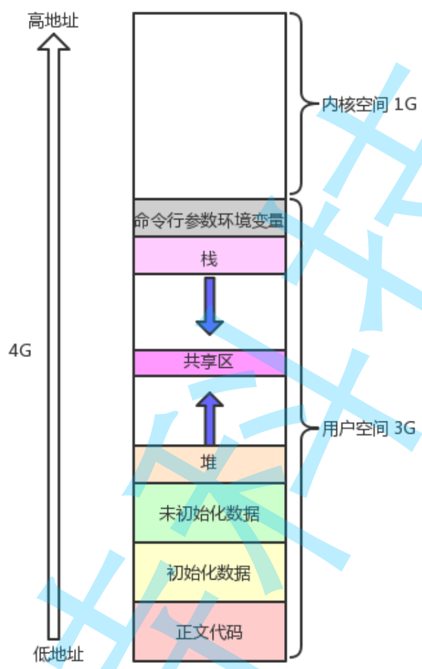

<details><summary>目录</summary>

- [什么是信号？](#什么是信号)
  - [发送信号的本质](#发送信号的本质)
- [信号产生](#信号产生)
- [函数](#函数)
- [信号的含义](#信号的含义)
- [除0动作解释](#除0动作解释)
- [野指针错误](#野指针错误)
- [管道异常](#管道异常)
- [核心转储](#核心转储)
- [概念](#概念)
- [task\_struct](#task_struct)
- [信号的捕捉流程](#信号的捕捉流程)
  - [概念](#概念-1)
- [程序地址空间概念](#程序地址空间概念)
- [处理信号](#处理信号)
- [函数](#函数-1)
- [网络编程](#网络编程)


</details>

## 什么是信号？
像人能识别红绿灯一样，红绿灯发出的就是**信号**
- 进程是如何识别信号的？认识+动作
- 进程本身是被程序员填写的属性和逻辑的集合--程序员编码完成
- 当进程收到信号后，进程可能正在执行更为重要的代码，所以不一定会立即处理
- 进程本身必须具有保存信号的能力
- 进程在处理信号的时候，一般有三种动作（默认、自定义、忽略）`这种行为称为 信号被捕捉`
### 发送信号的本质
就是修改PCB中的信号位图\
而只有OS在管理PCB，所以是**OS向目标进程发送信号**\
编号为1 ~ 31的信号为传统UNIX支持的信号，是不可靠信号(非实时的)，编号为32 ~ 63的信号是后来扩充的，称做可靠信号(实时信号)。不可靠信号和可靠信号的区别在于前者不支持排队，可能会造成信号丢失，而后者不会。


ctrl+c热键：OS将其解释为2号信号`2）SIGINT`
    
    --------------------------------------------------------->
    预备工作    信号的发送      信号的保存      信号的递达处理
## 信号产生
|热键|信号|选项|
|---|---|---|
|ctrl+c|2|SIGINT|
|ctrl+\ |3|SIGQUIT|

2. 系统调用向目标进程发送信号
3. 硬件异常产生信号
4. 软件条件

linux中只允许存在一个前台进程运行
## 函数

|函数名|作用|返回值|头文件|
|---|---|---|---|
|sighandler_t signal(int signum, sighandler_t handler)<br>typedef void (*sighandler_t)(int);|接收信号, 将对应的信号接受的默认动作修改为自定义动作和休眠||#include<signal.h>|
|int kill(pid_t pid, int sig);|接收任意pid, 调用kill对应的参数|成功0失败-1|#include <signal.h>|
|int raise(int sig);|给自己发送任意的信号||#include <signal.h>|
|void abort(void);|给自己发送指定的信号,终止进程||#include <stdlib.h>|
|unsigned int alarm(unsigned int second)|定义的闹钟, 到点发送`SIGALRM 14`信号, 闹钟只会响一次||#include<unistd.h>|
## 信号的含义
信号处理的行为的理解：有很多的情况，进程收到大部分的信号，默认处理动作都是终止进程\
信号的意义：信号的不同，代表不同的事件，但是对事件发生之后的处理动作可以一样

## 除0动作解释
除0会导致OS一直给当前除0进程发送`SIGFPE 8`号信号

OS为什么会知道当前进程产生除0动作？\
CPU中有很多寄存器，存储代码中的变量，并对其进行基本的运算，在CPU中运算时，会有一个**专门检测是否出现错误**的**状态寄存器**

如果产生除0错误，在计算机中除0相当于除无穷小，结果会无穷大。此时会引起状态寄存器中溢出标记位由0设置为1，计算出来的结果没有意义，不需要被采纳。

cpu就会触发运算异常

受到信号，不一定会引起进程退出--没有退出，有可能还会被调到\
CPU内部的寄存器只有一份，但是寄存器中的内容，属于当前进程的上下文!


进程没退出，每次识别到特定信号后跳转执行，进程就会被保存和恢复，所以每次恢复的时候都会让OS识别到了CPU内部的状态寄存器中的溢出标志位是1

## 野指针错误
```cpp
int *p = nullptr;
*p = nullptr;
```
程序中的指针保存的都是虚拟地址

访问nullptr指向的空间时，在页表环节，由于访问0地址，而0地址的内容不允许访问，此时触发了虚拟到物理内存转换的硬件MMU的异常，使得其标志位设置为1，此时硬件的所有异常都会被OS检测到，并且给进程发送信号

## 管道异常
管道读端关闭，写端写入无意义，OS不允许不高效的进程存在，所以给该进程发送`SIGPIPE 13`号信号

## 核心转储
```cpp
int a[10]={0};
a[100]=6;
```
有可能不报错,为什么?\
因为进程有自己的栈帧空间, 只要是在自己的有效空间内访问, 都算是合法访问, 除非访问完全不是该进程的空间。

- Term报错方式表示正常报错，OS不会做额外的操作
- core报错方式会将内存中的有效数据转储到磁盘中

在云服务器上，core是默认关闭的，使用`ulimit -a`查看所有选项\
使用`ulimit -c`设置core存储文件大小

打开后如果触发core报错,OS会将该进程的有效二进制数据存储到以core命名, pid为后缀的文件中。形成一个临时文件

OS将产生崩溃的上下文数据存储起来，方便调试

在gdb中调试使用`core-file core.XXXX`自动跳转到报错行,显示错误信息

---
## 概念
1. 实际执行信号的处理动作称为信号递达(Delivery)
2. 信号从产生到递达之间的状态,称为信号未决(Pending)。
3. 进程可以选择阻塞 (Block )某个信号。
4. 被阻塞的信号产生时将保持在未决状态,直到进程解除对此信号的阻塞,才执行递达的动作.
5. 注意,阻塞和忽略是不同的,只要信号被阻塞就不会递达,而忽略是在递达之后可选的一种处理动作。

## task_struct
    unsigned int pending = 0;
    a. 比特位的位置，表示信号编号
    b. 比特位的编号，表示是否*收到*了对应的信号
    unsigned int block = 0;
    a. 比特位的位置，表示信号编号
    b. 比特位的编号，表示是否*阻塞*了对应的信号
    
因为该信号被阻塞，所以发送的信号不会被**递达**，除非未来解除阻塞


如果一个信号要被递达，伪代码
信号`signo`0x1
```c++
判断信号量是否递达的伪代码
//条件为真, 表示当前信号是被阻塞的
if((0x1 << (signo - 1)) & pcb->block)
{
    //signo是被阻塞的, 不递达
}
else
{
    if((0x1 << (signo - 1)) & pcb->pending)
    {
        //递达该信号
    }
}
```
```c++
//将函数指针整合到数组中
typedef void (*hanlder_t)(int signo);
handler_t handler[32] = {0};

handler_t handler[32]数组是有下标的
a. 数组的位置(下标), 就是信号的编号
b. 数组下标对应的内容, 表示对应信号的处理方式(对应信号的函数方法)
```
1. 所以未来信号被产生时，修改pending对应的比特位。
2. 并且block对应的比特位没有阻塞（置1）时。
3. 根据信号位置，反向得到信号编号。
4. 进而根据处理数组，得到该信号的处理方法。

如果一个信号没有产生，并不妨碍它可以先被阻塞

## 信号的捕捉流程
信号在产生的时候，不会立即被处理，而是在合适的时候\
合适的时候：在内核态返回用户态的时候，进行处理
### 概念
自己写的所有代码都是属于用户态的代码
难免访问其他的资源。\
用户为了访问内核或者硬件资源，必须通过系统调用完成访问
1. 操作系统自身的资源（getpid，waitpid...）
2. 硬件资源（printf，write，read）

往往系统调用比较费时间一些，尽量避免频繁调用系统调用

一切因节省空间而牺牲效率的问题，都是空间换时间

凡是和当前进程强相关的数据，我们都称之为当前进程的上下文数据

- CPU中有一个寄存器保存了当前运行进程的PCB,也称为PCB的起始地址
- CPU也有一些寄存器保存了当前进程的用户页表的起始地址
- CPU中也继承了MMU页表映射转换单元
- CPU存在CR3寄存器,表征当前进程的运行级别(`0:内核态,3:用户态`)

## 程序地址空间概念


用户进程不仅有用户空间,还有1G的内核空间, 并且OS不仅维护进程与硬件的**用户级页表**, 同时还要维护进程与内核之间的**内核级页表**

操作系统在内存中只会存在一份, 进程和数据在内存中可以有多份, 所以**操作系统的内核级页表只有一份**

每一个进程都有自己的地址空间(用户空间独占)内核空间(被映射到了每个进程的3-4G地址空间), 所以**每个进程看到的内核空间都是一样的**\
因此, 进程要访问OS的接口, 其实只需要在自己的地址空间上进行跳转就行了

每一个进程都有3~4G空间, 都会共享一个内存级页表, 无论进程如何切换,都不会改变任何的3~4G空间\
用户凭什么能够访问内核的接口或者数据?\
当进程跳转到内核空间时,都必须在CR3处改变自己的运行级别\
并且系统调用接口,在起始的位置就会帮你修改运行级别,OS会使用陷入内核指令, 也就是INT 80, 将用户态修改为内核态

## 处理信号
进程在由用户态转换成内核态的时候, 会在由内核态转回用户态时做些其他的事情\
比如处理进程的信号\
OS通过遍历该进程的task_struct表, 在其中查找block表
- 如果是1, 表示阻塞, 不处理
- 如果是0, 表示不阻塞, 查看后面的pending表

查看后面的pending表
- 如果是0, 表示无信号
- 如果是1, 表示有信号, 再根据headler表中定义的动作处理该信号, 之后将pending表中的值置为1

- 捕捉处理信号的自定义动作, 不能使用内核态调用内核态中的自定义动作, 因为OS不能相信任何人\
    所以OS在调用自定义动作的时候, 会从内核态切换到用户态.
- 也不能从自定义动作直接跳回源程序代码, 因为当前是无法确认是从哪里跳转的\
  自己是无法从一个地方跳转到另一个地方,必须要操作系统参与才行\
  所以会经过特殊的系统调用最后跳转回内核态, 然后经过特点的系统调用返回上次调用函数的地方继续向下执行

## 函数
|函数名|作用|头文件|
|---|---|---|
|int sigpending(sigset_t *set);|获取当前进程的pending信号值|#include <signal.h>|
|int sigprocmask(int how, const sigset_t *set, sigset_t *oldset);|读取和修改进程的信号屏蔽字(阻塞信号集)|#include <signal.h>|
|sighandler_t signal(int signum, sighandler_t handler)<br>typedef void (*sighandler_t)(int);|接收信号, 将对应的信号接受的默认动作修改为自定义动作和休眠<br>处理handler数组的|#include<signal.h>|

## 网络编程
默认情况：
1. 默认所有进程都是不被阻塞的
2. 如果一个信号被屏蔽了，该信号不会被递达

只有设置了sigprocmask函数时，才是将pending信号集设置进内核

一旦对特定信号进行解除屏蔽，一般OS要至少立马递达一个信号