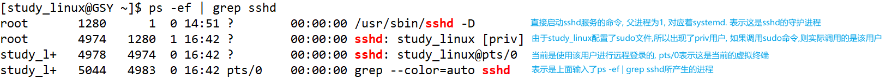

### 选项风格
    a x u等不加-的选项是BSD风格
    -a等加-的选项是继承与UNIX风格
    
**PPID**就是指该进程的父进程的ID
**PID**指当前进程的ID
- USER`当前的用户名`
- PID`当前用进程的编号`
- %CPU`当前用户占用CPU的百分比`
- %MEM`当前进程占用内存空间的百分比`
- VSZ`当前进程所占用的虚拟内存`
- RSS`当前进程所占用的实际物理内存`
  - 经常使用的内容才会保存在物理内存, 不经常使用的保存在虚拟内存
- TTY`表示使用的是哪个终端来进行调用` `?表示没有使用终端`
  - tty1~6表示本地运行的终端
  - pts/0~255代表虚拟终端`在Xshell或图形界面右键打开终端就是虚拟终端`
  - bash就是控制台界面
- STAT`进程状态`
  - 僵尸状态`进程快要结束, 有些信息没有删除. 父进程可能需要它的资源, 等父进程销毁才会销毁该进程` `但是如果空壳没有清理,还是会占用资源,所以有时会关注该状态并清理`
  - `<` 表示当前进程具有较高的优先级
  - `N` 表示当前进程具有较低的优先级
- TIME`当前进程占用CPU的运算时间`
- COMMAND`调用该进程执行的命令`
  - PID为1的进程就是CentOS7最初执行的初始进程`CentOS6使用的是init`**
  - PID为2的进程是非常重要的守护进程`专门负责所有内核调度管理的`**
  - idu进程就是所谓的0号进程

        查看进程的CPU占用率和内存占用率, 可以使用aux
        查看进程的父进程ID可以使用ef
#### 查看ps -ef | grep sshd
如果使用root用户登录, 可以发现只要打开一个终端, 就会创造一个root权限的root@pts/x, 代表打开的第几个终端

而如果使用普通用户study_linux登录, 就会发现产生了两个虚拟进程, 这是为什么?\
因为这是为了做到权限分离而设计的, 如果study_linux使用普通用户操作,使用的就是下面的虚拟虚拟进程进行操作,但是如果使用sudo权限进行操作,则实际上使用的是上面那个进程进行操作

---
### kill 终止进程
如果发现进程过于卡顿或者占用资源,可以使用kill去杀死一个进程

    如果将sshd的守护进程kill掉, 会发现之前已经开启使用的两个进程还是照样运行, 并不影响
    但是如果将开启的关闭,则发现不能进行远程登录了,需要使用systemctl重新启动才行

    因为现存的两个进程的守护进程, 也就是父进程被kill后, 当前的两个进程就会直接把他的父进程转换成了1, 也就是systemd(系统管理工具)

    在重启守护进程后, 再连接一个远程终端就会发现, 之前的两个已经开启的终端与守护进程不存在父子关系, 但是新连接的远程终端与该守护进程存在父子关系
    

    启动指令进程的父进程, 通过ps -ef | grep 父进程  可以查看到是bash运行的
    bash指的就是当前这个输入命令的控制台界面, shell的实现是一个bash

    1号进程(systemd系统管理工具)启动后->启动SSHD后台守护进程->远程登录进程->启动bash进程

    所有在控制台输入的子进程, 都是基于bash运行出来的

    sshd远程连接是连接上了以后,这就进程就处在一个保持连接的等待状态
    bash就是当前运行的控制台界面, 本身他就是一个正在运行的一个界面, 如果直接删除, 肯定是失败的.
    直接删除会失败, 就要增加一个-9参数, 表示强迫进程立刻停止

    可以使用killall sshd将所有的sshd关闭(注意: 会将守护进程也一起关闭, 所以需要谨慎操作)
    

ps命令查看进程状态

---
### pstree 查看进程树
- 因为我们知道, 在bash中执行一条命令的时候. 它的父进程应该是bash, bash的父进程应该是远程登录的父进程, 远程登录进程的父进程应该是sshd系统服务守护进程.
- 按照这个父子进程来逐级查看他们的父子关系会显得格外麻烦.
- 因此,出现了pstree,能一次性查看所有的父子关系

---
### top 实时监控系统进程状态
- top`实时时钟`
- up`当前系统的运行时间`
- user`当前正在使用机器的用户数` `图形化界面是一个用户, 终端界面是一个用户`
- load average`显示过去的1分钟, 5分组, 15分钟内的系统的平均负载` `小于0.7算是比较小`
- Tasks`当前正在执行的任务(进程)` `yunning运行状态` `sleeping休眠状态` `stopped停止状态` `zombie僵尸状态`
- CPU`CPU的占用状态` `US用户进程占用(默认情况下,没有进行专门的更改优先级的用户进程)` `sy系统进程` `ni(nice)` `id空闲时间` `wa(I/O操作)的时间占比` `hi硬件中断服务请求时间占比` `si软件中断服务请求时间占比` `st被虚拟化设备占用时间的占比`
- Mem`当前内存占用空间的占比`
- Swap`当前的虚拟内存占用空间的占比` `total总占用大小` `free剩余多少空闲空间` `used剩余多少占用状态` `buff 剩余多少放入缓存区`

---
- PID`当前的ID号`
- USER`调用的用户`
- PR`调用的优先级`
- NI`调用时, 用户指定的NICE值`
- VIRT`虚拟内存占用的大小`
- RES`实际(物理)内存占用的大小`
- SHR`共享内存占用大小`
- S`状态` `Running sleep等`
- TIME`当前占用CPU的时间`
- COMMAND`生成当前进程调用的命令`

|按键|作用|
|---|---|
|shift+P|按照CPU从大到小进行排序|
|shift+N|按照PID从大到小进行排序|
|shift+M|按照MEM从大到小排序|
|q|退出|
|u|输入监控指定用户|
|k|输入指定PID终止一个进程`包含后面输入9`|

---
### netstat 显示网络状态和端口占用信息
    PC主机需要使用ssh服务, 远程连接到虚拟机上面去.
    pc有远程连接进程, 虚拟机有sshd进程, 两者之间需要有一个通信
    进程间要做网络通信的话,需要在机器上开一个门, 数据经过这个门出去, 数据再经过网络传输.
    在远程服务器那边也要开一个门, 数据从这个门进去, 传递给相应的服务

    这个门, 就叫做套接字(socket).

    套接字的出现, 需要在数据传输时指定是哪台机器的哪个门, 数据传输需要门, 一个门对应的传输是有限的, 如果存在另一个进程, 就需要再开辟一个门
    
    这个用来传输数据的门, 就叫做端口号

    一个ip, 就可以存在65536个端口(0 ~ 65535)
    
    有些端口号已经被固定的服务占用的, 比如ssh服务占用了22端口. 网页服务, 占用80端口. mysql占据的端口是3306
  
- 端口号用于传输数据
- 套接字是ip+端口
- socket表示一般为`192.160.1:22`
  
|表头|含义|
|---|---|
|Proto|协议|
|Recv-Q|连接到当前socket用户程序,还没有拷贝的字节数|
|Send-Q|已经发出去,但是远程的主机还没有确定收到的字节数|
|Local Address|本地地址`127.0.0.1经典的本地回环地址`|
|Foreign Address|远程地址`显示的形式就是socket形式` `0.0.0.0表示本机本地的所有地址`|
