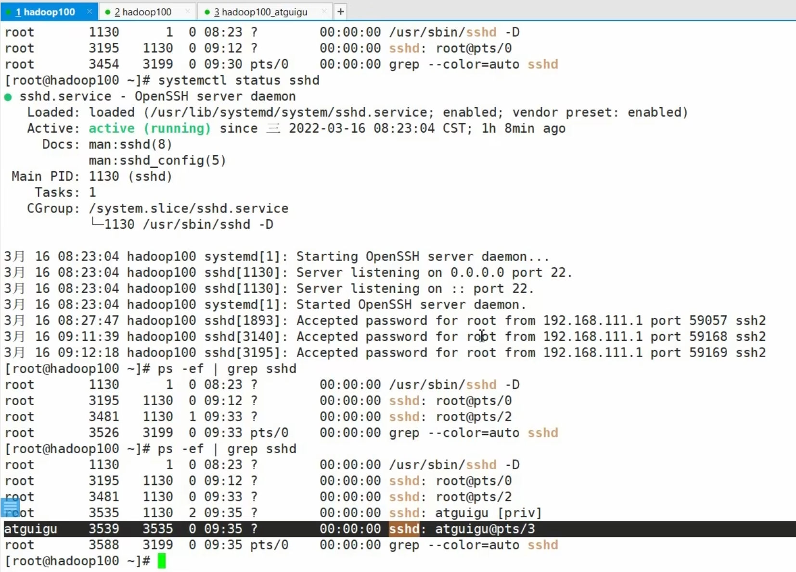

### 选项风格
    a x u等不加-的选项是BSD风格
    -a等加-的选项是继承与UNIX风格
    
**PPID**就是指该进程的父进程的ID
**PID**指当前进程的ID
- USER`当前的用户名`
- PID`当前用进程的编号`
- %CPU`当前用户占用CPU的百分比`
- %MEM`当前进程占用内存空间的百分比`
- VSZ`当前进程所占用的虚拟内存`
- RSS`当前进程所占用的实际物理内存`
  - 经常使用的内容才会保存在物理内存, 不经常使用的保存在虚拟内存
- TTY`表示使用的是哪个终端来进行调用` `?表示没有使用终端`
  - tty1~6表示本地运行的终端
  - pts/0~255代表虚拟终端`在Xshell或图形界面右键打开终端就是虚拟终端`
  - bash就是控制台界面
- STAT`进程状态`
  - 僵尸状态`进程快要结束, 有些信息没有删除. 父进程可能需要它的资源, 等父进程销毁才会销毁该进程` `但是如果空壳没有清理,还是会占用资源,所以有时会关注该状态并清理`
  - `<` 表示当前进程具有较高的优先级
  - `N` 表示当前进程具有较低的优先级
- TIME`当前进程占用CPU的运算时间`
- COMMAND`调用该进程执行的命令`
  - PID为1的进程就是CentOS7最初执行的初始进程`CentOS6使用的是init`**
  - PID为2的进程是非常重要的守护进程`专门负责所有内核调度管理的`**
  - idu进程就是所谓的0号进程

        查看进程的CPU占用率和内存占用率, 可以使用aux
        查看进程的父进程ID可以使用ef
#### 查看ps -ef | grep sshd
如果使用root用户登录, 可以发现只要打开一个终端, 就会创造一个root权限的root@pts/x, 代表打开的第几个终端

而如果使用普通用户study_linux登录, 就会发现产生了两个虚拟进程, 这是为什么?\
因为这是为了做到权限分离而设计的, 如果study_linux使用普通用户操作,使用的就是下面的虚拟虚拟进程进行操作,但是如果使用sudo权限进行操作,则实际上使用的是上面那个进程进行操作

---
### kill 终止进程
如果发现进程过于卡顿或者占用资源,可以使用kill去杀死一个进程

    1号进程启动后->启动SSHD后台守护进程->远程登录进程->启动bash进程
    所有在控制台输入的子进程, 都是基于bash运行出来的

