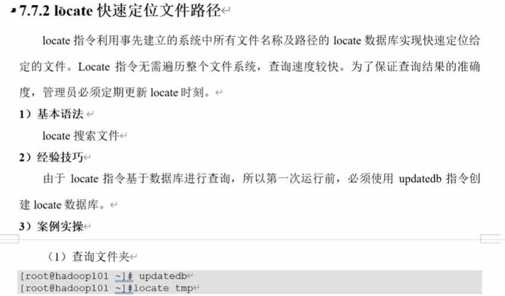
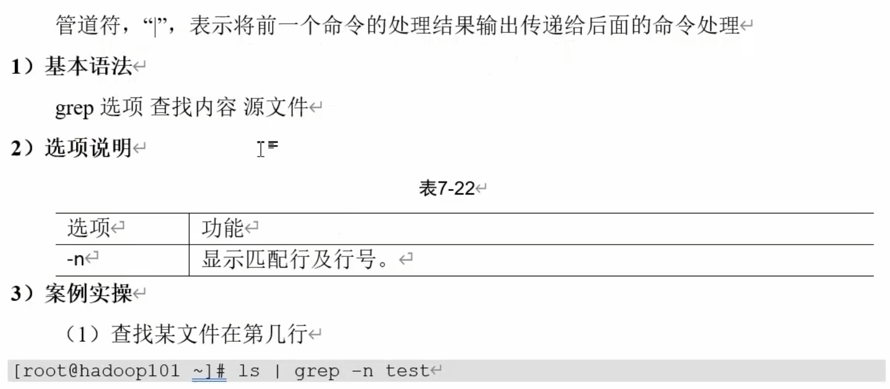

### find查找文件或目录
find指令将从指定目录向下递归的遍历其各个子目录,将满足条件的文件显示在终端
1. 基本语法\
   find [搜索范围][选项]
2. 选项说明

|选项|功能|
|---|---|
|-name<查询方式>|按照指定的文件名查找模式查找文件|
|-user<用户名>|查找属于指定用户名所有文件|
|-size<文件大小>|按照指定的文件大小查找文件,单位为: b——块（512字节） c——字节 w——字（2字节） k——千字节 M——兆字节 G——吉字节|

3. 使用技巧
 `find -name test`使用指定名称test查找文件
 `find /root -name test`指定目录下递归遍历查找所需文件
 `find /root -name "*.cfg"`最好使用`""`括起来,查找root目录下所有是.cfg后缀的文件
 `find /name -user tony`在name目录下查找关于用户tony的文件
 `find /root -size +10M`在root目录下查找大小超过10M的文件

<h3 align="left">locate 快速定位文件路径</h3>

<h3>使用which查找命令的存放位置</h3>
<h3>使用whereis查看命令的目标文件和存放位置</h3>

<h2>grep过滤查找及"|"管道符</h2>

### 管道符"|"
**作用**: 一般是在两个命令之间,作用是将前一个命令的执行结果作为参数传递给后面的命令\
**列举**: `ls | grep .cfg`在ls列出的所有文件中,筛选出后缀名为.cfg的文件并打印

### wc 统计指定文件
    wc就是word count的缩写,用于统计文件中的数据

|数字: 21 22 258 info|
|---|
|含义: 21行, 22个单词数量, 158个字节数|