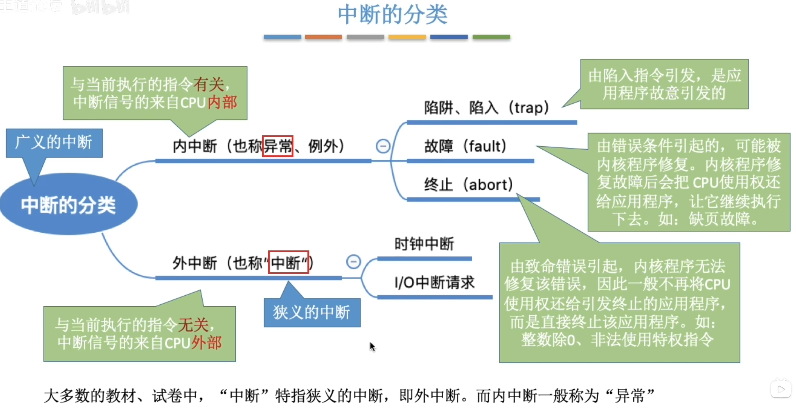
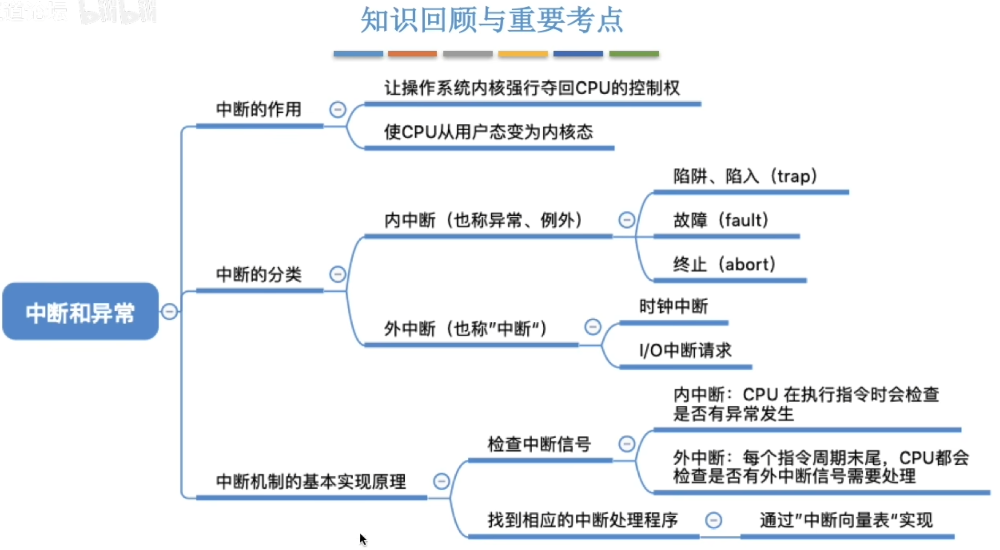

- [中断](#中断)
  - [内中断](#内中断)
  - [外中断](#外中断)
    - [时钟中断](#时钟中断)
    - [I/O中断](#io中断)
- [中断的分类](#中断的分类)
  - [中断机制的基本原理](#中断机制的基本原理)
- [内容回顾](#内容回顾)

# 中断
    在合适的情况下, 操作系统内核会把CPU的使用权主动让给应用程序
    中断是 让操作系统内核夺回CPU使用权 的唯一途径

    如果没有"中断"机制,那么一旦应用程序上CPU运行, CPU就会一直运行这个应用程序

    CPU在检测到中断信息时, 会暂停当前执行的应用程序, 转去处理对应中断的内核程序

    只有存在中断,才能让'并发'机制实现

|内中断|外中断|
|---|---|
|与当前执行的指令**有关**,终端信号来源于CPU|与当前执行的指令**无关**,中断信号来源于CPU**外部**|
## 内中断
应用程序想请求操作系统内核的服务, 此时会执行一条**特殊的指令--陷入指令**, 该指令会引发一个内部中断\
是应用程序主动将内核的控制权还给内核\
`系统调用`就是通过陷入指令完成的
## 外中断
与当前执行的指令**无关**, 中断信号来源于CPU**外部**\
**每一条指令执行结束后**, CPU都会例行检查是否有外中断信号
### 时钟中断
时钟部件每隔一个时间片(如50ms)会给CPU发送一个时钟中断信号\
类似于单片机中的计数器中断
### I/O中断
当输入输出任务完成时,向CPU发送中断信号
# 中断的分类

## 中断机制的基本原理
**不同的中断信号,需要用不同的中断处理程序来处理**. 当CPU检测到中断信号后,会根据中断信号的类型去查询"**中断向量表**". 以此来找到对应的中断处理程序在内存中的存放位置
|中断信号类型|中断处理程序指针|
|---|---|
|0|...|
|1|...|
|2|...|

显然, 中断处理程序一定是内核程序, 需要运行在"内核态"

# 内容回顾
