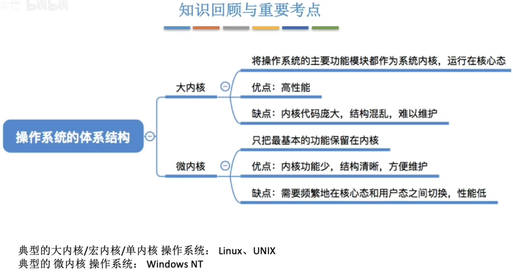
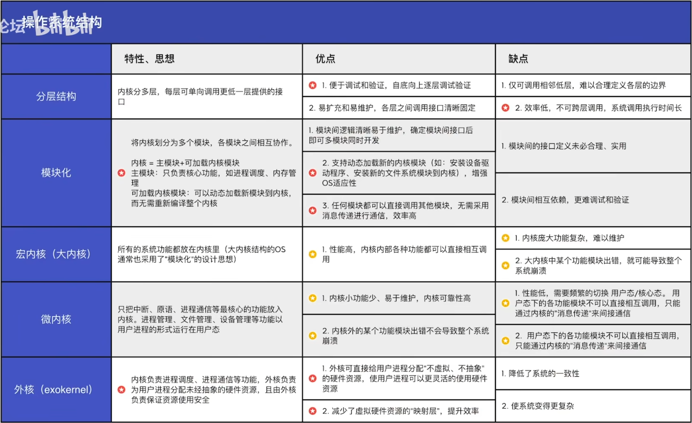

- [内核](#内核)
- [大内核和微内核](#大内核和微内核)
- [知识回顾](#知识回顾)
- [外核](#外核)
  - [映射资源](#映射资源)

# 内核
只保留操作系统中与CPU最紧密的部分被称为微内核\
包含与内核不太相关的内容称为大内核

|大内核|微内核|
|---|---|
|进程管理、储存器管理、设备管理等功能|时钟管理、中断处理、原语（设备驱动、CPU切换等）|

# 大内核和微内核
在应用程序中存在请求操作系统的服务,这个服务的处理同时设计到进程管理,存储管理,设备管理\
**如果是大内核结构**: 存在两次变态\
应用程序向操作系统提出服务的请求,这个时候CPU会从用户态切换成核心态, 开始运行一系列的内核程序

**如果是微内核结构**: 存在六次变态\
比如进程管理, 在执行应用程序的请求时, 进程管理需要得到内核的支持, 所以这个模块对内核的访问就涉及到CPU从用户态到内核态的转换, 服务完成后又涉及到从内核态转换成用户态的两次转变

**注意**: `变态的过程是有成本的`, 要消耗不少时间,`频繁的变态会降低系统性能`

# 知识回顾

# 外核
用户程序所使用和申请到的空间, 都是经过抽象,虚拟化的\
操作系统会将分配的虚拟页面, 映射到实际的物理页框当中\
这些物理页框,在内存中通常是离散的

外核可以给用户直接分配未经抽象的硬件资源

比如一个用户资源知道自己经常需要随机访问的, 如果给这个用户进程分配的进程空间,在外存当中是离散的,用户进程在随机访问它的文件块的时候,磁头需要来回横跳\
这样就会导致用户进程对自己的文件随机访问的性能效能变低\
因为用户进程的这个文件在外存当中到底被零散的分配到哪些位置,是完全由操作系统来决定的,用户进程自己并不能控制\
如果这个用户进程知道自己会经常被频繁的随机访问,他就可以向外核申请一片连续的磁盘块.用户进程它的数据直接存储在连续的几个磁盘块当中,当他想要随机访问自己进程文件当中的随机一块,移动的距离就会减少,性能就会提升

外核不仅需要给用户进程分配硬件资源, 还需要保证分配这些硬件资源的使用安全`保证未被分配的进程不能调用` `被分配资源的进程不能访问未被分配的其他硬件资源`

## 映射资源
普通的操作系统给用户进程分配的都是虚拟的硬件资源, 比如"虚拟内存"\
一般的用户进程在访问它的地址空间时, 操作系统只能提供虚拟地址,操作系统需要去查页表,通过多次的访问才能将虚拟地址转换成实际的物理地址\
那么将虚拟地址通过映射转换成实际的物理地址, 需要时间的代价, 降低整体的效率

