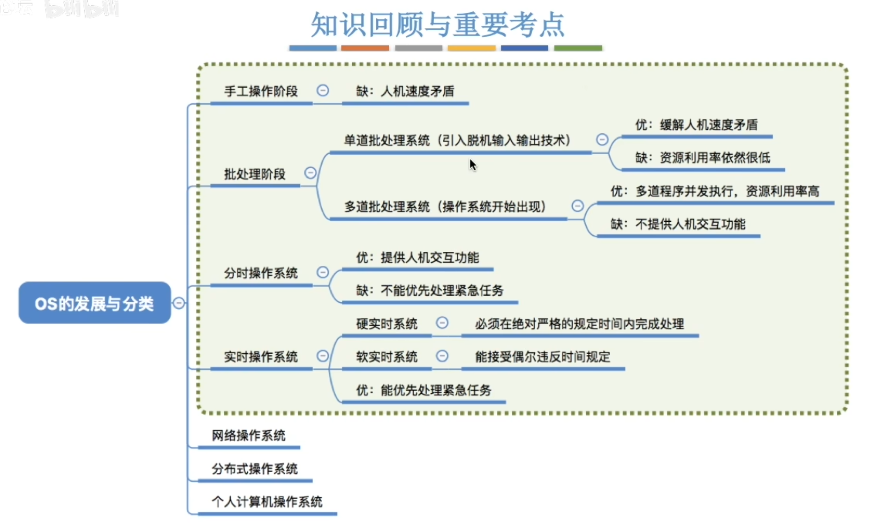

- [手工操作阶段](#手工操作阶段)
- [批处理阶段--单道批处理系统](#批处理阶段--单道批处理系统)
- [批处理阶段--多道批处理系统](#批处理阶段--多道批处理系统)
- [分时操作系统](#分时操作系统)
- [实时操作系统](#实时操作系统)

要重点关注和理解各类操作系统主要想解决的是什么问题, 各自的优缺点
# 手工操作阶段
程序员通过在纸带机上面录入程序, 计算机读取程序运行, 然后在纸带机上打出结果

    写程序->写入纸带机->计算机计算->纸带机打印->程序员翻译
        (输入输出速度慢) (计算速度快) (慢)     (超慢)

**主要缺点:** 用户独占全机、人机速度矛盾导致资源利用率极低

# 批处理阶段--单道批处理系统
    引用  脱机输入/输出技术  (用外围机+磁带完成), 并由  监督程序  负责控制作业的输入、输出

    就是多个程序员将程序提交给外围机, 通过外围机把程序提前存到磁带里
    磁带的读写速度要比纸带快很多
    串行执行程序

**主要优点:** 缓解了一定程度的人机速度矛盾,资源利用率有所提升\
**主要缺点:** `内存中仅能有一道程序运行`, 只有该程序运行结束后才能调入下一道程序.\
`CPU有大量的时间是在空闲等待I/O完成`. 资源利用率依旧很低\
这就是操作系统的雏形
# 批处理阶段--多道批处理系统
    操作系统正式诞生, 用于支持多道程序并发运行
    每次往内存中读入多道程序

    每次计算机读入程序的时候, CPU是处于空闲状态, 这个时候CPU可以进行上一次读入的程序的运算, 大幅度提高运算效率

**主要优点:** 多道程序`并发`执行,`共享`计算机资源. `资源利用率大幅度提升`, CPU和其他资源更能保持"忙碌"状态, 系统吞吐量增大\
**主要缺点:** 用户响应时间长, `没有人机交互功能`(用户提交自己的作业之后就只能等待计算机处理完成,中间不能控制自己的作业。`eg: 无法调试程序/无法在程序运行过程中输入一些参数`)

# 分时操作系统
计算机以`时间片`为单位`轮流为各个用户/作业服务`, 各个用户可通过终端与计算机进行交互。\
**主要优点:**&nbsp;&nbsp;用户请求可以被即时响应, `解决了人机交互问题.` 允许多个用户同时使用一台计算机, 并且用户对计算机的操作相互独立, 感受不到别人的存在. 
**主要缺点:**&nbsp;&nbsp;`不能优先处理一些紧急任务.`操作系统对各个用户/作业都是完全公平的,循环的为每个用户/作业服务一个时间片, 不区分任务的紧急性.
# 实时操作系统
**主要优点:** 能够有限响应一些紧急任务, 某些紧急任务不需要时间片排队

在实时操作系统的控制下, 计算机系统接收到外部信息后及时进行处理, 并且`要在严格时限内处理完事件`. 实时操作系统的主要热点是`及时性和可靠性`
   

**实时操作系统**
|硬实时系统|软实时系统|
|---|---|
|必须在绝对严格的规定时间内完成处理|能接受偶尔违反时间规定|

