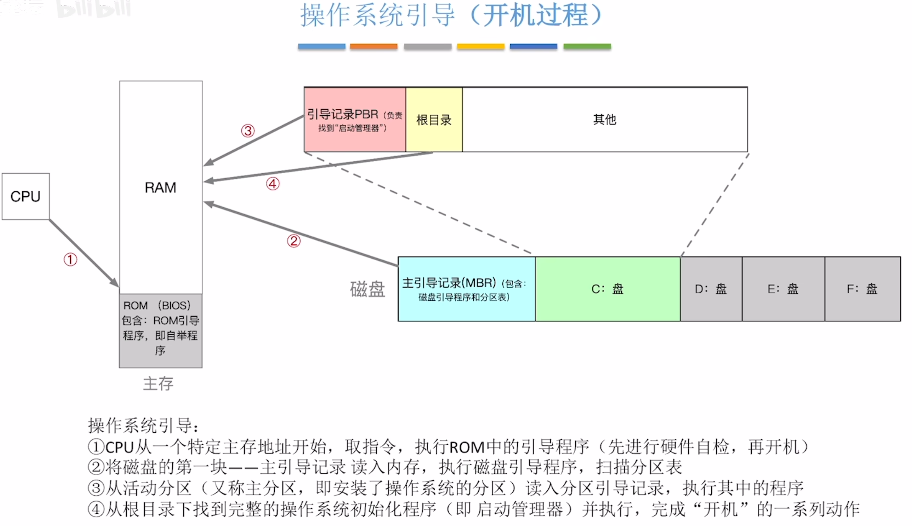

# 什么是引导
在开机的时候,让操作系统运行起来的操作就叫做引导

**主存**: 由RAM和ROM组成, 一般所谓的电脑内存就是指RAM

ROM芯片被集成到电脑的主板上, ROM存储芯片中存储的是BIOS`基本输入输出系统`

BIOS是由一系列的程序组成的, ROM引导程序被称作引导程序

RAM中的数据一般经过断电就会清除其中的数据,ROM不会断电丢失\
开机后, ROM引导程序会指示CPU去把磁盘的主引导记录读入内存`主引导记录包含分区表和磁盘引导程序`\
接下来CPU就可以执行磁盘当中的磁盘引导程序,磁盘引导程序会根据分区表判断C盘所处的位置\
接下来就可以读取C盘的第一部分的数据"PBR",接下来CPU就可以去执行PBR中的程序\
PBR的程序会寻找到启动管理器, 启动管理器是另一个程序,一般存放在根目录下的某个位置\
CPU再去执行启动管理程序,这个启动管理程序就会完成操作系统一系列的程序

