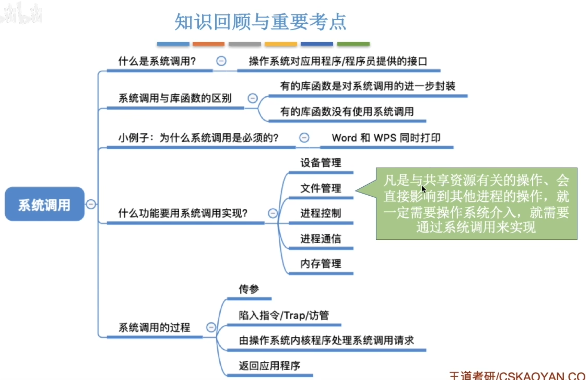

# 共享资源
操作系统作为用户和计算机硬件之间的接口, 需要向上提供一些简单易用的服务. 主要包括命令接口和程序接口. 其中, 程序接口由一组**系统调用**组成.\
"系统调用"是操作系统提供给应用程序(编程人员)使用的接口, 可以理解为一种可供应用程序调用的特殊函数,**应用程序可以通过系统调用来请求获得操作系统内核的服务**

对于一些共享资源, 需要两个进程互斥并且并发的执行时, 是由操作系统内核对共享资源进行统一的管理, 并向上提供"系统调用",用户进程想要使用共享资源, 只能通过系统调用向操作系统内核发出请求.内核会对各个请求进行协调处理
### 系统调用和库函数的区别
|库函数|操作系统|
|---|---|
|部分包含程序调用, 有时会将系统调用封装成库函数,以隐藏系统调用的一些细节,使程序员变成更加方便|向上提供系统调用,使得上层程序能请求内核的服务

