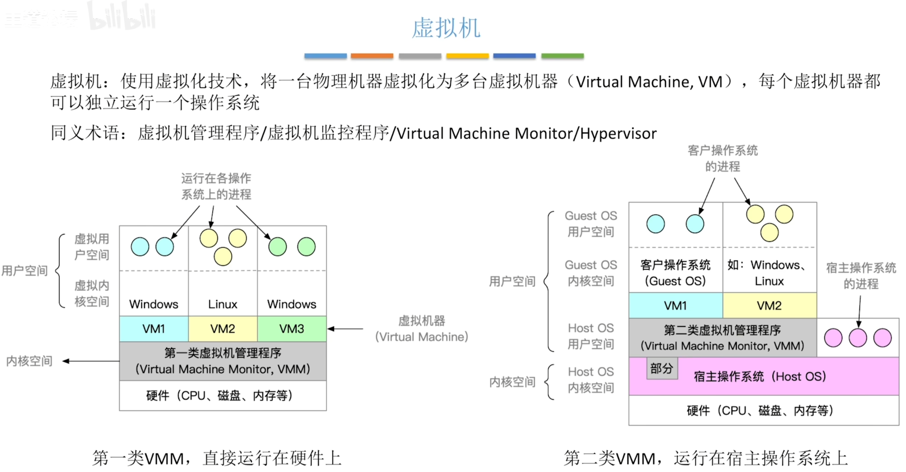
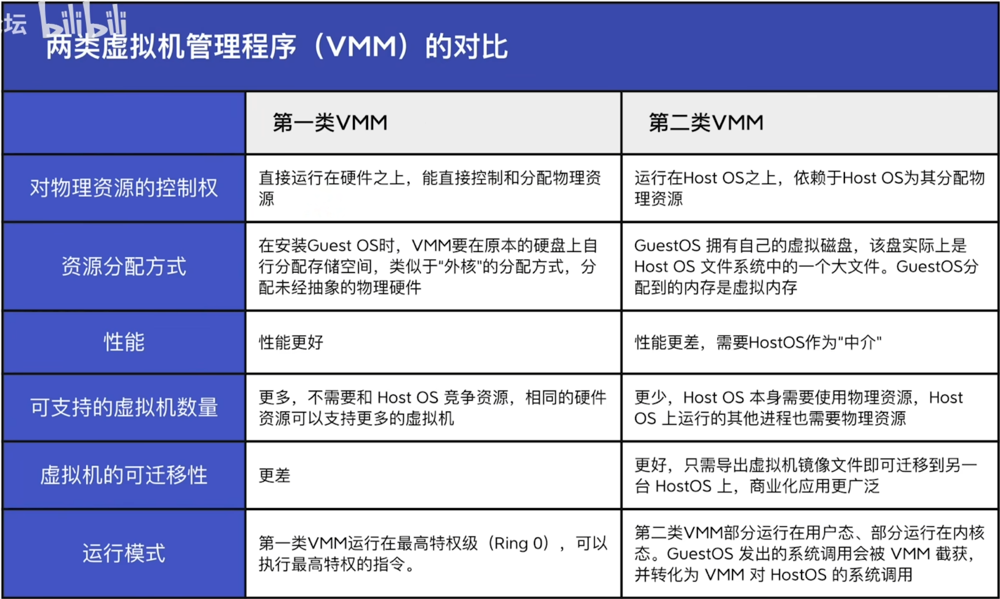
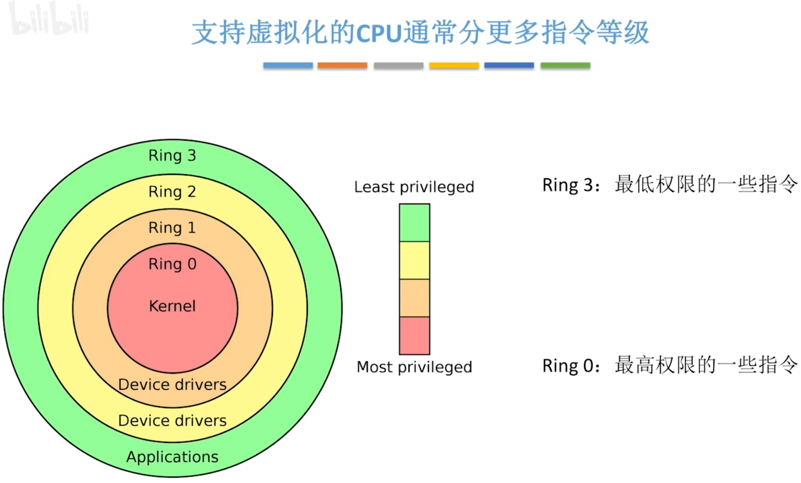

- [第一类虚拟机](#第一类虚拟机)
- [第二类虚拟机](#第二类虚拟机)
- [第一类虚拟机管理系统](#第一类虚拟机管理系统)
  - [只分为特权指令和非特权指令的空间管理和划分](#只分为特权指令和非特权指令的空间管理和划分)
  - [细分特权指令的划分](#细分特权指令的划分)
- [第二类虚拟机管理系统](#第二类虚拟机管理系统)

    一个操作系统上执行两个进程有可能产生冲突
    如果为了安全考虑选择另启动一台服务器就会造成硬件资源上的浪费

## 第一类虚拟机
单核CPU怎么把资源费分配给虚拟机的多台操作系统`CPU将时间片对操作系统进行划分,每个操作系统划分到若干个时间片`\
磁盘和硬盘划分部分空间划分给各个虚拟机
- 只有虚拟机管理程序,才是运行在内核态的, 可以执行更高权限的指令`特权指令`\
  上层的操作系统实际上是执行在用户态的, 当上层的操作系统执行`特权指令`时,通过虚拟机管理系统的转换,获得和内核态一样的效果
- 所以, 第一类虚拟机管理程序会运行在硬件之上,分配和管理硬件资源

## 第二类虚拟机
内核空间包含`宿主操作系统`和`硬件资源`, 第二类虚拟机管理系统运行在宿主操作系统上, 用户态中
- 如果虚拟机操作系统想要给虚拟机分配硬件资源,需要请求宿主操作系统给他分配硬件资源. 由虚拟机管理程序进行再分配.
- 硬件资源的管理者依然是宿主操作系统
- 第二类虚拟机管理系统需要消耗更多的硬件资源`宿主操作系统,宿主操作系统的进程都需要消耗硬件资源`

## 第一类虚拟机管理系统
### 只分为特权指令和非特权指令的空间管理和划分
如果只分为特权指令和非特权指令，那么任意一条特权指令的使用，都需要虚拟机管理程序把他截获，并且判断这条指令的使用是否合法\
如果合法，还需要虚拟机管理程序来模拟出特权指令执行的一个效果
### 细分特权指令的划分
    如果是更精细的划分，虚拟机管系统在rank0，上层的操作系统和用户进程分别在rank1和rank2，如果只是运行rank1和2，直接运行即可。如果运行了少量的rank0，再对他进行判断和执行
    相当于将原来的特权指令进行了细分，将敏感的指令放在了0环，不敏感的放在了1环
    这样虚拟机管理程序只需要检查那些敏感的指令即可
    以上为第一类虚拟机管理系统
## 第二类虚拟机管理系统
    第二类虚拟机管理程序一部分在用户态，一部分在内核态。内核态是以虚拟机驱动程序的方式加载到操作系统内核当中。
    当用户进程发出write请求读写磁盘的时候，会被虚拟机管理程序截获，然后由虚拟机管理程序进行一些处理，代替他，向底层的宿主操作系统发出write系统调用，来请求底层宿主操作系统的服务

