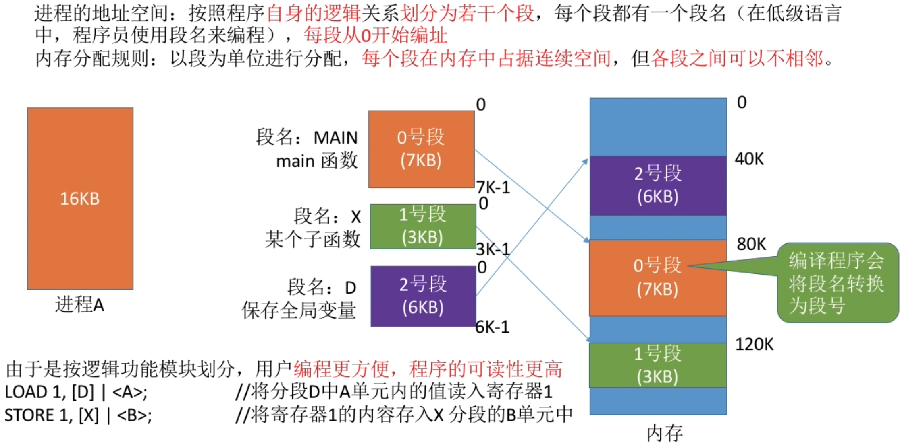
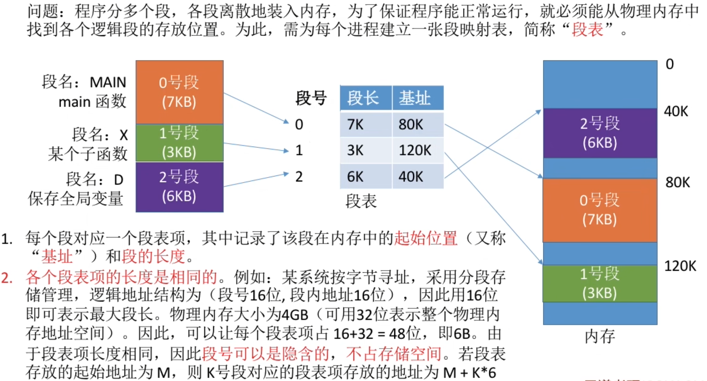
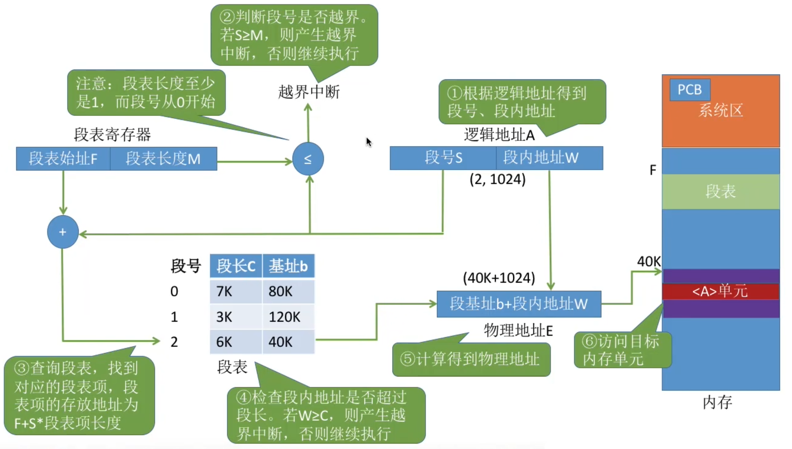
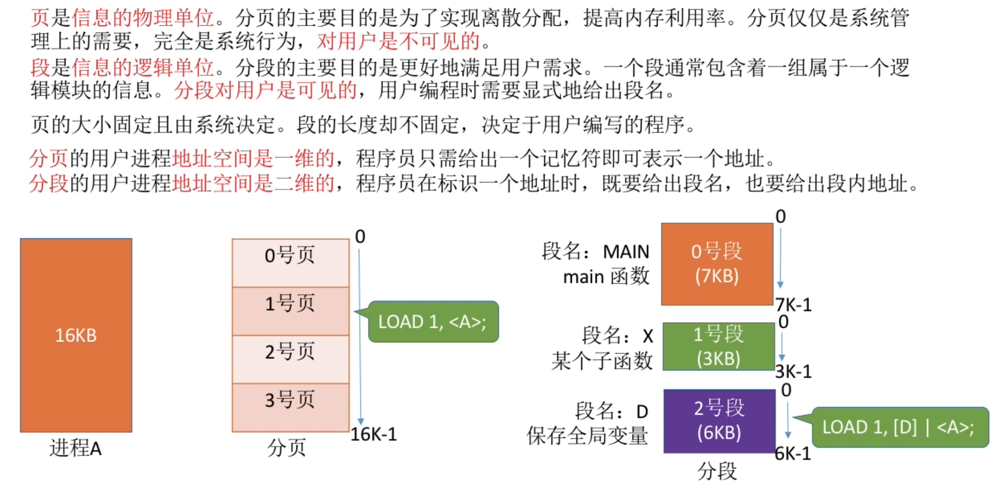
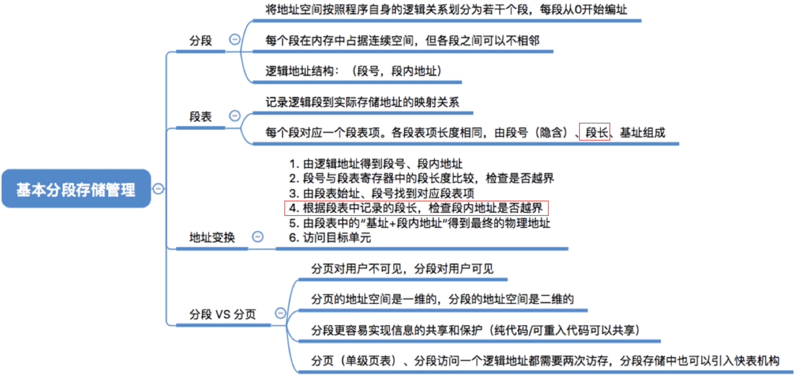

# 分段

# 段表
为各个逻辑段所对应的物理地址建立映射关系

# 逻辑地址转换
段表长度M指的就是段表的元素个数, 例如: 下面段表中,存在的段表长度为3

# 分段、分页管理的对比

- `分段`比分页`更容易实现信息的分享和保护`

不能被修改的代码成为`纯代码`或`可重入代码`(不属于临界资源),这样的代码是可以共享的。可修改的代码是不能共享的（比如，有一个代码段中有很多变量，各进程并发地同时访问可能造成数据不一致）

想要使得两个进程同时访问一段资源, 只需要在段表中写入相同的基址即可.

页面不是按逻辑模块划分的,这就很难实现共享

# 知识回顾与重要考点
