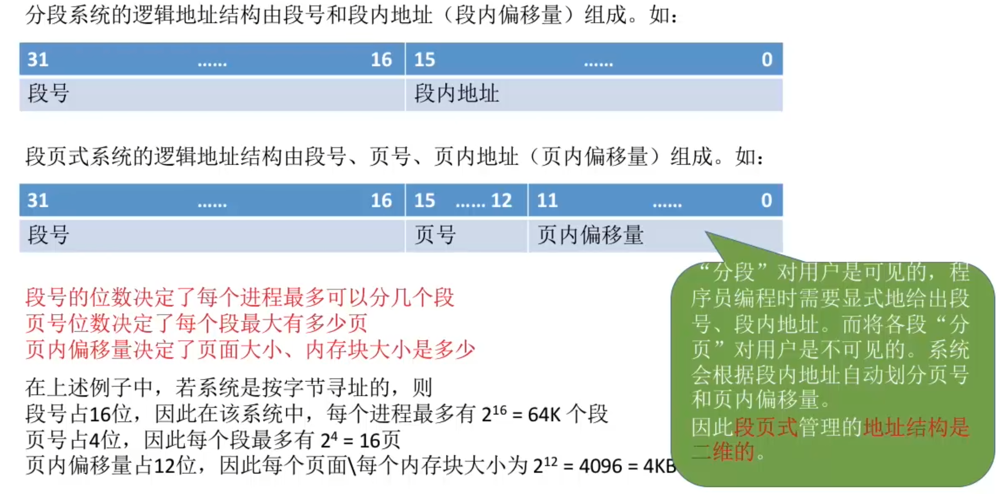
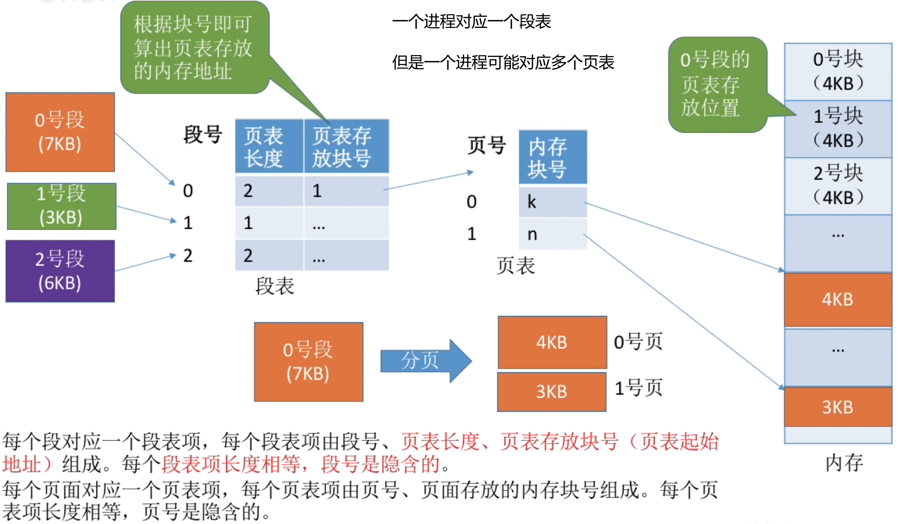
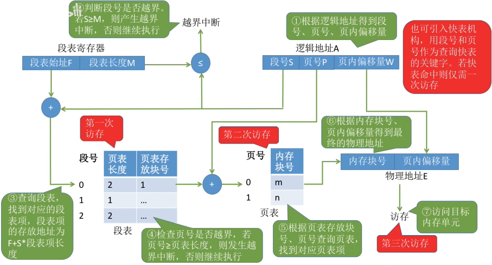
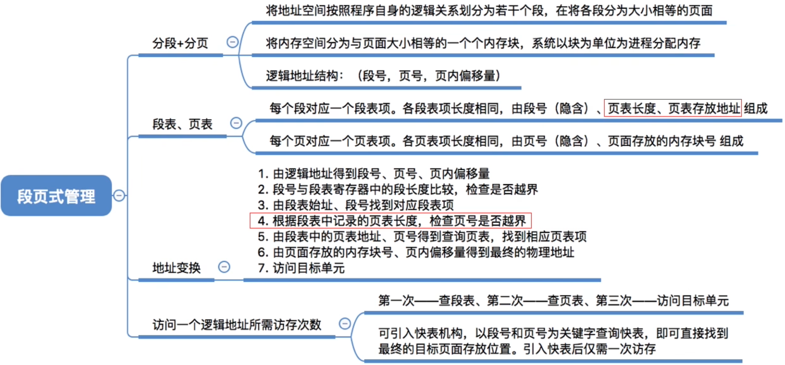

# 分页、分段的优缺点分析
| |优点|缺点|
|---|---|---|
|分页管理|内存空间利用率高,`不会产生外部碎片`,只会有少量的页内碎片|不方便按照逻辑模块实现信息的共享和保护|
|分段管理|很方便按照逻辑模块实现信息的共享和保护|如果段长过大,为其分配很大的连续空间会很不方便。另外，段式管理`会产生外部碎片`|

# 段页式管理的逻辑地址结构
**基础思想**: 先将进程进行`分段`, 然后对**分段的部分**进行`分页`

# 知识回顾与重要考点
