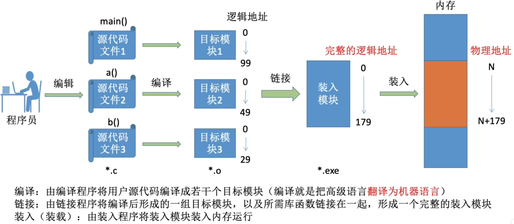
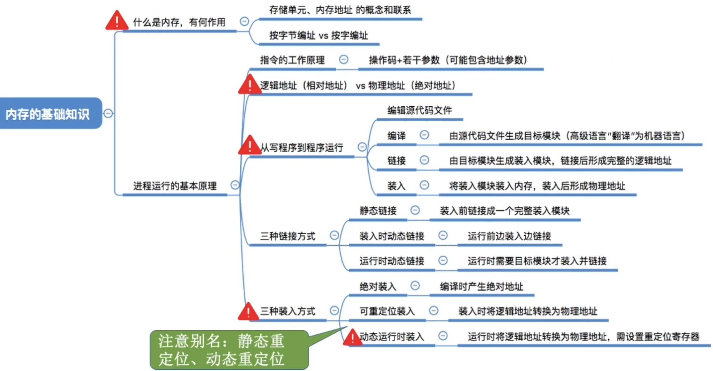

# 什么是内存?有什么作用
内存可存放数据。程序执行前需要先放到内存中才能被CPU处理--缓和和硬盘之间的速度矛盾
# 指令的工作原理
软件经过编译、链接后生成的指令中指明的是逻辑地址（相对地址），即：相对于进程的起始地址而言的地址\
物理地址(绝对地址)不是由程序决定的

如何将指令中的逻辑地址转换为物理地址?
1. 绝对装入
2. 可重定位装入(静态重定位)
3. 动态运行时装入(动态重定位)

# 装入的三种方法--绝对装入
**绝对装入**: 在编译时,如果知道程序将放到内存中的哪个位置,编译程序将产生绝对地址的目标代码.\
装入程序按照装入模块中的地址,将程序和数据装入内存.

绝对装入**只适用于单道程序环境**.\
如果转换为新的电脑,地址不一定相同, 所以不灵活

# 装入的三种方式--可重定位装入
静态重定位: 又称可重定位装入。编译、链接后的装入模块都是从0开始的，指令中使用的地址、数据存放的地址都是相对于起始位置而言的逻辑地址。可根据内存的当前状况，将装入模块装入到内存的适当位置。装入时对地址进行“重定位”，将逻辑地址变为物理地址（地址变换是在装入时一次完成的）。

静态重定位的特点是在一个作业转入内存时，必须分配其要求的全部内存空间，如果没有足够的内存，就不能装入该作业。\
作业一旦进入内存后，在运行期间就不能再移动，也不能再申请内存空间。

# 转入的三种方式--动态重定位

# 从写程序到程序运行

# 链接的三种方式
1. 静态链接: 在从程序运行之前,先将各目标模块及他们所需的库函数连接成一个完整的可执行文件(装入模块), 之后不再拆开.
2. 装入时动态链接: 将各目标模块装入内存时,边装入边链接的链接方式.
3. 运行时动态链接: 在程序执行中需要该目标模块时, 才对他进行链接. 其优点是便于修改和更新, 便于实现对目标模块的共享。

# 知识回顾与重要考点
