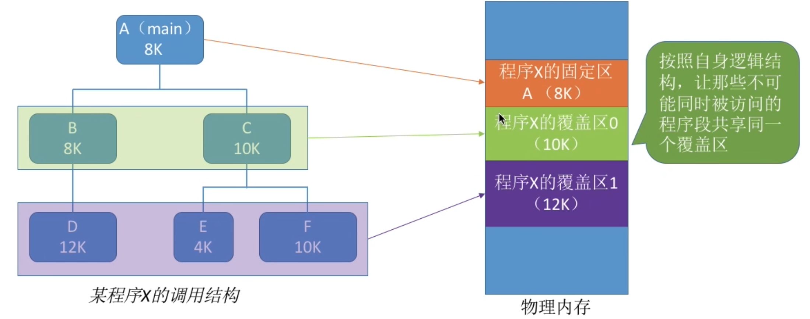
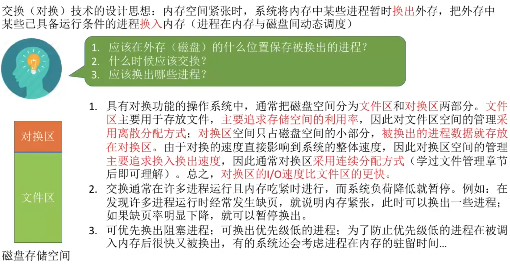
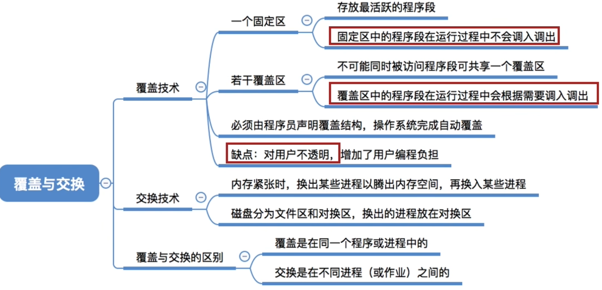

- [覆盖技术](#覆盖技术)
- [交换技术](#交换技术)
- [知识回顾与重要考点](#知识回顾与重要考点)

# 覆盖技术
指的就是`程序大小超过物理内存总和`的问题

覆盖技术的思想: 将程序分为多个段(多个模块)。\
常用的段常驻内存，不常用的段在需要时调入内存。

内存中分为一个固定区和若干个“覆盖区”。

需要常驻内存的段放在“固定区”中，调入后就不再调出（除非运行结束）

- 必须由程序员声明覆盖结构, 操作系统完成自动覆盖。
- 缺点：对用户不透明，增加了用户编程负担。

覆盖技术只用于早期的操作系统中，现在已经成为历史

# 交换技术
设计思想: 内存空间紧张时,系统将内存中某些进程暂时换出外存,把外存中某些已具备运行条件的进程换入内存(进程在内存与磁盘间动态调度)

被换出的进程的`PCB`将会保留在`内存`中,并且进入`挂起队列`。

中级调度(内存调度),就是决定将哪些处于挂起状态的进程重新调入内存。

注意:PCB会常驻内存,不会被换出外存

# 知识回顾与重要考点
