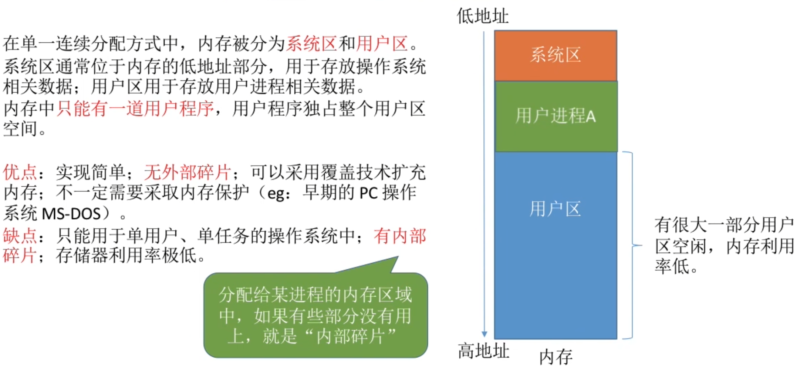
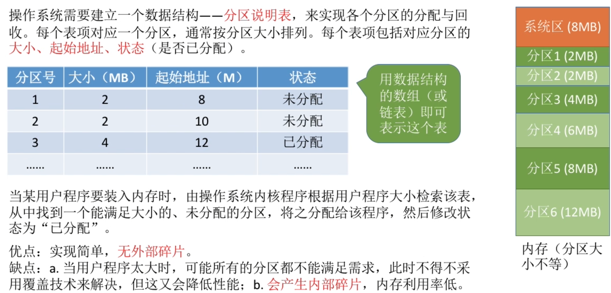
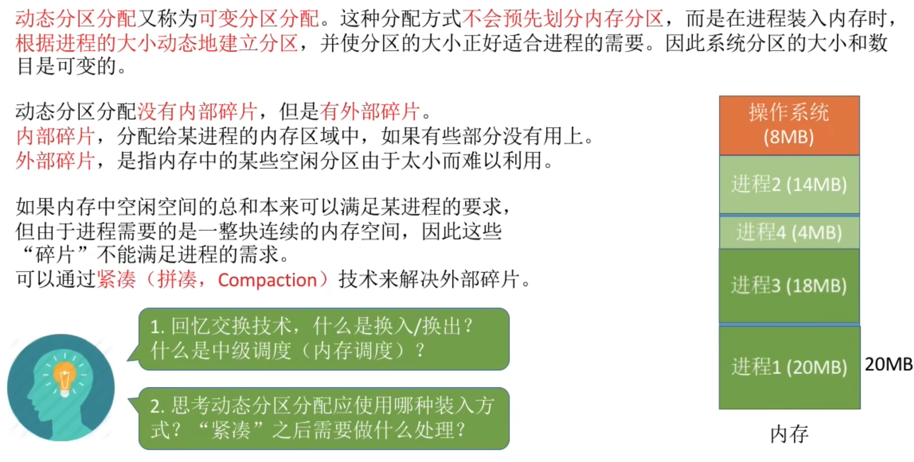
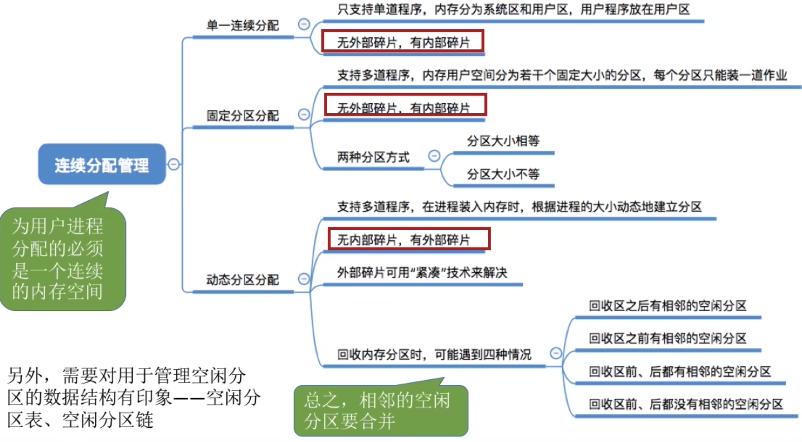

- [单一连续分配](#单一连续分配)
- [固定分区分配](#固定分区分配)
- [动态分区分配](#动态分区分配)
  - [1. 系统要用什么样的数据结构记录内存的使用情况?](#1-系统要用什么样的数据结构记录内存的使用情况)
  - [2. 当有很多个空闲分区都能满足需求时,应该选择哪个分区进行分配?](#2-当有很多个空闲分区都能满足需求时应该选择哪个分区进行分配)
  - [3. 如何进行分区的分配与回收操作?](#3-如何进行分区的分配与回收操作)
- [动态分区分配](#动态分区分配-1)
- [知识回顾与重要考点](#知识回顾与重要考点)

# 单一连续分配
连续分配: 指为用户进程分配的必须是一个连续的`内存空间`

# 固定分区分配
分区大小相等: 缺乏灵活性, 但是很适合用于用一台计算机控制多个相同对象的场合\
分区大小不等: 增加了灵活性, 可以满足不同大小的进程需求。

# 动态分区分配
`动态分区分配`又称为`可变分区分配`。这种分配方式`不会预先划分内存分区`，而是在进程装入内存时，`根据进程的大小动态地建立分区`，并使分区的大小正好适合进程的需要。因此系统分区的大小和数目是可变的。
## 1. 系统要用什么样的数据结构记录内存的使用情况?
- 空闲分区表：每个空闲分区对应一个表项。表项中包含分区号、分区大小、分区起始地址等信息。
- 空闲分区链：每个分区的起始部分和末尾部分分别设置前向指针和后向指针。起始部分处还可记录分区大小等信息。
  
## 2. 当有很多个空闲分区都能满足需求时,应该选择哪个分区进行分配?
把一个新作业装入内存时,需按照一定的动态分区分配算法,从空闲分区表(或空闲分区链)中选出一个分区分配给该作业。由于分配算法对系统性能有着很大的影响，因此人们对它进行了广泛的研究
## 3. 如何进行分区的分配与回收操作?
1. 回收区的后面有一个相邻的空闲分区
2. 回收区的前面有一个相邻的空闲分区
3. 回收区的前、后各有一个相邻的空闲分区
4. 回收区的前、后都没有相邻的空闲分区

# 动态分区分配

# 知识回顾与重要考点
