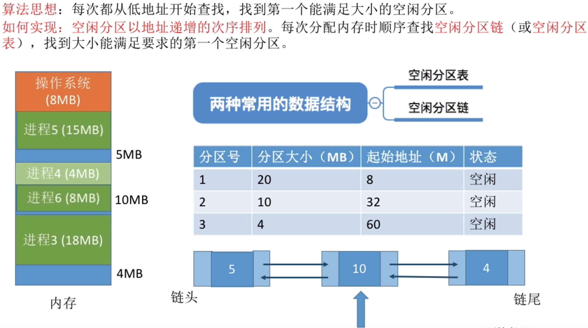
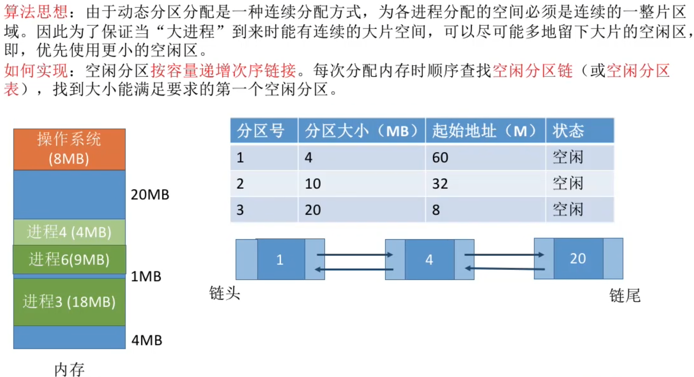
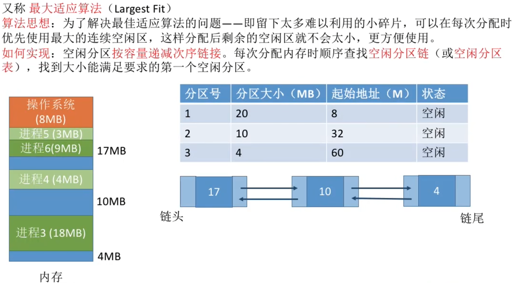
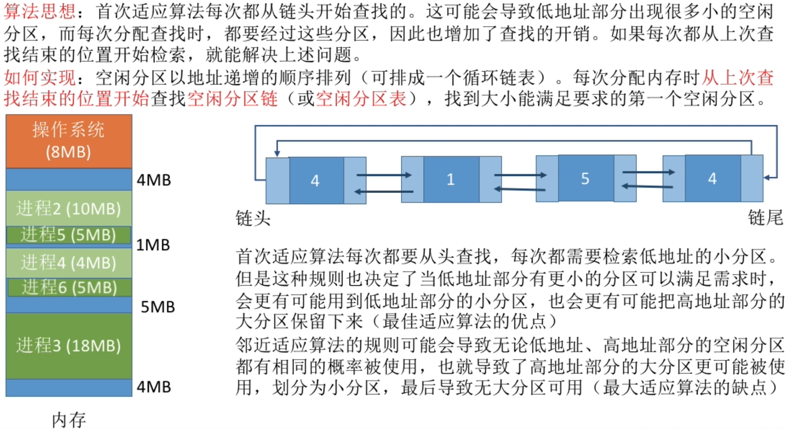
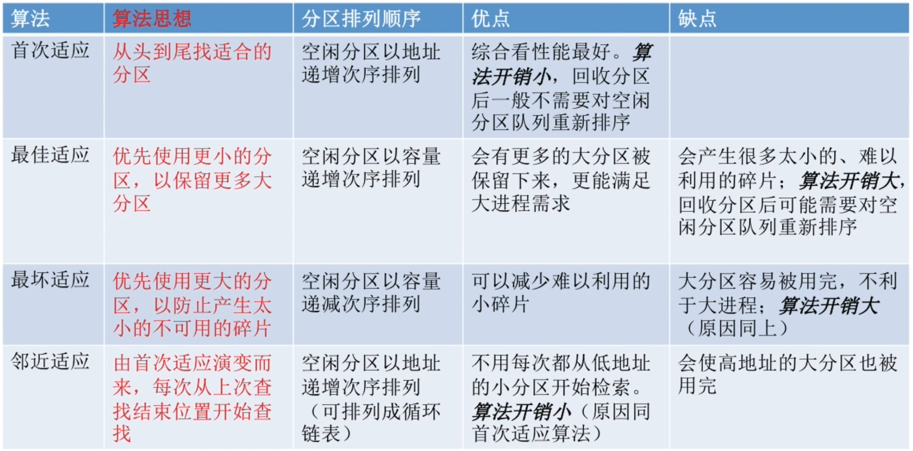

# 首次适应算法

# 最佳适应算法

- 注意是按照递增排序
- 按照顺序找到的第一个符合大小的空间就是最佳空间

**缺点**: 每次都选最小的分区进行匹配，都会留下越来越多的、很小的、难以利用的内存块。因此这种方法会产生很多的外部碎片。

# 最坏适应算法
核心思想：优先使用最大的空闲空间，这样分配后的空闲空间就不会太小，更方便利用。

**缺点**: 每次都选最大的分区进行分配，虽然可以让分配后留下的空闲区更大，更可用，但这种方式会导致较大的连续空闲区被迅速用完。如果之后又“大进程”到达，就没有内存分区可用了。

# 邻近适应算法
**核心思想**：每次都从上次查找结束的位置开始检索，减小查找的开销

采用循环链表存储，这样即使链表的内部数据发生变化，也不用交换链表的内部排序，这样算法的内部开销就很小

- 四种算法中,首次适应算法的效果反而更好

# 知识回顾与重要考点
