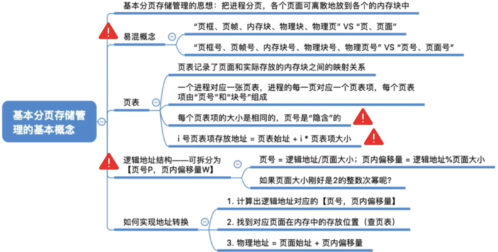

# 什么是分页存储
|名称|含义|
|---|---|
|页框(页帧)|指的是内存在**物理**上被划分为的这样一个一个的部分|
|页(页面)|指的是进程在**逻辑**上被划分为的一个一个部分|

`页框`也可以叫做`内存块、物理块、物理页面`

# 重要的数据结构--页表
操作系统会给每个进程创建一张页表\
这个页表通常存储在PCB(进程控制块)中

一个进程的逻辑地址空间会被划分为一个一个的页表项

## 每个页表项占多少字节?
计算机分配存储空间是以字节为单位分配

- `内存块大小=页面大小=4KB=2^12 B`
- ->4GB的内存总共会被分为`2^32/2^12=2^20`个内存块
- ->内存块号至少要用`20bit`来表示
- ->至少要用`3B`来表示块号`(3*8=24bit)`
- ->由于页号时候隐含的，因此每个页表项占3B，存储整个页表至少需要`3*(n+1)B`

**重点**: 计算机中内存块的数量->页表项中块号至少占多少字节\
因为页表中页表项是连续存放,因此页号可以是隐含的,不占存储空间(类比数组)

**注意**：页表记录的只是内存块号，而不是内存块的起始地址`j号内存块的起始地址=j*内存块大小`
## 如何实现地址的转换

## 如何确定一个逻辑地址对应的页号、页内偏移量
**计算公式**\
`页号=逻辑地址/页面长度(取除法的整数部分)`\
`页内偏移量=逻辑地址%页面长度(取除法的余数部分)`

如果把每个页面大小设置为2的`整数幂`,则`末尾K位`即为`页内偏移量`,其余部分就是`页号`.\
这样的操作可以让计算机硬件更快地把逻辑地址拆分成(页号,页内偏移量)

<h4>页面大小刚好是2的整数幂有什么好处?</h4>

1. 逻辑地址的拆分更加迅速, 前一部分是页号, 后一部分是页内偏移量
2. 物理地址的计算更加迅速--根据逻辑地址得到页号,根据页号查询页表从而找到页面存放的内存块号,将二进制表示的内存块号和页内偏移量拼接起来,就可以得到最终的物理地址. 

## 逻辑地址结构
- 如果有k位表示"页内偏移量",则说明该系统中一个页面的大小是`2^k`各存储单元
- 如果有M位表示"页号",则说明在该系统中,一个进程最多允许有`2^m`各页面

<h3>页面大小<->页内偏移量位数->逻辑地址结构</h3>

# 知识回顾与重要考点
