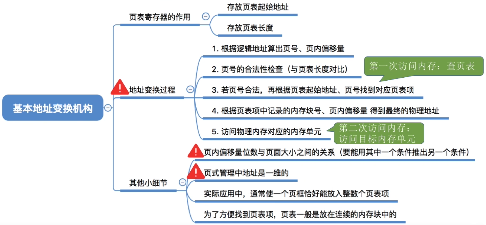

- [基本地址变换机构](#基本地址变换机构)
- [对页表项大小的进一步探讨](#对页表项大小的进一步探讨)
- [知识回顾与重要考点](#知识回顾与重要考点)

重点理解、记忆基本地址变换机构（用于实现逻辑地址到物理地址转换的一组硬件机构）的原理和流程
# 基本地址变换机构
基本地址变换机构可以借助进程的页表将逻辑地址转换为物理地址

通常会在系统中设置一个`页表寄存器`，存放`页表在内存中的起始地址F`和`页表长度M`。

进程未执行时，页表的起始地址和页表长度`放在进程控制块中`，当进程被调度时，操作系统内核会把它们放在页表寄存器中。

**注意**:页面大小是2的整数幂

操作系统对整个计算机软硬件进行管理的一些相关的数据结构,包括进程控制块PCB也是储存在系统区当中的

# 对页表项大小的进一步探讨

# 知识回顾与重要考点
