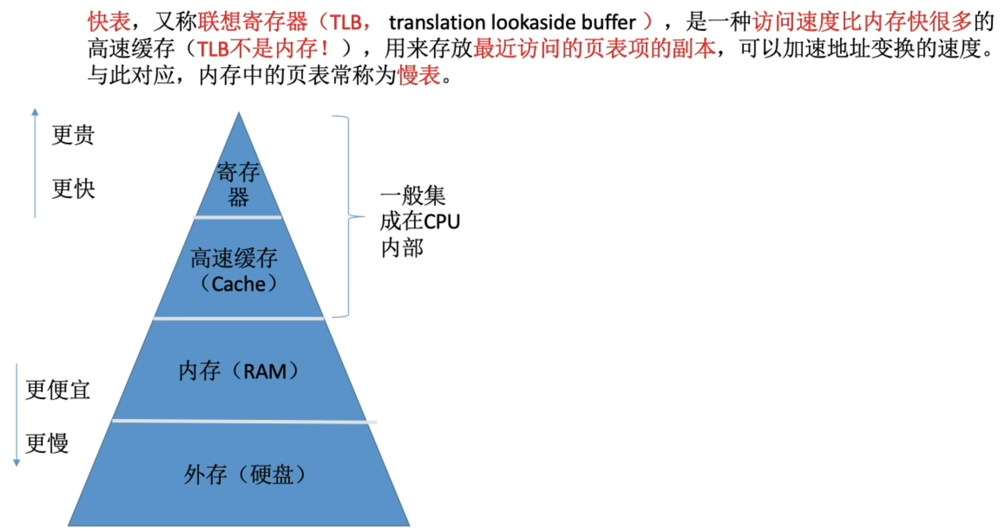
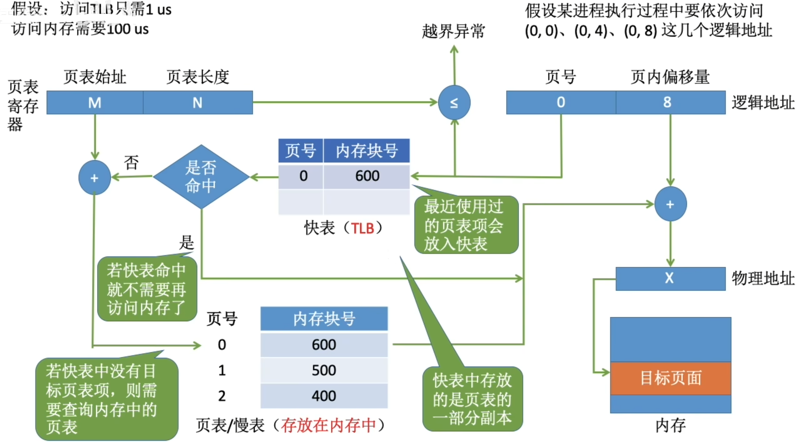
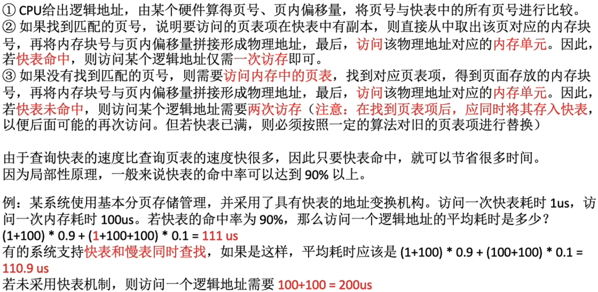
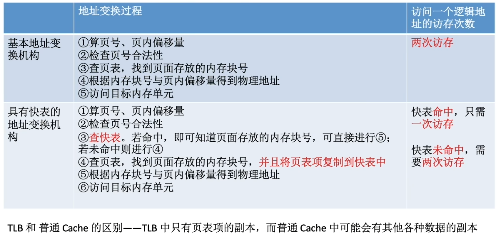

- [什么是快表](#什么是快表)
- [引入快表后,地址的变换过程](#引入快表后地址的变换过程)
- [局部性原理](#局部性原理)
- [知识回顾与重要考点](#知识回顾与重要考点)

# 什么是快表

# 引入快表后,地址的变换过程

# 局部性原理
- **时间局部性**：如果执行了程序中的某种指令，那么不久后这条指令很可能再次执行；如果某种数据被访问过，不久后该数据很可能再次被访问。（因为程序中存在大量的循环）
- **空间局部性**：一旦程序访问了某个存储单元，在不久之后，其附近的存储单元也很可能被访问。（因为很多数据在内存中都是连续存放的）

在**基本地址变换机构**中, 每次要访问一个逻辑地址,都需要**查询内存中的页表**。由于局部性原理，**可能连续很多次查到的都是同一个页表项**。

# 知识回顾与重要考点
