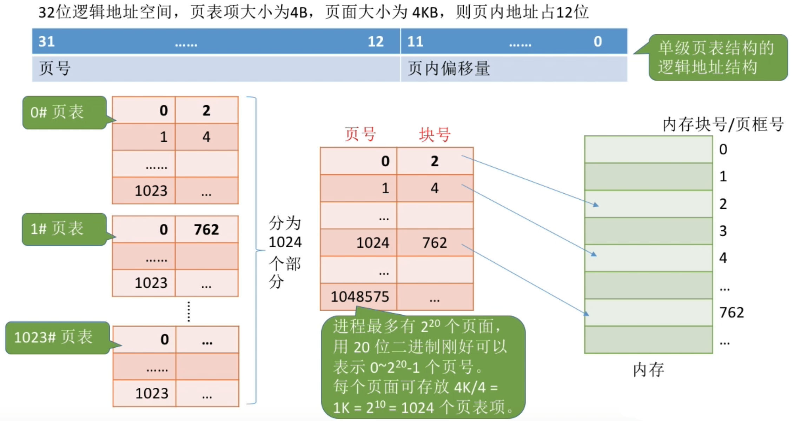
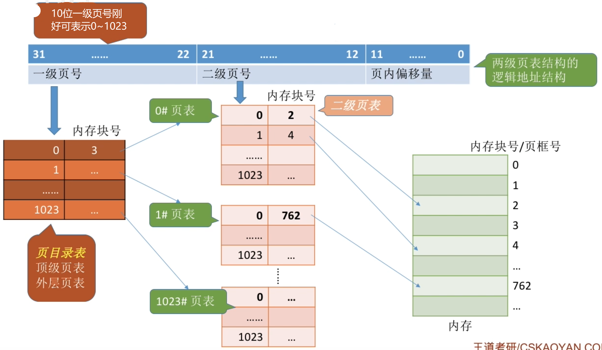
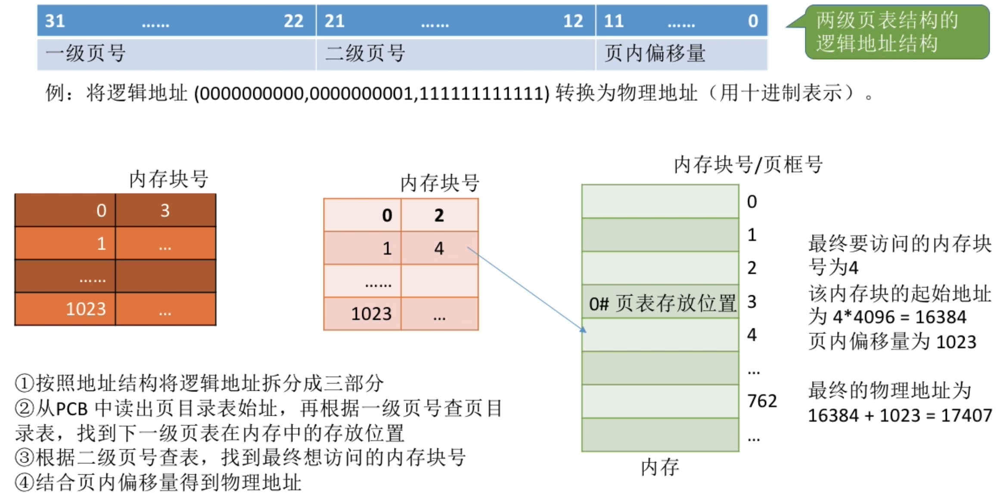
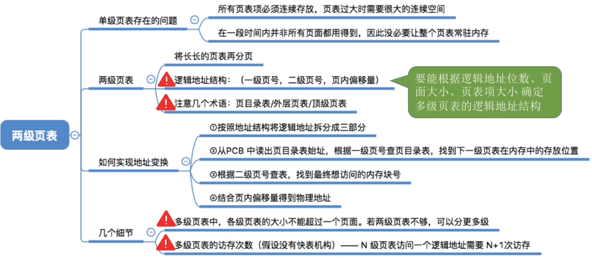

# 单级页表存在的问题
1. 页表必须连续存放,因此当页表很大时,需要占用很多个连续的页框。
2. 没有必要让整个页表常驻内存，因为进程在一段时间内可能只需要访问几个特定的页面。

<h3>上述逻辑图解</h3>

**解析**: `页面`比`页表项`大, 将`页表项`的集合储存进`页面`中, 使得`页表`被划分为很多区域,分别存储进`内存块`中,成为一个`类页表结构`.\
为了记录这些小页表的相对顺序,还有他们在内存当中存放的块号,位置.\
为其创建的上一级的页表成为`页目录表\顶级页表\外层页表`, 下一层的小页表被称为`二级页表`

# 两级页表的原理、地址结构

# 如何实现地址变换

# 如何解决单级页表的问题
可以在需要访问页面时才把页面调入内存(虚拟存储技术)。可以在页表项中增加一个标志位，用于表示该页面是否已经调入内存

若想访问的页面不在内存中，则产生缺页中断（内中断），然后将目标页面从外存调入内存

## 需要注意的几个细节

# 知识回顾与重要考点
