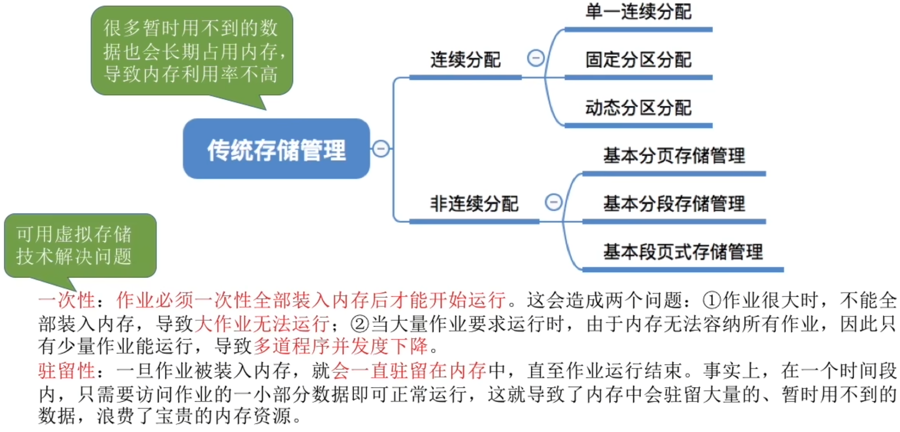
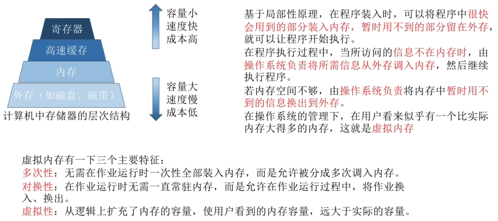
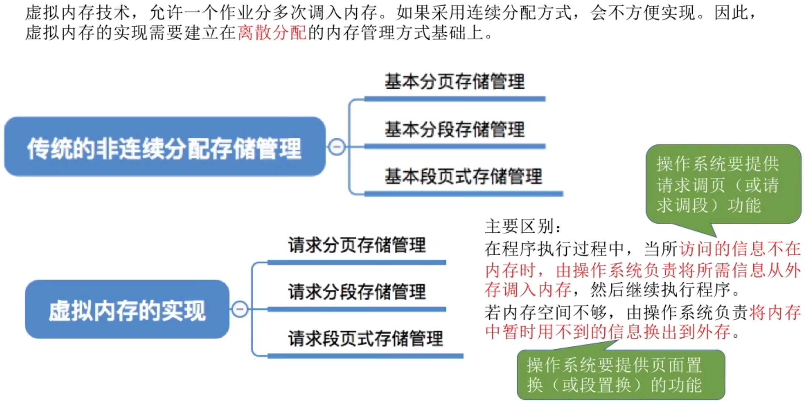
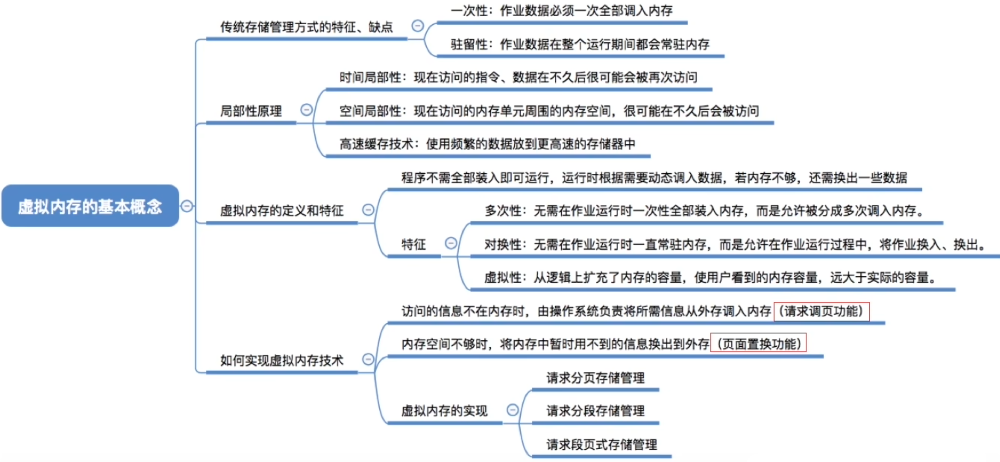

- [传统存储管理方式的特征、缺点](#传统存储管理方式的特征缺点)
- [局部性原理](#局部性原理)
- [虚拟内存的定义和特征](#虚拟内存的定义和特征)
- [如何实现虚拟内存技术](#如何实现虚拟内存技术)
- [知识回顾与重要考点](#知识回顾与重要考点)

# 传统存储管理方式的特征、缺点

# 局部性原理
**时间局部性**：如果执行了程序中的某条指令，那么不久后这条指令很可能再次执行；如果某个数据被访问过，不久之后该数据很可能再次被访问。（因为程序中存在大量的循环）\
**空间局部性**：一旦程序访问了某个存储单元，在不久之后，其附近的存储单元也很有可能被访问。（因为很多数据在内存中都是连续访问的，并且程序的指令也是顺序地在内存中存放的）
# 虚拟内存的定义和特征

# 如何实现虚拟内存技术

# 知识回顾与重要考点
