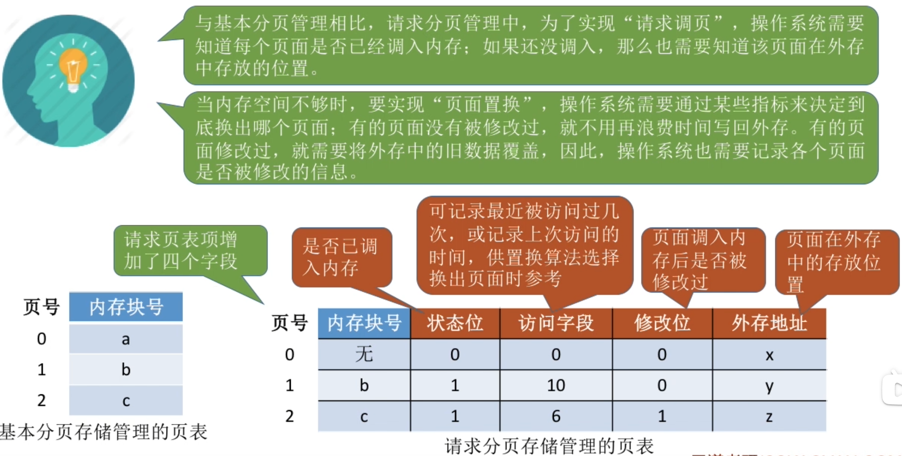
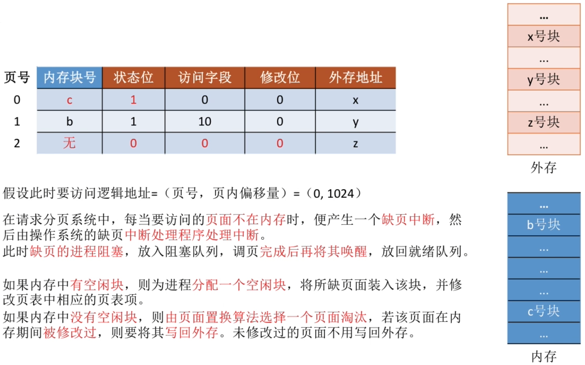
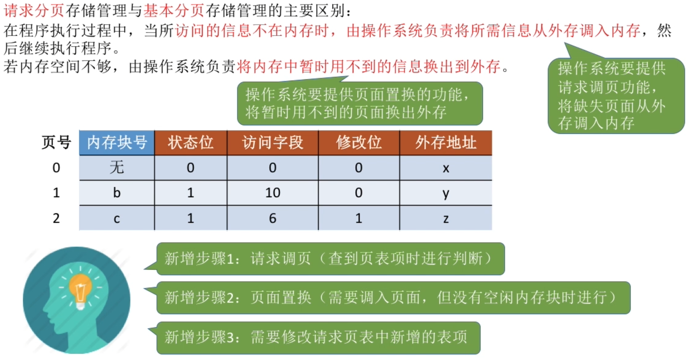
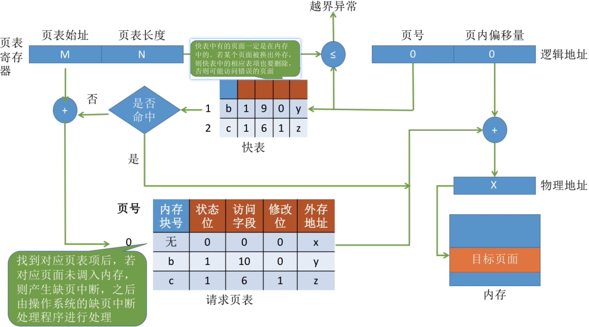
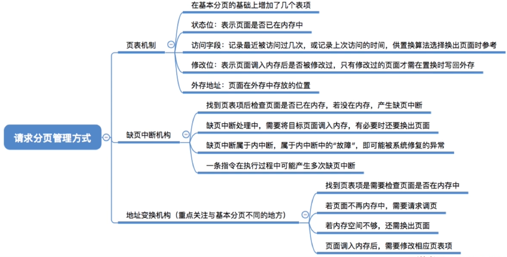

- [页表机制](#页表机制)
- [缺页中断机构](#缺页中断机构)
- [地址变换机构](#地址变换机构)
    - [细节](#细节)
- [知识回顾与重要考点](#知识回顾与重要考点)

## 请求分页与基本分页管理的主要区别
在程序执行过程中,当所<mark>访问的信息不在内存时，由操作系统负责将所需信息从外存调入内存</mark>，然后继续执行程序。\
若内存空间不够，由操作系统<mark>将内存中暂时用不到的信息换出外存</mark>。
|内容|作用|
|---|---|
|页面置换|将暂时用不到的页面换出外存|
|请求调页|将缺失页面从外存调入内存|
# 页表机制

# 缺页中断机构

<mark>缺页中断</mark>是因为当前执行的指令想要访问的目标页面未调入内存而产生的,因此<mark>属于内中断</mark>\
<mark>一条指令</mark>在执行期间，<mark>可能产生多次缺页中断。</mark>（如：copy A to B，即将逻辑地址A中的数据复制到逻辑地址B，而A、B属于不同的页面，则可能产生两次中断）

# 地址变换机构

### 细节
1. 只有“写指令”才需要修改“修改位”。并且，一般来说只需要修改快表中的数据，只有要将快表项删除时才需要写回内存中的慢表。这样可以减少访问次数。
2. 和普通的中断处理一样，缺页中断处理任然需要保留CPU现场。
3. 需要用某种“页面置换算法”来决定一个换出页面。
4. 换入/换出页面都需要启动慢速的I/O操作，可见，如果换入/换出操作太频繁，会有很大的开销。
5. 页面调入内存后,需要修改慢表，同时也需要将表项复制到快表中。
   1. 在具有快表机构的请求分页系统中，访问一个逻辑地址时，若发生缺页，则地址变换步骤是：$查快表(未命中)--查慢表(发现未调入内存)--调页(调入的页面对应的表项会直接加入快表)--查页表(命中)--访问目标内存单元$

# 知识回顾与重要考点
