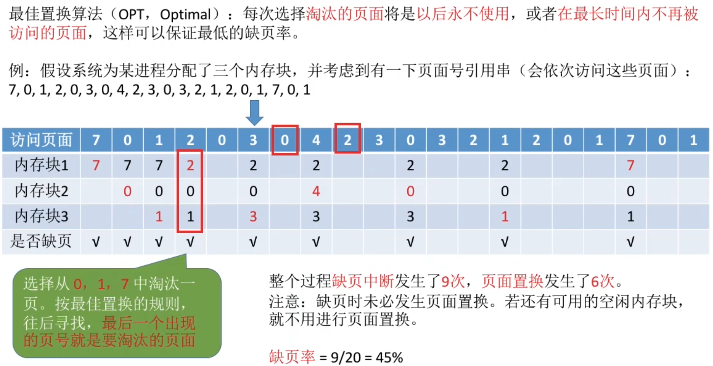
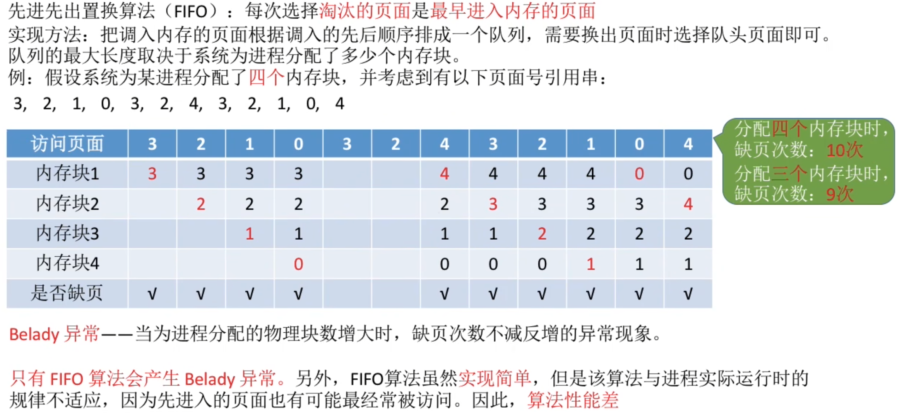
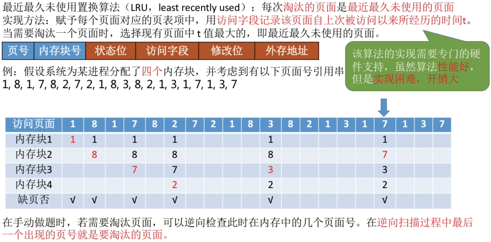
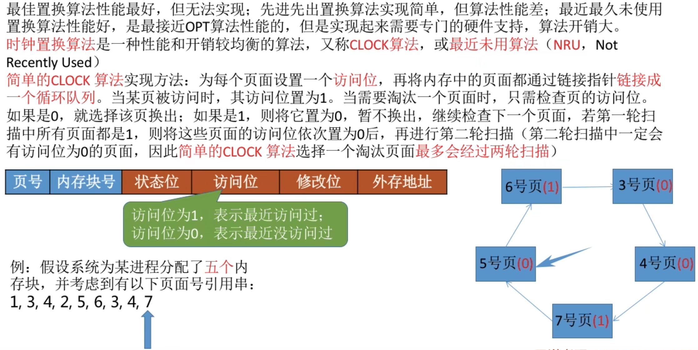
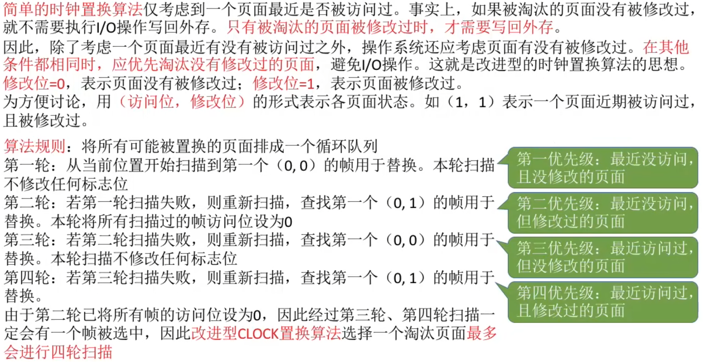
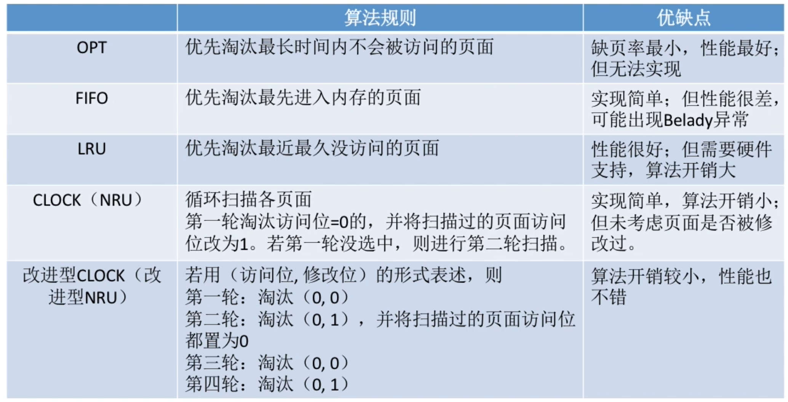

# 知识总览
<mark>请求分页</mark>存储管理与<mark>基本分页</mark>存储管理的主要区别:\
在程序执行过程中,当所<mark>访问的信息不在内存时,由操作系统负责将所需信息从外存调入内存</mark>,然后继续执行程序.\
若内存空间不够,由操作系统负责<mark>将内存中暂时用不到的信息换出外存。</mark>(用页面置换算法决定应该换出哪个页面)

页面的换入、换出需要磁盘IO，会有较大的开销，因此好的页面置换算法应该最求最少得缺页率。

# 最佳置换算法（OPT）

最佳置换算法可以保证最低的缺页率,但实际上,只有进程执行的过程中才能知道接下来会访问到的会死哪个界面。操作系统无法提前预判界面访问序列。因此，<mark>最佳置换算法是无法实现的。</mark>

# 先进先出置换算法(FIFO)

# 最近最久未使用置换算法(LRU)

# 时钟置换算法(CLOCK)

## 改进型的时钟置换算法
<mark>只有被修改过数据的页面需要执行IO操作写回外存</mark>

# 知识回顾与重要考点
