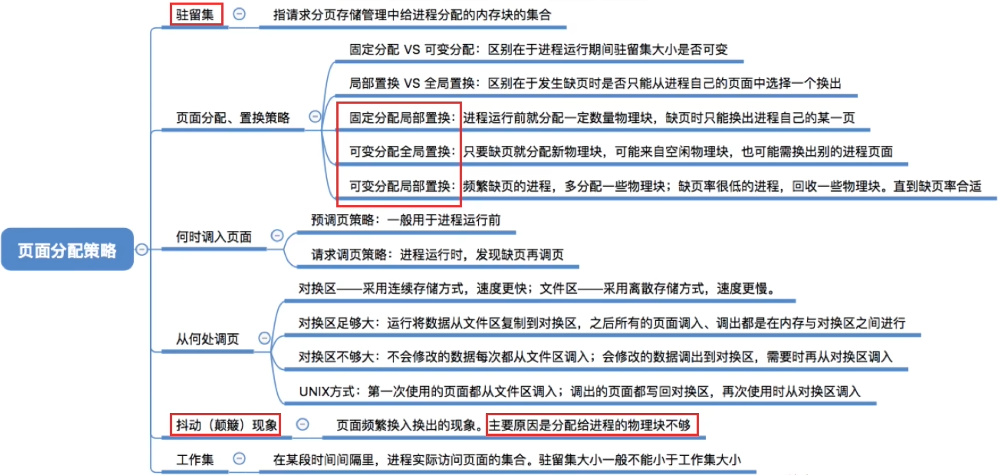

# 页面分配、置换策略
**驻留集**：指请求分页存储管理中给进程分配的物理块的集合。\
在采用了虚拟存储技术的系统中，驻留集大小一般**小于**进程的总大小。\
若驻留集太小，会导致缺页频繁，系统要花费大量的时间来处理缺页，实际用于进程推进的时间很少；\
驻留集太大，又会导致多道程序并发度下降，资源利用率降低。所以应该选择一个合适的驻留集大小。

针对上述内容,系统给驻留集分配了两种选择策略
1. **固定分配**：操作系统为每个进程分配一组固定数目的物理块，在进程运行期间不再改变。即，<mark>驻留集大小不变。</mark>
2. **可变分配**：先为每个进程分配一定数目的物理块，在进程运行期间，可根据情况做适当的增加或减少。即，<mark>驻留集大小可变。</mark>

两种置换策略
1. **局部置换**：发生缺页时只能选进程自己的物理块进行置换。
2. **全局置换**：可以将操作系统保留的空闲物理块分配给缺页进程，也可以将别的进程持有的物理块置换到外存，再分配给缺页进程。

||局部置换|全局置换|
|:---:|:---:|:---:|
|固定分配|√|-|
|可变分配|√|√|

全局置换意味着一个进程拥有的物理块数量必然会改变,因此不可能是固定分配

# 页面分配、置换策略

# 何时调入页面
1. **预调页策略**：根据局部性原理，一次调入若干个相邻的页面可能比一次调入一个页面更高效。单如果提前调入的页面中大多数都没被访问过，则又是低效的。因此可以预测不就之后可能访问到的页面，将它们预先调入内存，但目前预测成功率只有50%左右。故这种策略<mark>主要用于进程的首次调入</mark>，由程序员指出应该先调入哪些部分。
2. **请求调页策略**：进程<mark>在运行期间发现缺页时才将所缺页面调入内存</mark>。由这种策略调入的页面一定会被访问到，但由于每次只能调入一页，而每次调页都要IO操作，因此IO开销较大。

**进程的首次调入**一般是`在运行前调入`\
**在运行期间发生缺页时才将所缺页面调入内存的操作**在`运行时调入`

**空间局部性**: 如果当前访问了某个内存单元,在之后很有可能会接着访问与其相邻的那些内存单元.

# 从何处调入页面

# 抖动(颠簸)现象
刚刚换出的页面马上又要换入内存，刚刚换入的页面马上又要换出外存，这种频繁的页面调入行为称为<mark>抖动</mark>，或<mark>颠簸</mark>。产生抖动的<mark>主要原因</mark>是进程频繁访问的页面数目高于可用的物理块数（<mark>分配给进程的物理块不够</mark>）

由此推出了“工作集”的概念以此来减少抖动现象的产生

# 工作集

# 知识回顾与重要考点
