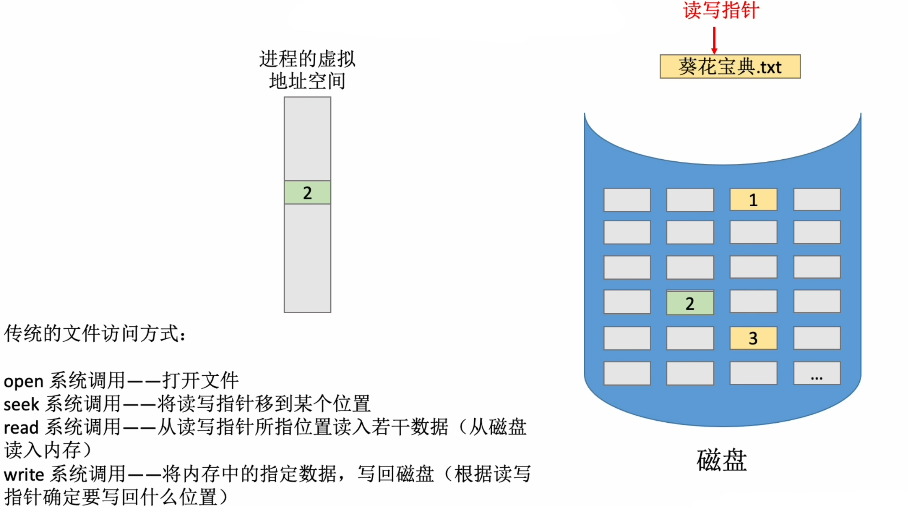
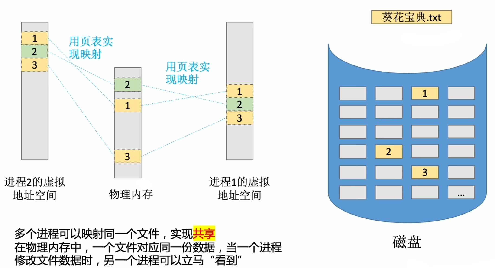

# 什么是内存映射文件?
内存映射文件--操作系统向上程序提供的功能(系统调用)
- 方便程序员访问文件数据
- 方便多个进程共享一个文件

# 传统的文件访问方式

# 内存映射文件
内存映射文件的访问方式:\
open系统调用--打开文件\
mmap系统调用--将文件映射到进程的虚拟地址空间
- 以访问内存的方式访问文件数据
- 文件数据的读入、写出有操作系统自动完成
- 进程关闭文件时，操作系统自动将文件被修改的数据写回磁盘

# 知识回顾
