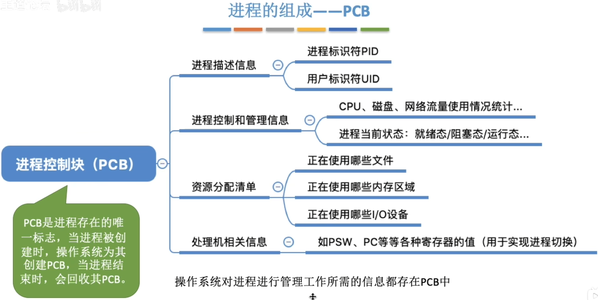
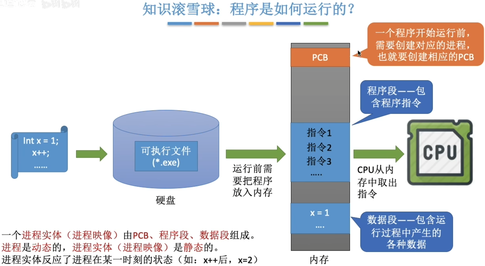
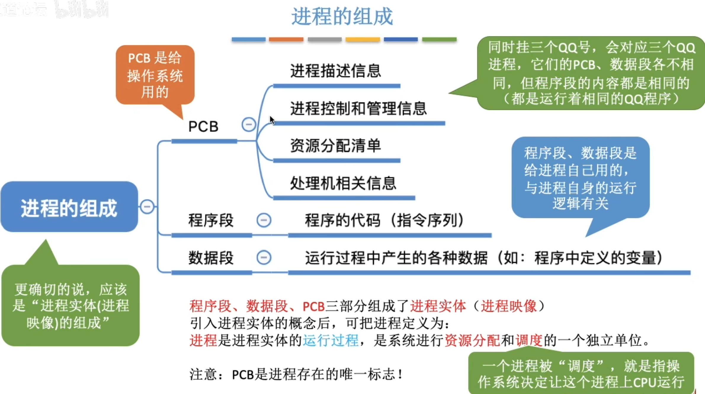
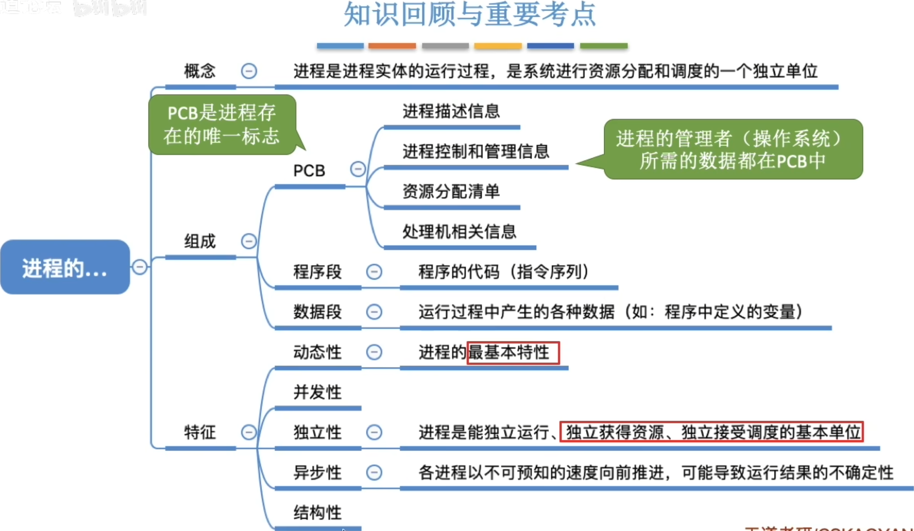

- [进程的概念](#进程的概念)
- [程序是如何运行的?](#程序是如何运行的)
- [知识回顾和重要考点](#知识回顾和重要考点)

# 进程的概念
- 程序: 是**静态的**,就是存放在磁盘里的可执行文件,就是一系列的指令集合
- 进程: 是**动态的**,是程序的一次执行过程`一次程序多次执行会对应多个进程`

问题:**操作系统是怎么区分这些进程的**?\
当进程被创建时,操作系统会为该进程分配一个**唯一的、不重复**的“身份证号”--**PID**（Process ID，进程ID）

    每次进程都会创建一个唯一的PID
    
    记录进程的各种信息: 分配多少内存,正在使用的IO设备,正在使用的文件
    这些信息被保存在一个数据结构PCB中, 即进程控制块
    操作系统需要对各个并发运行的进程进行管理,但凡管理时所需要的信息, 都会存放在PCB中

# 程序是如何运行的?
一个**进程实体(进程映像)**由**PCB,程序段,数据段**组成\
**进程**是**动态**的,**进程实体(进程映像)**是**静态**的`进程是动态的,进程映像可以理解为进程的某一时刻的快照`

- PCB是进程存在的唯一标志
- 进程的管理者`操作系统`所需要的数据都在PCB中
- 进程的**动态性**是它**最基本的特征**
- 进程是`独立获得资源的基本单位`

# 知识回顾和重要考点
