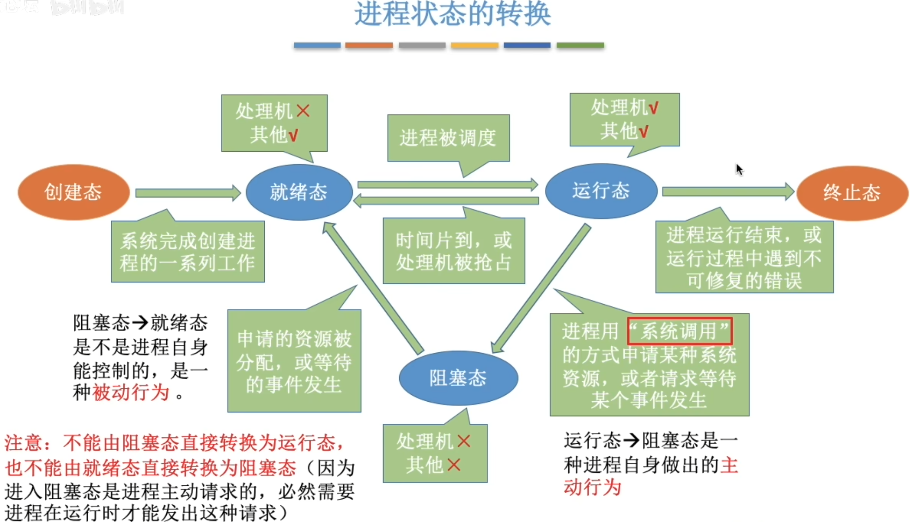
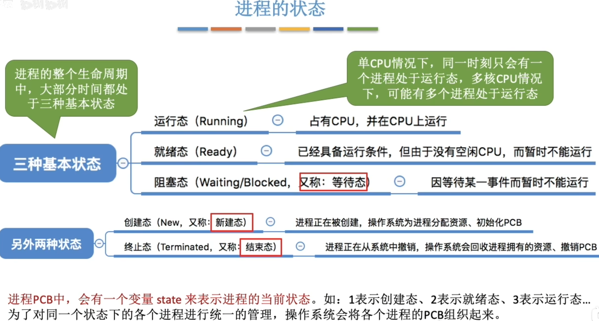
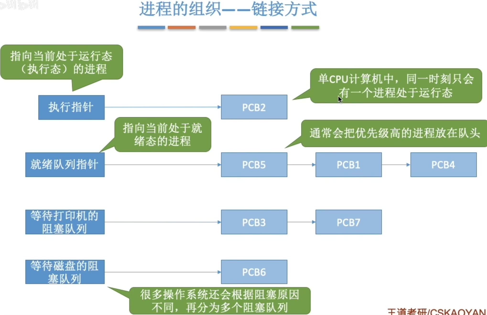
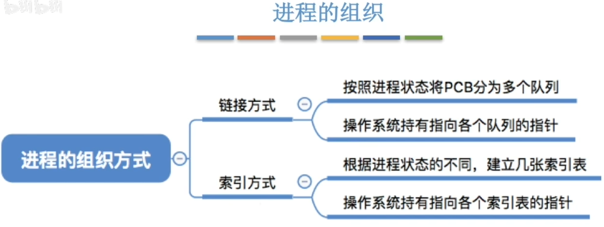
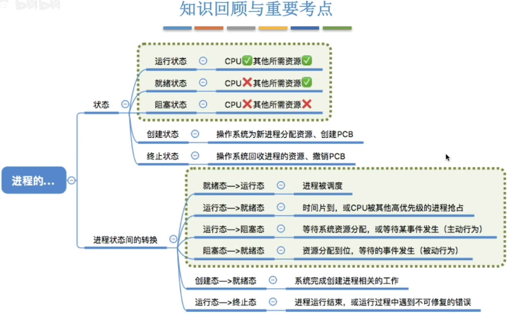

- [进程的状态--创建态、就绪态](#进程的状态--创建态就绪态)
- [进程的状态--运行态](#进程的状态--运行态)
- [进程的状态--阻塞态](#进程的状态--阻塞态)
- [进程的状态--终止态](#进程的状态--终止态)
- [进程状态的转换](#进程状态的转换)
- [进程的状态](#进程的状态)
  - [进程的组织--链接方式](#进程的组织--链接方式)
  - [进程的组织](#进程的组织)
- [知识回顾和考点](#知识回顾和考点)

# 进程的状态--创建态、就绪态
    将可执行程序调入内存，系统会为他创建相应的PCB，也就是进程。在创建的过程，它的状态就是“创建态”，在这个阶段操作系统会为进程分配资源、初始化PCB
    当程序创建成功后，便进入“就绪态”，处于就绪态的进程已经具备运行条件，但由于没有空闲cpu，就暂不执行
# 进程的状态--运行态
    当cpu空闲时，操作系统就会选择一个就绪进程让他上处理机运行

当一个进程运行的时候，这个进程的状态就是运行态
# 进程的状态--阻塞态
在进程运行的过程中，可能会`请求等待某个事件的发生`（如等待某种系统资源的分配，或者等待其他进程的响应）\
在这个事件发生之前,进程无法往下执行,此时操作系统会让这个进程下CPU,并让它进入"`阻塞态`"\
当CPU空闲时,又会选择另一个"就绪态"进程上CPU运行

当之前请求的系统资源空闲下来后,就会分配给之前请求的进程,该进程就会由`阻塞态`转换为`就绪态`

# 进程的状态--终止态
一个进程在运行结束后,
会执行一个exit系统调用,
请求操作系统终止该进程.
此时该进程会进入`终止态`,操作系统会让该进程下CPU,
并回收内存空间等资源,最后还要回收该进程的PCB\
当终止进程的工作完成后,这个进程就彻底消失了

# 进程状态的转换

# 进程的状态

## 进程的组织--链接方式

## 进程的组织

# 知识回顾和考点
