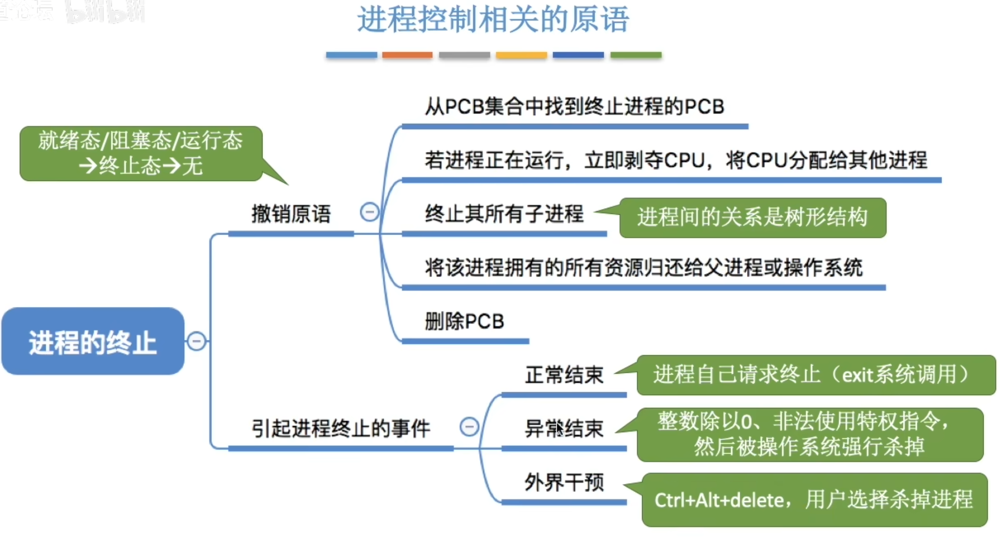
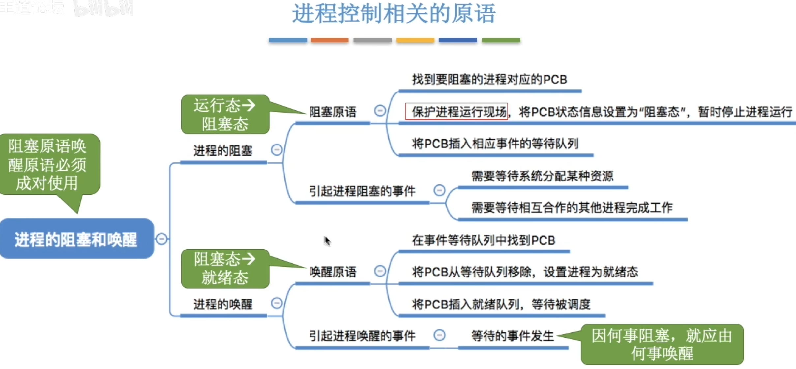
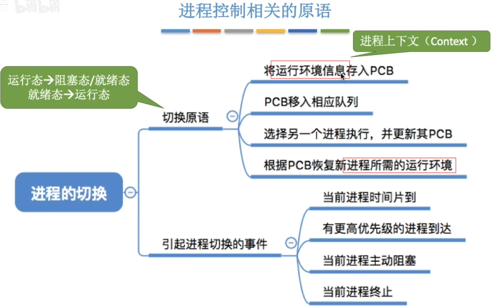
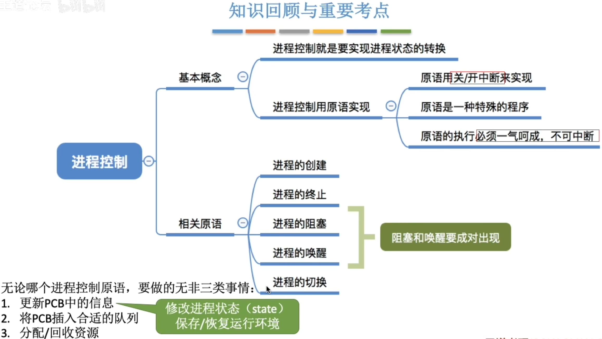

- [什么是进程控制?](#什么是进程控制)
  - [如何实现进程控制](#如何实现进程控制)
  - [如何实现原语的"原子性"](#如何实现原语的原子性)
- [进程控制考点](#进程控制考点)

# 什么是进程控制?
就是要实现进程状态转换
## 如何实现进程控制
使用原语\
"原语"具有一气呵成,不可被打断的特性\
一个进程由阻塞态转换成就绪态的过程中不可被打断,不然就会出现操作系统中某些关键数据结构信息不统一的情况\
使用`原语`来实现进程的转换可以避免出现问题
## 如何实现原语的"原子性"
`原语`的执行具有`原子性`,即执行过程只能一气呵成, 期间`不允许被中断`\
可以用"`关中断`指令" 和 "`开中断`指令" 这两个`特权指令`实现`原子性`

- CPU没执行一条指令之后,都会检查是否有中断信号需要处理
- CPU执行了`关中断指令`之后,就不再例行检查中断信号,直到执行`开中断指令`之后才会恢复检查.

# 进程控制考点
