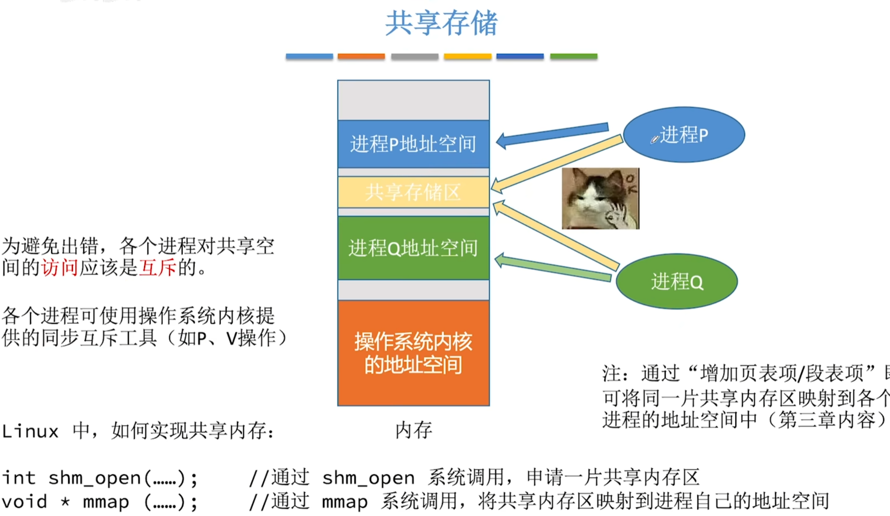
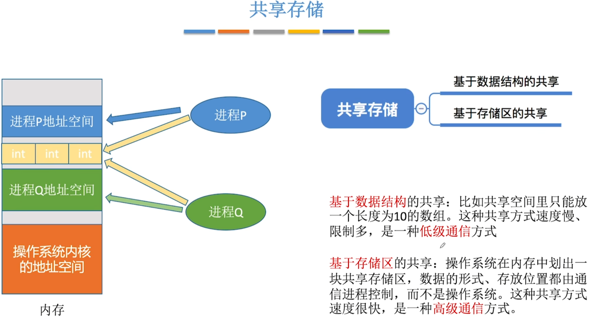
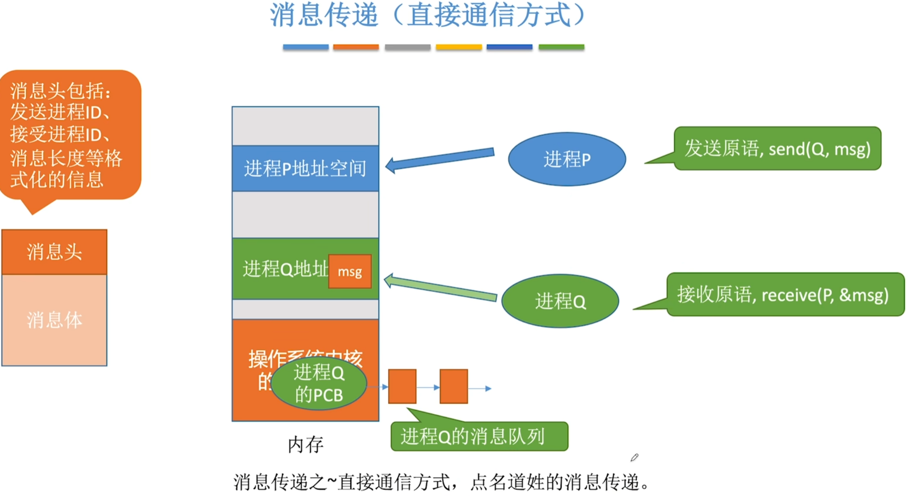
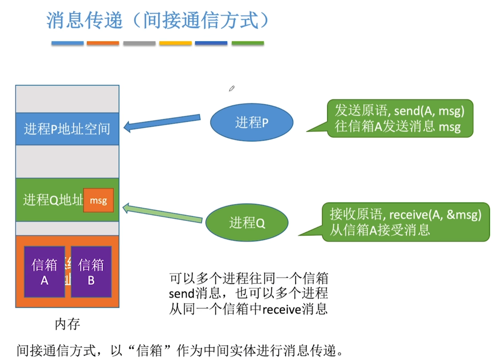
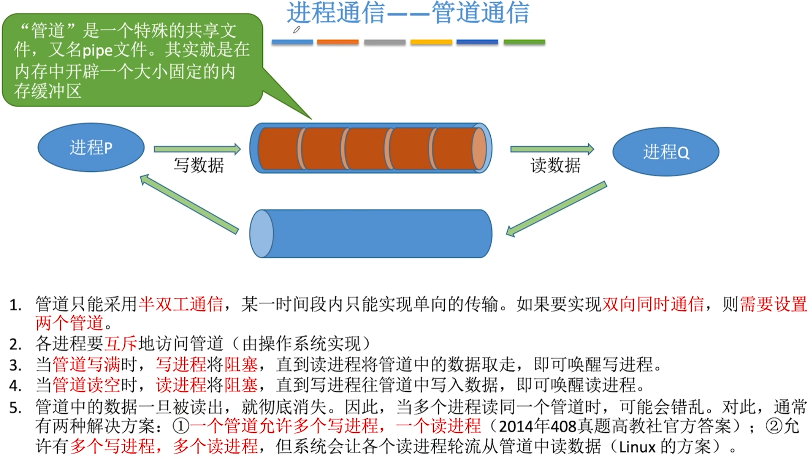
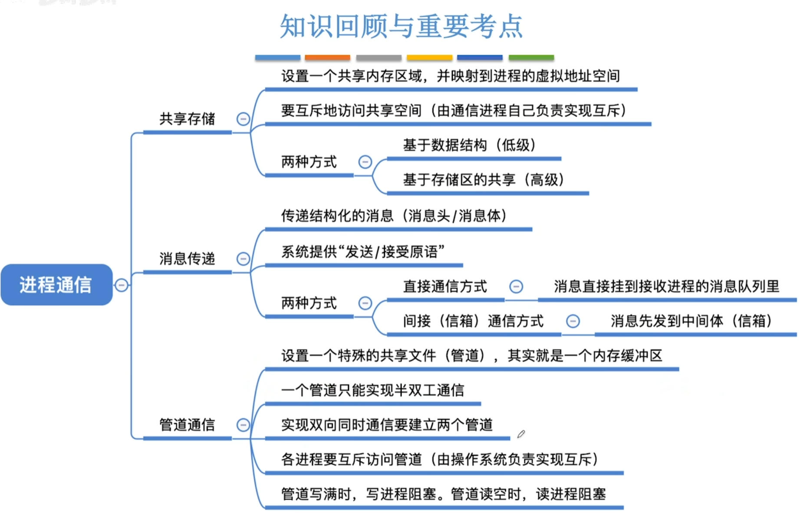

- [共享存储](#共享存储)
- [消息传递](#消息传递)
  - [消息为单位的结构](#消息为单位的结构)
  - [消息传递(直接通信方式)](#消息传递直接通信方式)
  - [消息传递(间接通信方式)](#消息传递间接通信方式)
  - [进程通信--管道通信](#进程通信--管道通信)
- [知识回顾与重要考点](#知识回顾与重要考点)

## 什么是进程间通信?
进程间通信是指两个进程之间产生数据交互

# 共享存储
1. 如果两进程想要通信,就由其中一个进程通过系统调用,申请一片共享内存区
2. 两个进程a和b都需要使用mmap系统调用,将共享内存区映射到进程自己的地址空间\
   进程通过调用mmap系统调用,进程的页表或者段表项就会增加一项,这个页面或者这个段可以映射到刚才申请的这片共享存储区,这样两个进程都包含了这个共享存储区

# 消息传递
进程间的数据交换以**格式化的消息**为单位.进程通过操作系统提供的"发送消息/接收消息"两个**原语**进行数据交换.
## 消息为单位的结构

## 消息传递(直接通信方式)

## 消息传递(间接通信方式)

## 进程通信--管道通信

写进程往管道写数据,即便管道没被写满,**只要管道没空,读进程就可以从管道读数据**\
读进程从管道读数据,即便管道没被读空,**只要管道没满,写进程就可以往管道写数据**

# 知识回顾与重要考点
