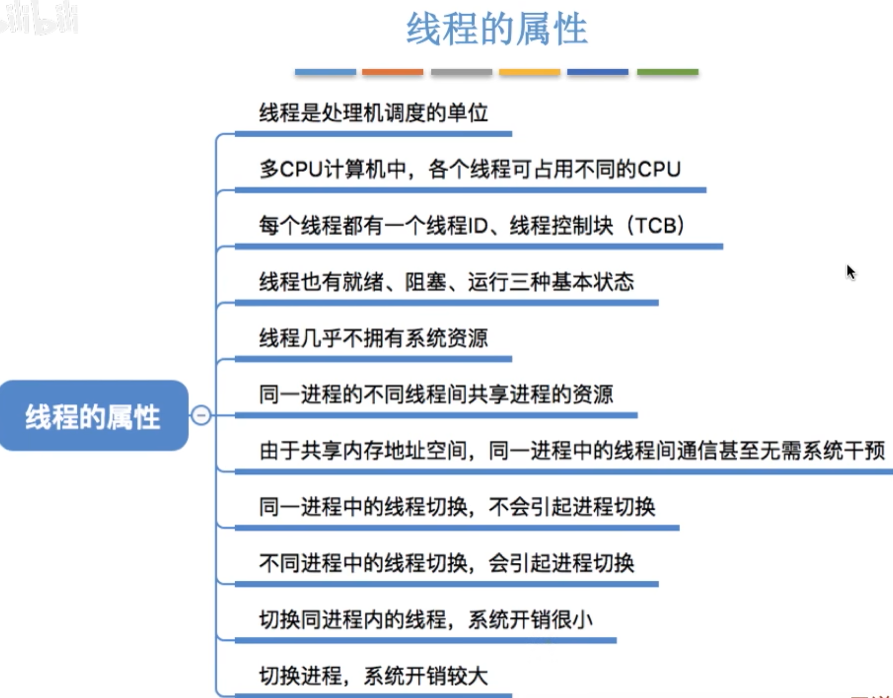

- [线程](#线程)
- [线程的属性](#线程的属性)

# 线程
为什么要引用线程?\
因为有的进程可能需要"同时"做很多事,而传统的进程只能串行地执行一系列程序.为此,引用"线程"来增加并发度

`传统的进程是程序执行流的最小单位`\
`引用线程后,线程就成了程序执行流的最小单位`一个进程中存在多个线程, CPU经过算法给每个线程分配时间\
引用线程后,不仅进程之间可以并发执行,进程中的**各线程之间**也可以并发, 从而进一步**提高了系统的并发度**,使得一个进程内也可以并发处理各种任务

引入线程后, **进程**只作为**除CPU之外的系统资源的分配单元**\
比如打印机,内存地址空间都是直接分配给进程,而不会分配给线程

# 线程的属性
