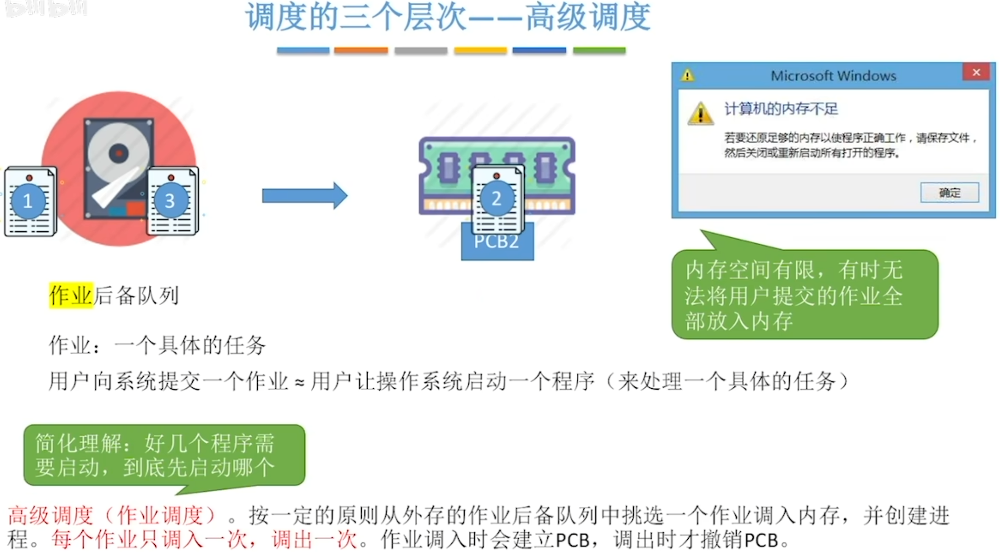
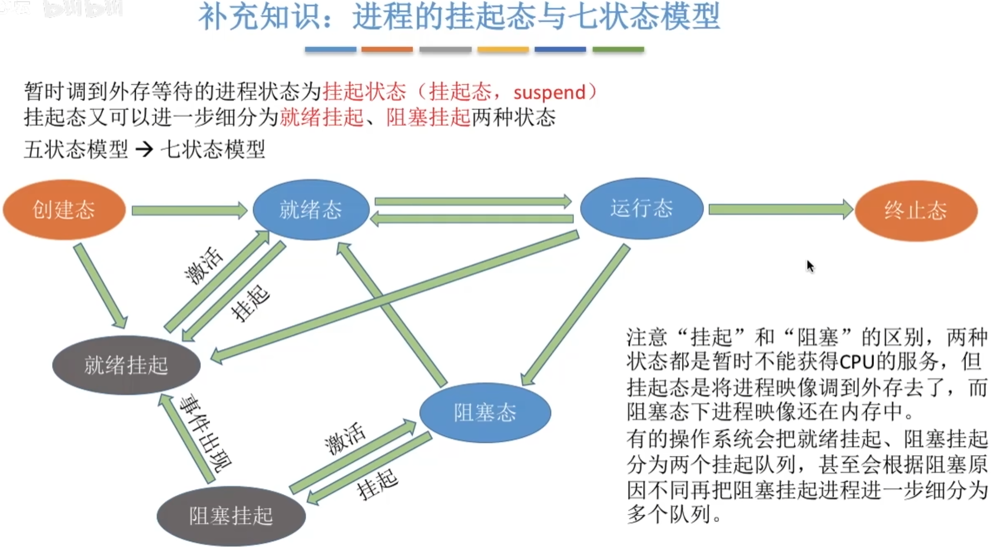
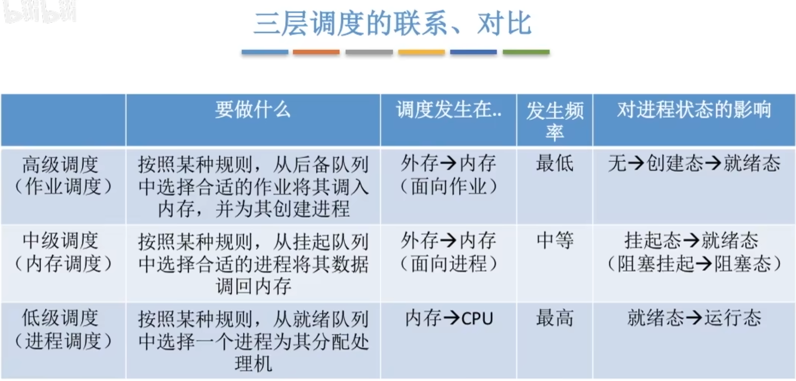
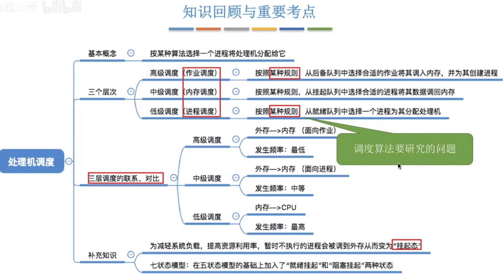

## 调度的基本概念
当有一堆任务要处理,但由于资源有限,这些事情没办法同时处理.
就需要确定**某些规则**来**决定**处理这些任务的顺序,这就是"调度"研究的问题

# 高级调度

# 低级调度
    按照某种策略, 使CPU从就绪队列选取一个进程, 将处理机分配给他

    低级调度(进程调度/处理机调度)是操作系统中 最基本的一种调度, 在一般的操作系统中都必须配置进程调度.
    进程调度的 频率很高, 一般几十毫秒一次

# 中级调度
内存不够时, 可将某些进程的数据调出外存. 等内存空闲或者进程需要运行时再重新调入内存.\
暂时调到外存等待的进程状态为**挂起状态**. 被挂起的进程PCB会被组织成**挂起队列**\
`中级调度(内存调度)`--按照某种策略决定将哪些处于挂起状态的进程重新调入内存\
一个进程可能会被多次调出、调入内存，因此**中级调度**发生的**频率**要比高级调度**更高**

# 进程的挂起态与七状态模型
如果内存空间不够，就会使就绪态的进程暂时挂起到**外存**，一直到内存空间空闲，或者这个进程急需执行，就会激活这个进程`将他的数据重新挪回内存当中`

相应的,`阻塞态`的进程执行相同的`就绪态`的进程挂起流程\
如果`阻塞挂起`的进程发生等待事件,就会从`阻塞挂起`转换成`就绪挂起`的状态,如果被激活就直接变成`就绪态`回到内存

有的时候`运行态`的进程运行结束的时候,可能会直接进入外存,变为`就绪挂起`的状态\
有的时候`创建态`创建完进程后,有可能发生内存空间不足的情况, 这个时候进程直接进入外存变为`就绪挂起`的状态

# 三种调度的联系、对比

# 考点回顾和知识总结
