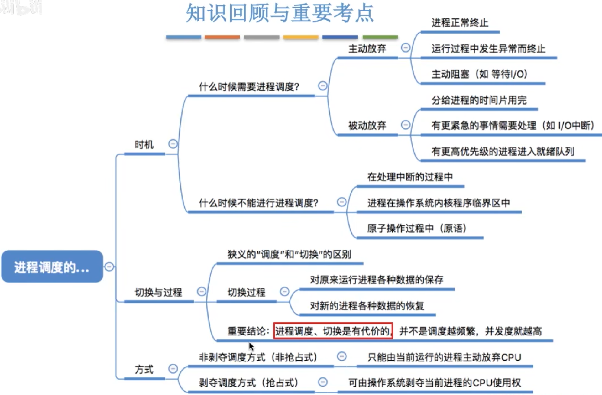

# 进程调度的时机
**进程调度**(低级调度),就是按照某种算法从就绪队列中选择一个进程为其分配处理机

    如果一个程序处于内核程序临界区,并且这个临界区他要访问就绪队列,在访问之后就会把这个就绪队列上锁,如果没有退出就绪队列,就不会解锁.
    此时进行进程调度相关的程序肯定是需要访问就绪队列这个临界资源的
    因为他需要进入就绪队列挑选进程,但是此时处于上锁状态,所以不能进行调度和切换

    如果访问普通的临界区的话,进程一直处于临界区内,临界资源不会解锁,此时应该不限制操作系统内核程序临界区的访问
    
    
- 进程在**操作系统内核程序临界区**中**不能**进行调度和切换`√`
- 进程处于**临界区**时**不能**进行处理机调度`×`

# 进程调度的方式
- 非剥夺调度方式,又称非抢占方式。即，只允许进程主动放弃处理机。在运行过程中即便有更紧迫的任务到达，当前进程依然会继续使用处理机，知道该进程终止或主动要求进入阻塞态。`实现简单,系统开销小但是无法及时处理紧急任务,适合于早期的批处理系统`
- 剥夺调度方式，又称抢占方式。当一个进程正在处理机上执行时，如果有一个更重要或更紧迫的进程需要使用处理机，则立即暂停正在执行的过程，将处理机分配给更重要紧迫的那个进程。`可以优先处理更紧急的进程,也可以实现让各进程按时间片轮流执行的功能(通过时钟中断).适合于分时操作系统、实时操作系统`

### 广义，狭义的进程调度
- 狭义的进程调度指的是从就绪队列中选中一个要运行的进程。（这个进程可以时刚刚被暂停执行的进程，也可能是另一个进程，后一种情况就需要进程切换）
- 进程切换是指一个进程让出处理机，由另一个进程占用处理机的过程。
- 广义的进程调度包含了选择一个进程和进程切换两个步骤。

进程切换的过程主要完成了：
1. 对原来运行进程各种数据的保存
2. 对新的进程各种数据的恢复

进程的切换是有代价的,因此如果进行进程调度,切换频繁的话,会使整个系统的效率降低

# 知识回顾与重要考点
