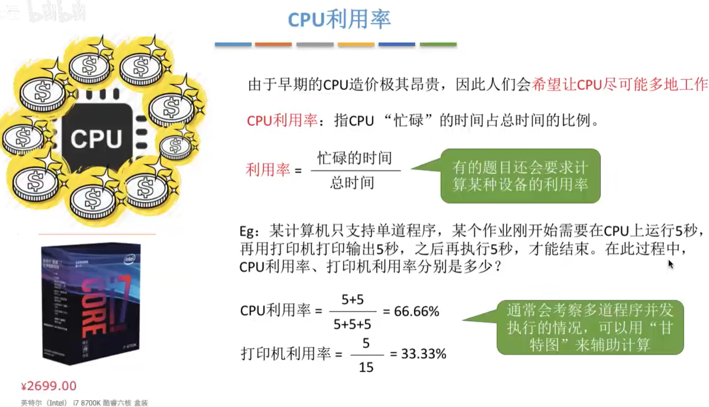
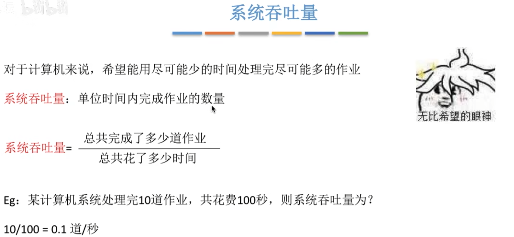
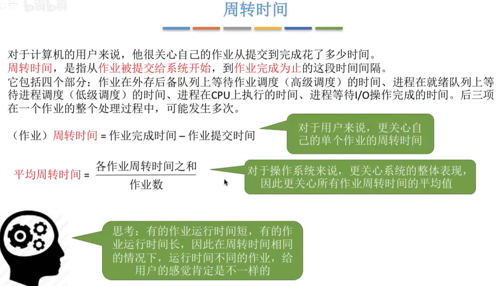
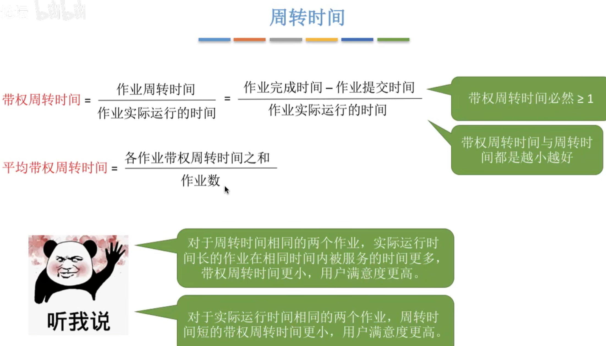
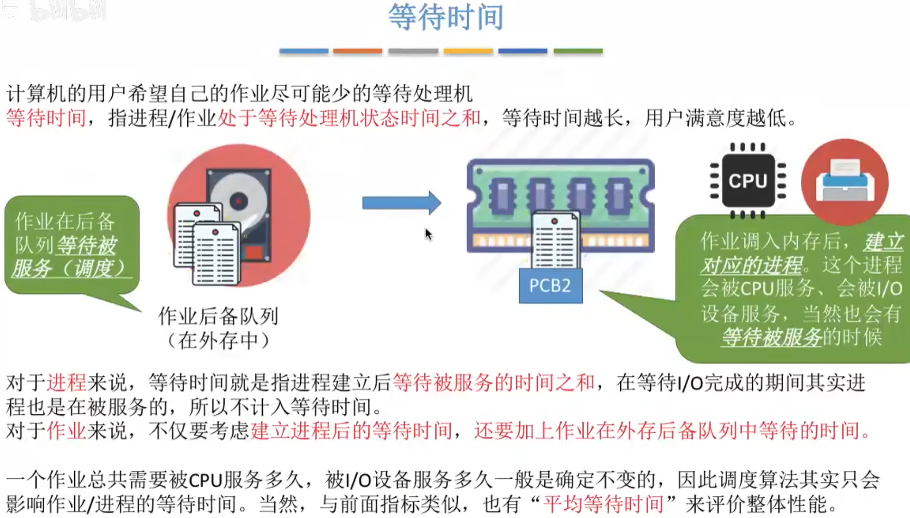
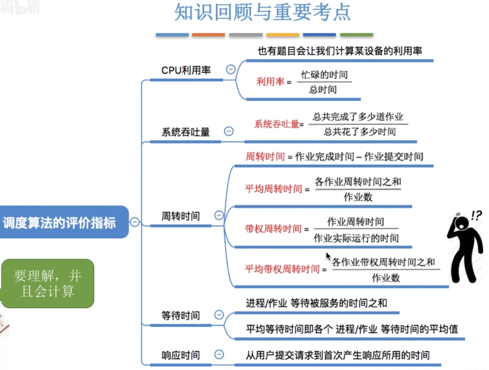

- [CPU利用率](#cpu利用率)
- [系统吞吐量](#系统吞吐量)
- [周转时间](#周转时间)
  - [周转时间计算方法](#周转时间计算方法)
- [等待时间](#等待时间)
- [响应时间](#响应时间)
- [知识回顾和考点总结](#知识回顾和考点总结)

# CPU利用率

# 系统吞吐量

# 周转时间 

进程等待I/O操作完成的时间=进程进入阻塞态的时间

**整个过程中,只会有一次作业调度**

- `周转时间`包含了作业的实际运行时间

## 周转时间计算方法

# 等待时间

作业比进程多出一段在外存(外存后备队列)中的等待时间

# 响应时间
对于计算机用户来说,会希望自己提交的请求(比如键盘输入了一个调试命令)尽早开始被系统服务、响应\
**响应时间**,指从**用户提交**请求到**首次产生响应**所用的时间

# 知识回顾和考点总结

