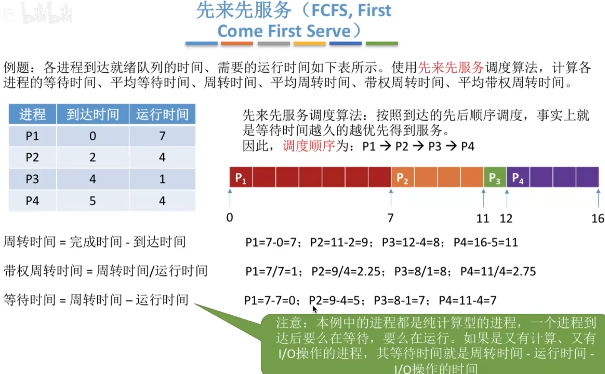
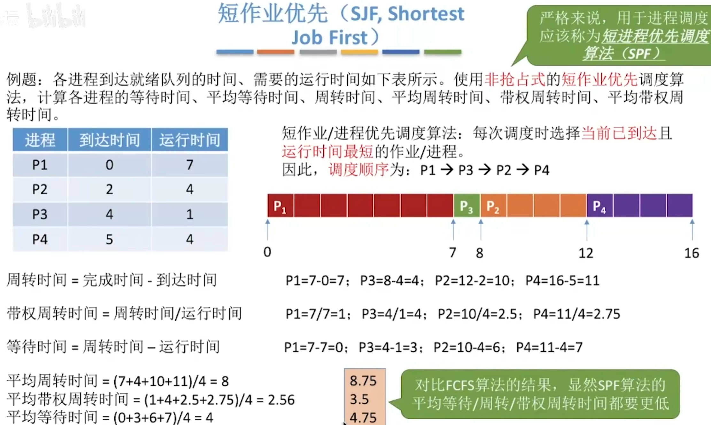
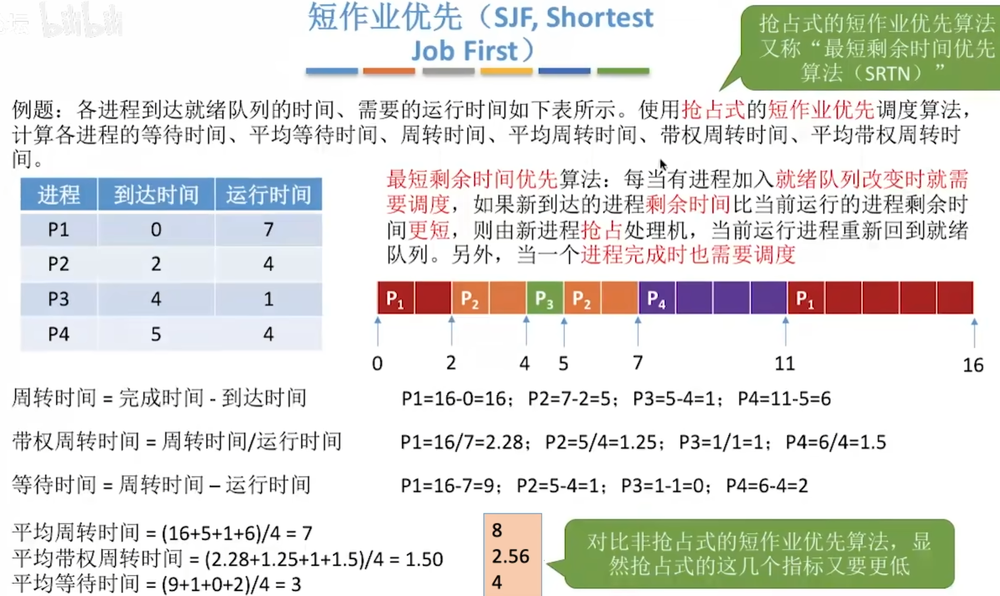
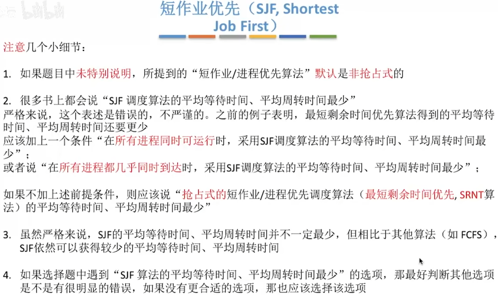
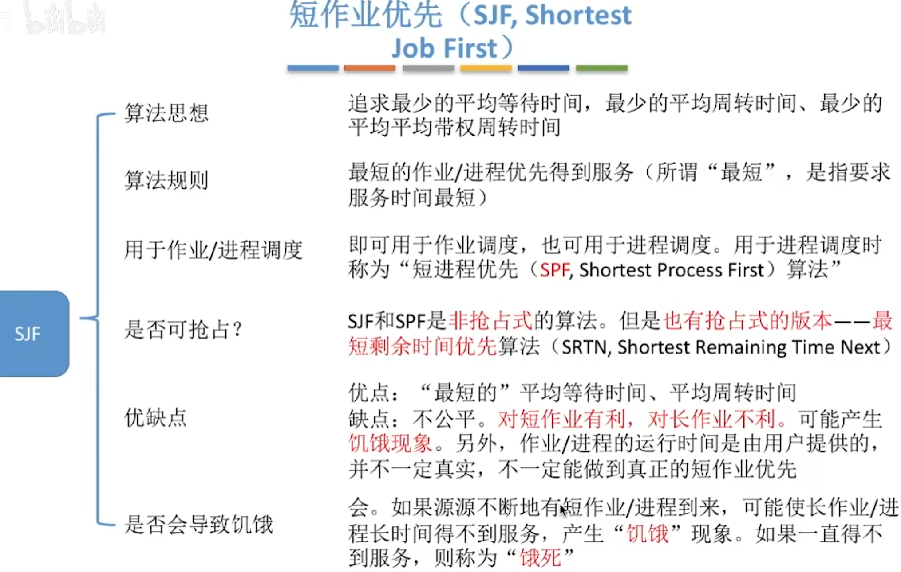
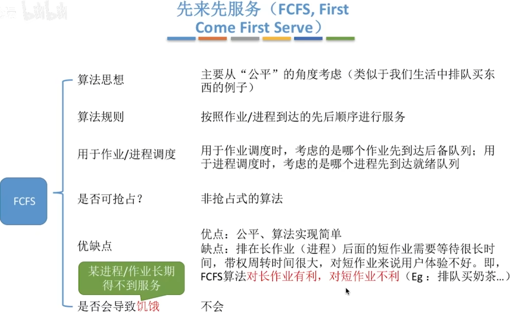
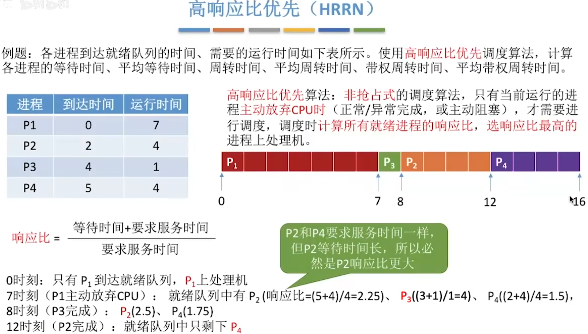
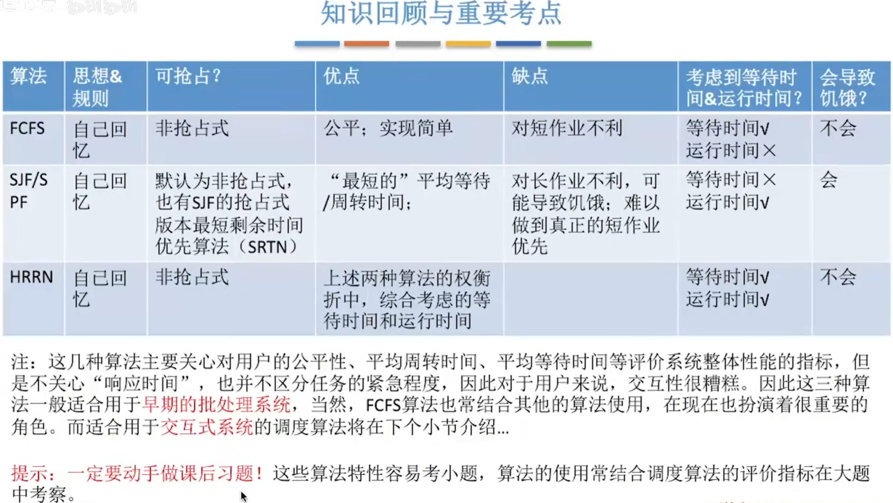

- [先来先服务](#先来先服务)
- [短作业优先](#短作业优先)
  - [最短剩余时间优先](#最短剩余时间优先)
- [短作业优先总结](#短作业优先总结)
- [高响应比优先](#高响应比优先)
- [知识回顾和重要考点](#知识回顾和重要考点)

# 先来先服务

# 短作业优先

## 最短剩余时间优先

# 短作业优先总结

饥饿状态--某进程/作业长期得不到服务\
非抢占式的算法--只有这个进程主动放弃处理机,才会进行调度\

<h1>先来先服务总结</h1>

# 高响应比优先

# 知识回顾和重要考点
