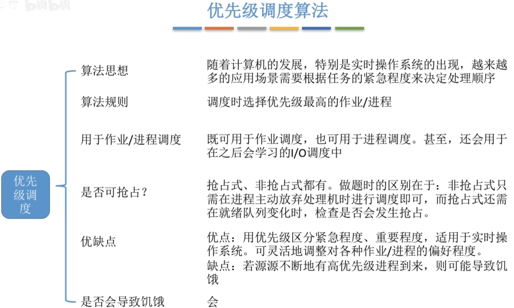

- [时间片轮转(RR,Round-Robin)](#时间片轮转rrround-robin)
- [优先级调度算法](#优先级调度算法)
  - [非抢占式的优先级调度算法](#非抢占式的优先级调度算法)
  - [抢占式的优先级调度算法](#抢占式的优先级调度算法)
  - [补充](#补充)
    - [如果采用的是动态优先级,什么时候应该调整?](#如果采用的是动态优先级什么时候应该调整)
- [多级反馈队列调度算法](#多级反馈队列调度算法)
- [知识回顾与重要考点](#知识回顾与重要考点)
- [多级队列调度算法](#多级队列调度算法)

# 时间片轮转(RR,Round-Robin)
- 时间片设置不能设置太大和太小
- 太小, 进程切换,调度是由代价的, 如果时间片太小,会导致切换过于频繁, 系统花费大量的时间来切换进程切换
- 太大, 使得每个进程都可以在一个时间片完成, 就会使该进程退化成先来先服务调度算法

一般来说,设计时间片时要让切换进程的开销占比不超过1%

# 优先级调度算法
## 非抢占式的优先级调度算法
每次调度时选择当前已到达且优先级最高的进程. 当前进程主动放弃处理机时发生调度

## 抢占式的优先级调度算法
每次调度时选择当前已经到达且优先级最高的进程,当进程`主动放弃处理机`时发生调度\
当`就绪队列发生改变时`也需要检查是否会发生抢占

## 补充
- 就绪队列未必只有一个, 可以按照不同的优先级来组织。另外，也可以把优先级高的进程排在更靠近队头的位置
- 根据优先级是否可以动态改变，可以将优先级分为静态优先级和动态优先级两种。\
  静态优先级：创建进程时确定，之后一直不变。\
  动态优先级：创建时有一个初始值，之后会根据情况动态地调整优先级。

**通常**：系统进程优先级高于用户进程\
前台进程优先级高于后台进程\
操作系统更偏好I/O型进程（或称I/O繁忙型进程）\
I/O设备和CPU可以并行的运行, 偏向于I/O型设备可以优先让I/O繁忙型进程优先运行,提高资源利用率,系统吞吐量

### 如果采用的是动态优先级,什么时候应该调整?
如果某进程在就绪队列中等待了很长时间,则可以适当提升其优先级\
如果某进程占用处理机运行了很长时间,则可以适当降低其优先级\
如果发现一个进程频繁的进行I/O操作,则可以适当提升其优先级\

# 多级反馈队列调度算法

# 知识回顾与重要考点

# 多级队列调度算法
队列之间可采取固定优先级,或时间片划分\
固定优先级: 高优先级空时低优先级优先级进程才能被调度\
时间片划分: 如三个队列分配时间50%、40%、10%

各队列可采用不同的调度策略，如：\
系统进程队列采用优先级调度\
交互式队列采用RR\
批处理队列采用FCFS