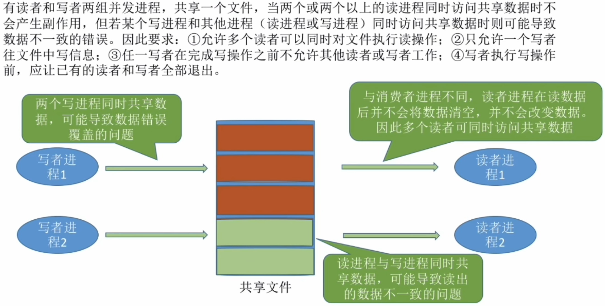
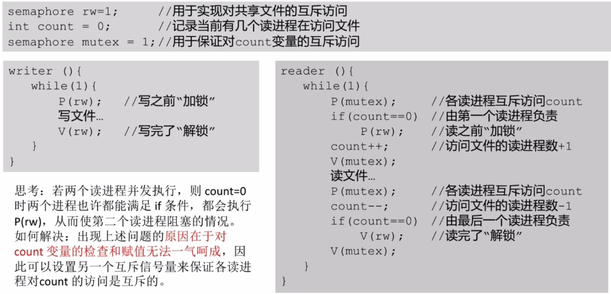

- [问题描述](#问题描述)
- [如何实现](#如何实现)
- [知识回顾与重要考点](#知识回顾与重要考点)

# 问题描述



# 如何实现
```c++
reader(){
    while(1)
    {
        P(mutex);       //各读进程互斥访问count
        if(count == 0)  //由第一个读进程负责
            P(rw);      //读之前"加锁"
        count++;        //访问文件的读进程数+1
        V(mutex);
        读文件
        P(mutex);
        count--;        //访问文件的读进程数-1
        if(count==0)    //由最后一个读进程负责
            V(rw);      //读完了"解锁"
        V(mutex);
    }
}
```

潜在的问题: 只要有读进程还在读, 写进程就要一直阻塞等待, 可能"饿死".因此这种算法中, 读进程是优先的

# 知识回顾与重要考点
