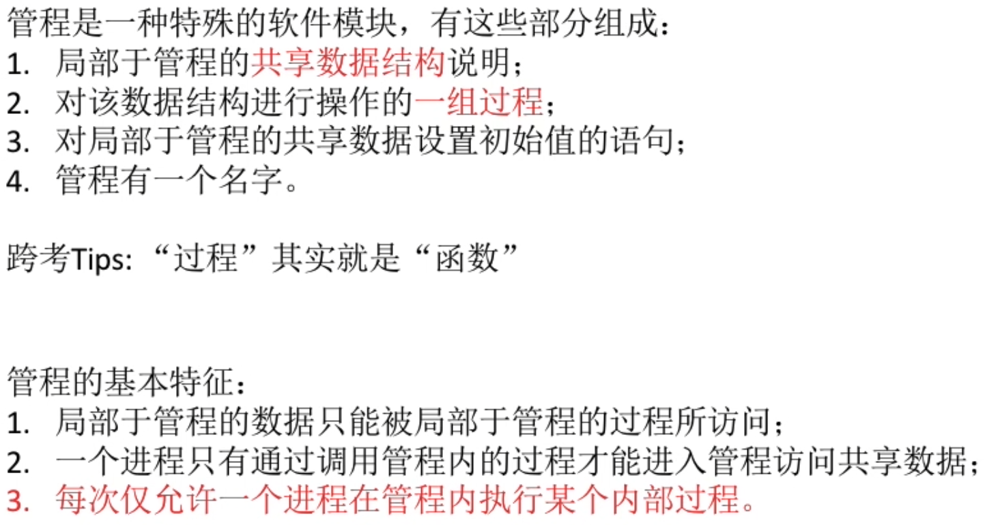
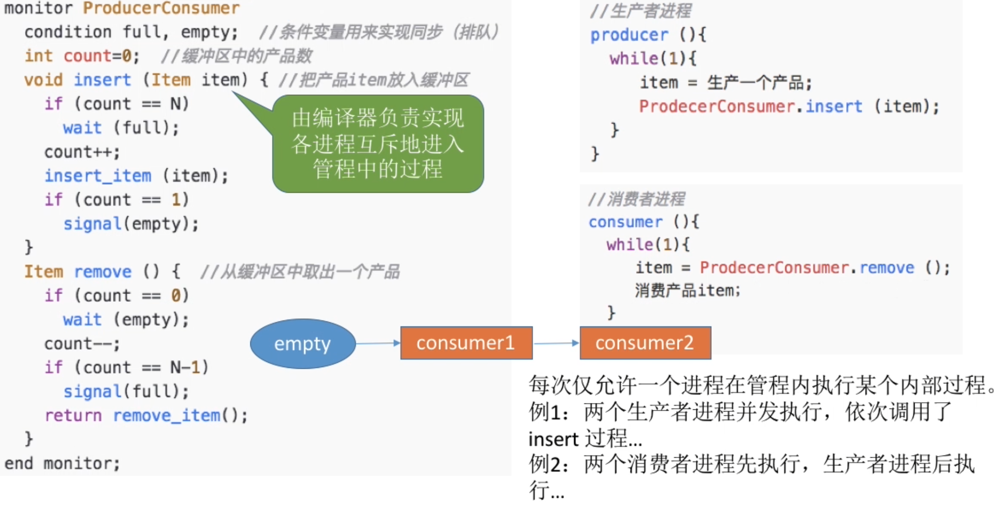
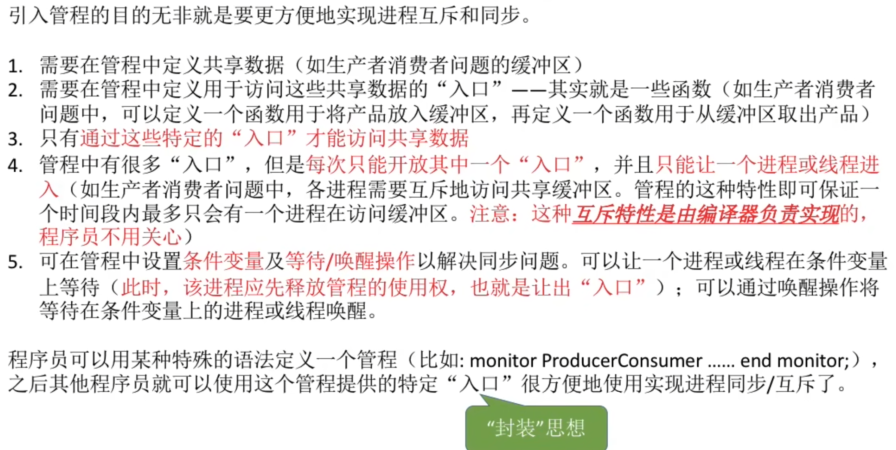
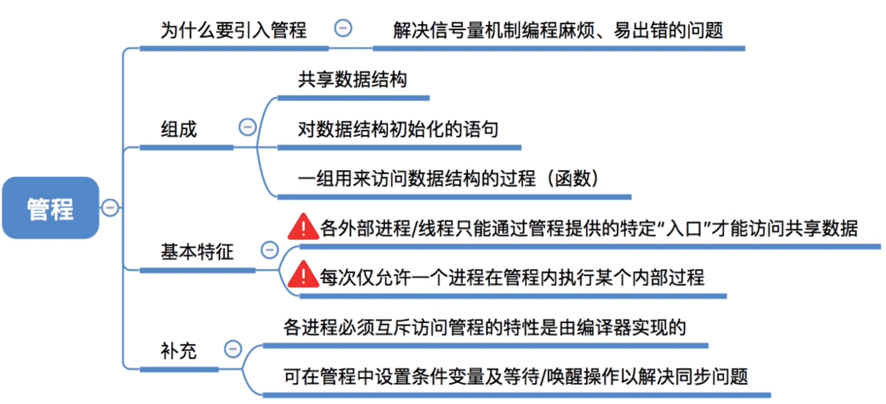

- [管程的定义和基本特征](#管程的定义和基本特征)
- [扩展: 用管程解决生产者消费者问题](#扩展-用管程解决生产者消费者问题)
    - [tips:](#tips)
- [知识回顾与重要考点](#知识回顾与重要考点)

# 管程的定义和基本特征

# 扩展: 用管程解决生产者消费者问题

1. 如果消费者在使用remove管程时,管程发现`cont==0`, 就执行`wait`等待操作,将消费者进程放入到empty等待进程的后面
2. 消费者进程从缓冲区取出一个产品后, 如果发现在取走之前缓冲区满了, 就需要在取走一个进程后唤醒生产者进程
3. 最后返回一个消费者产品的指针
### tips:

# 知识回顾与重要考点
