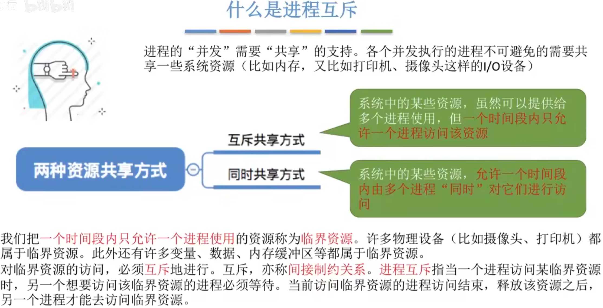
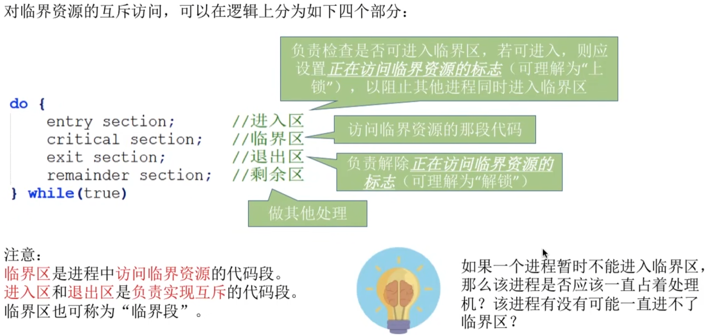
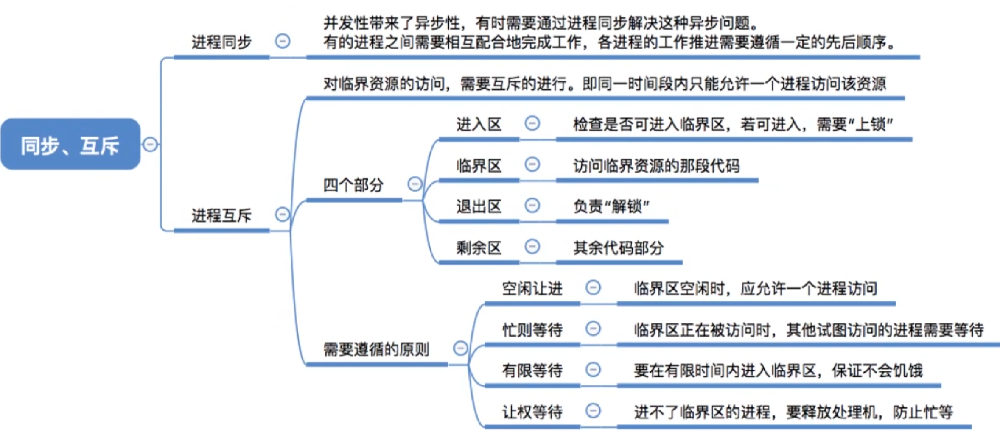

- [什么是进程同步?](#什么是进程同步)
- [什么是进程互斥?](#什么是进程互斥)
- [知识回顾与重要考点](#知识回顾与重要考点)

# 什么是进程同步?
知识回顾: 进程具有异步性的特征. 异步性是指, 各并发执行的进程以各自独立的、不可预知的速度向前推进。

读进程和写进程并发地运行,由于并发必然导致异步性,因此,"写数据"和"读数据"两个操作执行的先后顺序是不确定的。而实际运用中，又必须按照“`写数据->读数据`”的顺序来执行的。如何解决这种`异步`问题，这就是进程`同步`所讨论的内容。

`同步`亦称`直接制约关系`，它是指为完成某种任务而建立的两个或多个进程，这些进程因为需要在某些位置上`协调`它们的`工作次序`而产生的制约关系。进程间的直接制约关系就是源于它们之间的相互合作

# 什么是进程互斥?

为了实现对临界资源的互斥访问, 同时保证系统整体性能, 需要遵循以下原则:

1. 空闲让进。临界区空闲时，可以允许一个请求进入临界区的进程立即进入临界区；
2. 忙则等待。当已有进程进入临界区时，其他试图进入临界区的进程必须等待；
3. 有限等待。对请求访问的进程，应保证能在有限时间内进入临界区（保证不会饥饿）；
4. 让权等待。当进程不能进入临界区时，应立即释放处理机，防止进程忙等待。
# 知识回顾与重要考点
