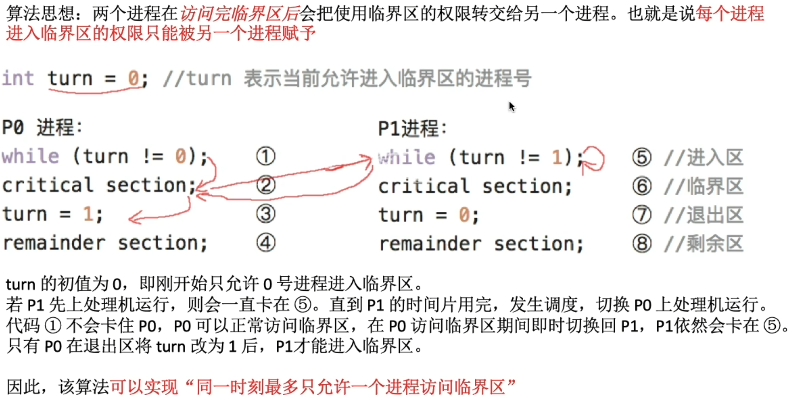
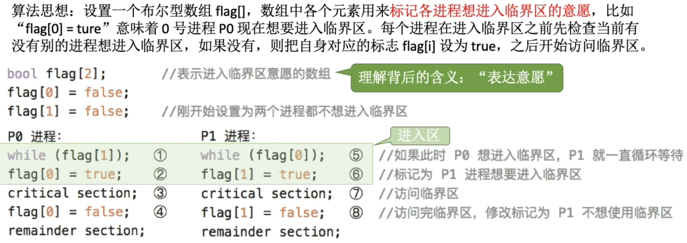
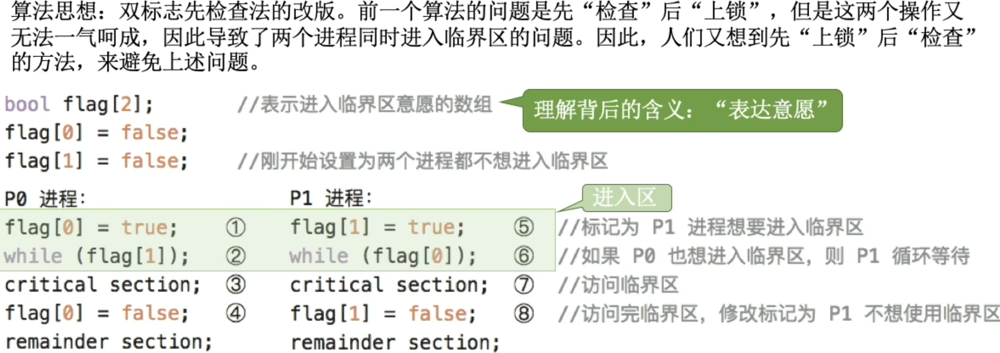
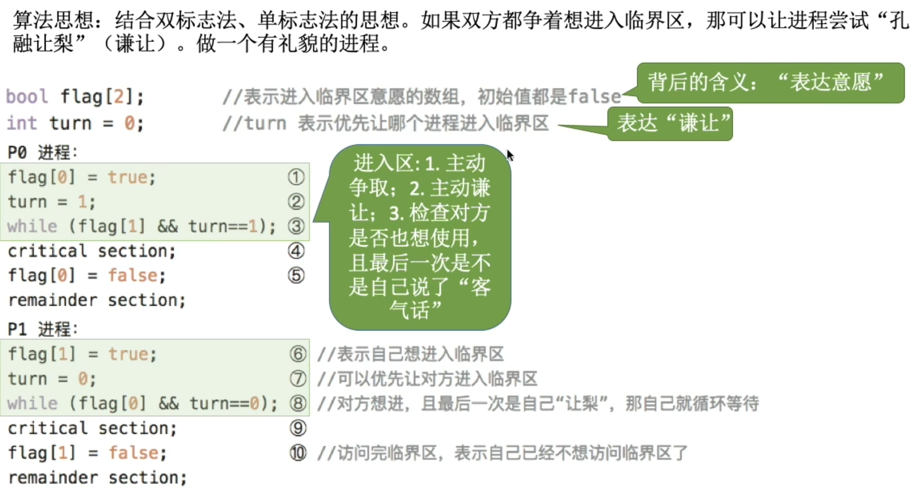
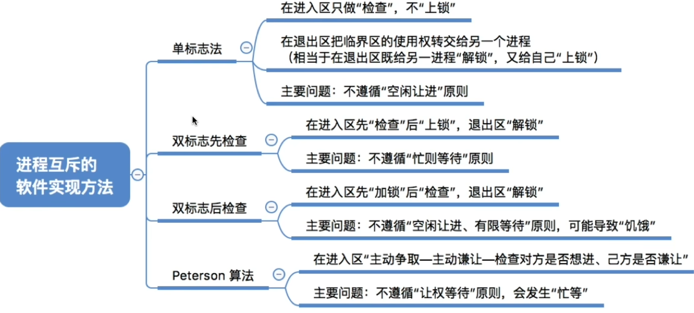

# 单标志法
思想: 两个进程在访问完临界区后会把使用临界区的权限转交给另一个进程。也就是说每个进程进入临界区的权限只能被另一个进程赋予

只能按照P0->P1这样轮流访问, 这种问题是如果P0一直没有访问临界资源,产生谦让的动作, P1就一直不能访问

因此, **单标志法**存在的**主要问题**是: **违背"空闲让进"原则**
# 双标志先检查法

检查对方是否想要进入临界区\
如果对方想进入临界区, 自己就一直循环等待\
如果对方不想进入临界区, 就表达自己想要进入临界区的意愿

如果按照并行执行的话,会出现P0和P1同时访问临界区的情况\
因此,双标志先检查法的**主要问题**是:违反"`忙则等待`"原则\
原因在于,进入区的"检查"和"上锁"`两个处理不是一气呵成的`, "检查"后,"上锁"前可能发生进程切换

# 双标志后检查法

如果按照`1 5 2 6`的顺序执行, P0和P1都将无法进入临界区\
因此,双标志后检查法虽然`解决了"忙则等待"`的问题, 但是`又违背了"空闲让进"和"有限等待"原则`,会因各进程都长期无法访问临界资源而`产生"饥饿"`现象

# Peterson算法

并行运行两个进程,谁最后先设置了turn的值,谁就会失去优先权,改由对方先进入临界区

Peterson算法用软件方法解决了锦城湖吃问题, `遵循了空闲让进、忙则等待、有限等待三个原则`，但是仍然`未遵循让权等待`的原则

# 知识回顾与重要考点
