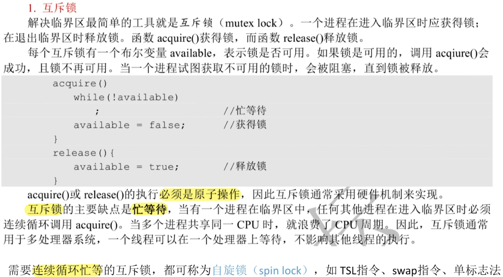

- [进程互斥:锁](#进程互斥锁)

# 进程互斥:锁

无论是那种锁, 都是为了解决`进程互斥`问题的.\
同时,不论是哪种锁,都是存在`忙等待`的问题,都违反了`让权等待`的原则

如果出现盲等的情况,不会一直占用处理机, 而是进行等待后, 在时间片用完后才下处理机

如果是多核系统, 出现互斥锁的情况时, 只有一个核产生了自旋锁的情况, 其他的内核会照常工作,并且快速释放临界区, 这时锁就会解开, 也不会产生切换上下文的情况

