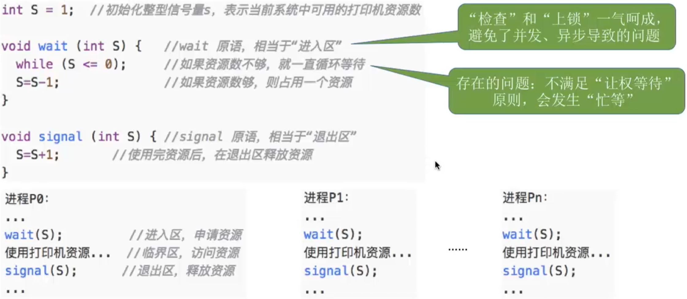

# 复习回顾+思考
进程互斥的四种软件实现方式(单标志法、双标志先检查、双标志后检查、Peterson算法)\
进程互斥的三种硬件实现方式（中断屏蔽方法、TS/TSL指令、Swap/XCHG指令）
1. 在双标志先检查法中, 进入区的"检查"、“上锁”操作无法一气呵成，从而导致了两个进程有可能同时进入临界区的问题；
2. 所有解决方案都无法实现“让权等待”

# 信号量机制
1. 信号量其实是一种变量, 我们可以用信号量来表示系统中某种资源的数量
2. 可以使用操作系统提供的原语`wait(S)和signal(S)`来对信号量进行操作

# 信号量机制--整形信号量
用一个`整数型的变量`作为信号量,用来`表示系统中某种资源的数量。`\
与普通整数变量的区别: 对信号量的操作只有三种, 即`初始化、P操作、V操作`

# 信号量机制--记录型信号量
等待队列--指向一个等待这种系统资源的等待队列\
wait原语会使calue数量减一, 如果剩余资源数`>0`,存在未使用的资源.\
反之,如果剩余资源数`<0`说明有一个进程在等待系统资源,使用BLOCK原语将进程从运行态进入阻塞态,并且将其放入等待队列中

如果value剩余数量`<0`,使用signal原语释放资源后,会使value值++, 然后使用wakeup将该进程从阻塞态变为就绪态,并将进程从等待队列中取出\
如果剩余数量`>0`,就不会使用wakeup原语

# 知识回顾与重要考点
