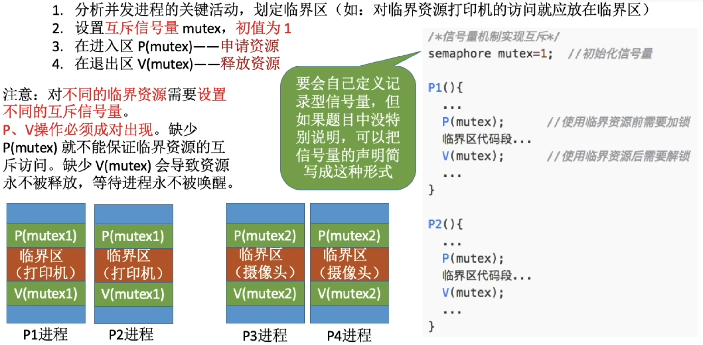
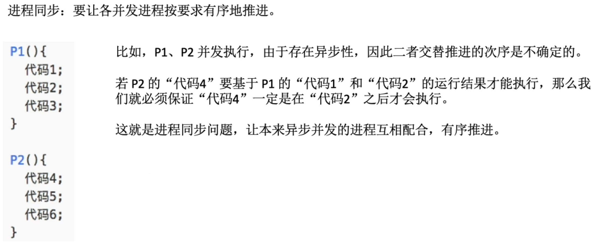
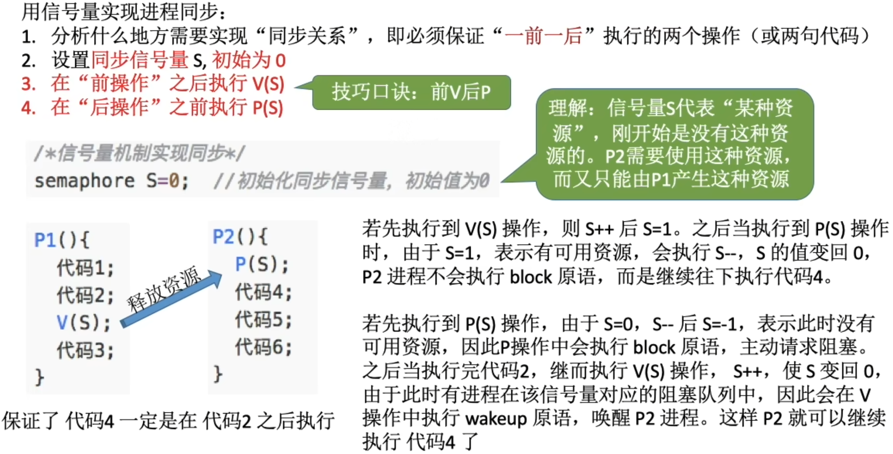

# 细节
- 一个信号量对应着一种资源
- 信号量的值=这种资源的剩余数量(信号量的值如果小于0,说明此时有进程在等待这种资源)
- P(S)--申请一个资源S,如果资源不够就阻塞等待
- V(S)--释放一个资源S,如果有进程就等待该资源,则唤醒一个进程

# 临界区
- 概念：每个进程中访问临界资源的那段程序称之为临界区。
- 临界区不是内核对象，而是系统提供的一种数据结构，程序中可以声明一个该类型的变量，之后用它来实现对资源的互斥访问。当欲访问某一临界资源时，先将该临界区加锁（若临界区不空闲则等待），用完该资源后，将临界区释放。
- 补充（待定）：分类：临界区也是代码的称呼，所以一个进程可能有多个临界区，分别用来访问不同的临界资源。
  - 内核程序临界资源：系统时钟
  - 普通临界资源：普通I/O设备，如打印机（进程访问这些资源的时候，很慢，会自动阻塞，等待资源使用完成）

# 信号量机制实现进程互斥
信号量mutex表示"进入临界区的名额"

```c
/*记录型信号量的定义*/
typedef struct{
    int value;  //剩余资源数
    struct process *L;  //等待队列
}semaphore;
```

# 信号量机制实现进程同步


要想要用信号量实现进程同步, 分析什么地方需要实现"同步关系", 即必须保证"`一前一后`"执行的两个操作(或两句代码)\
可以认为: `必须在前面执行完的代码是需要在后面执行的, 代码的前提条件` `只有执行完前面的所有代码, 才会执行V(S), 让信号量+1, 使得操作系统认为后面等待进程的P(S)等待的可用资源的数量+1.` `这时, 跳出等待, 实现了进程同步的操作`

