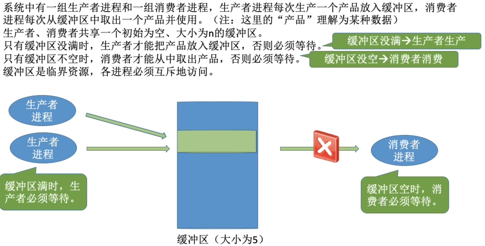
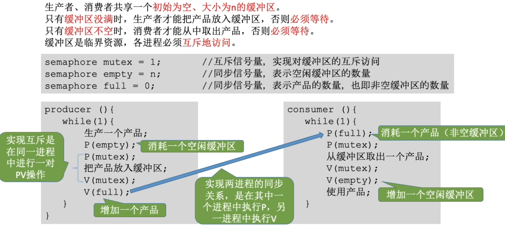
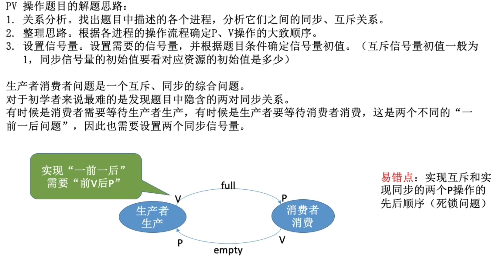

- [如何实现](#如何实现)
- [知识回顾与重要考点](#知识回顾与重要考点)

生产者生产产品时如果缓冲区满,则生产者进程阻塞.\
消费者进程从缓冲区取出产品时,如果发现生产者进程阻塞,就唤醒生产者进程\
这只是将生产者进程从阻塞态转换成就绪态

- 必须遵循进程同步的机制
- 缓冲区是临界资源,各进程必须互斥的访问

# 如何实现

- 实现互斥的P操作一定要在实现同步的P操作之后
- V操作不会导致进程阻塞,因此两个V操作顺序可以交换
- 可以把使用一个产品和生产一个产品放入临界区, 但是这样就会导致临界区代码过长, 对临界区上锁的时间会变长

# 知识回顾与重要考点
