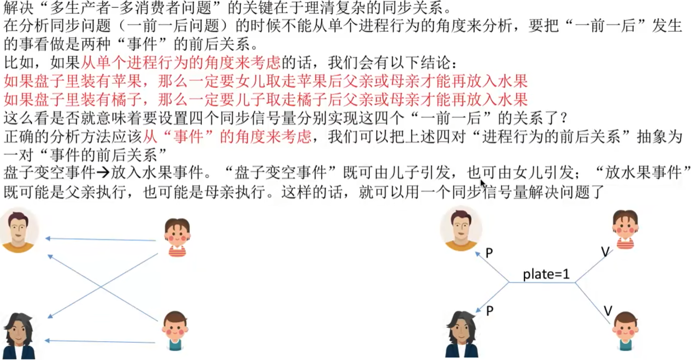

- [知识回顾与重要考点](#知识回顾与重要考点)

- 如果两个进程同时访问缓冲区的情况, 有可能导致两个进程写入缓冲区的数据相互覆盖的情况

在生产者-消费者问题中,如果缓冲区大小为1,那么有可能不需要设置互斥信号量就可以实现互斥访问缓冲区的功能。当然，这不是绝对的，要具体问题具体分析。\
如果来不及分析,可以加上互斥信号量, 保证各进程一定会互斥的访问缓冲区.\
但需要注意的是,实现互斥的P操作一定要在实现同步的P操作之后, 否则可能引起"死锁"

# 知识回顾与重要考点
