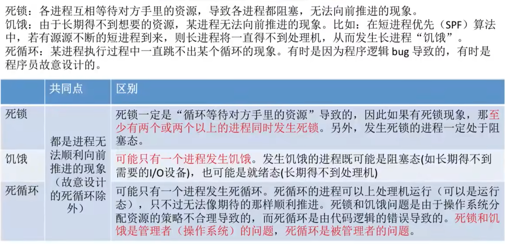
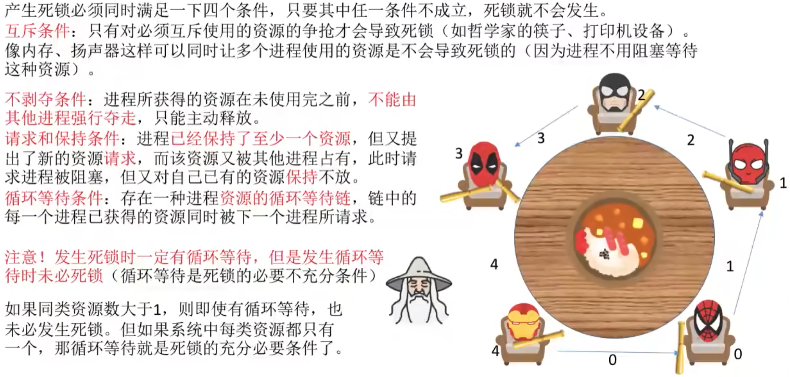
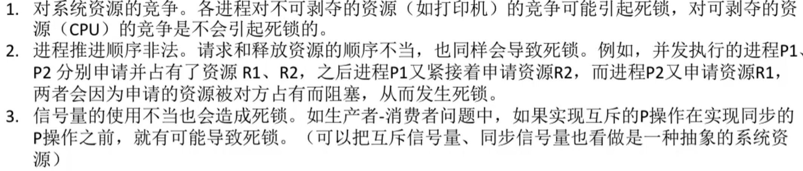
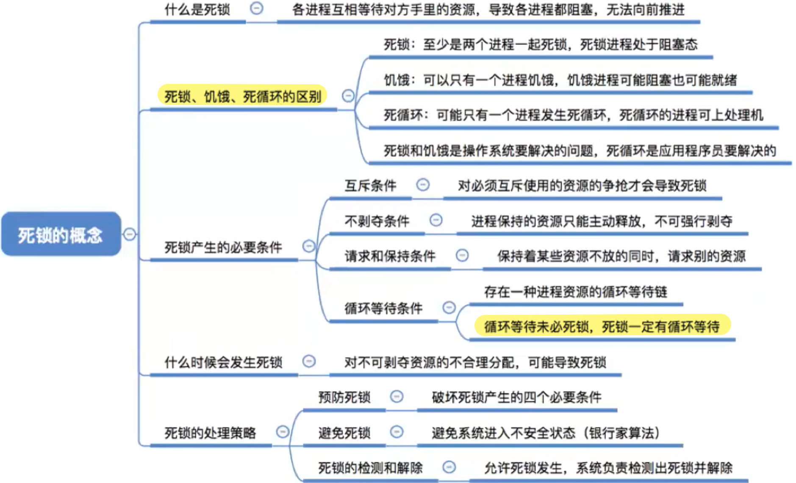

- [什么是死锁](#什么是死锁)
- [死锁、饥饿、死循环的区别](#死锁饥饿死循环的区别)
- [死锁产生的必要条件](#死锁产生的必要条件)
- [什么时候会发生死锁](#什么时候会发生死锁)
- [死锁的处理策略](#死锁的处理策略)
- [知识回顾与重要考点](#知识回顾与重要考点)

# 什么是死锁
在并发环境下,各进程因竞争资源而造成的一种`互相等待对方手里的资源, 导致各进程都阻塞, 都无法向前推进`的现象, 就是"死锁". 发生死锁后若无外力干涉,这些进程都将无法向前推进.

# 死锁、饥饿、死循环的区别

# 死锁产生的必要条件

# 什么时候会发生死锁

# 死锁的处理策略
1. 预防死锁。破坏死锁产生的四个必要条件中的一个或几个。
2. 避免死锁。用某种方法防止系统进入不安全状态，从而避免死锁（银行家算法）
3. 死锁的检测和解除。允许死锁的发生，不过操作系统会负责检测出死锁的发生，然后采取某种措施解除死锁。

# 知识回顾与重要考点
