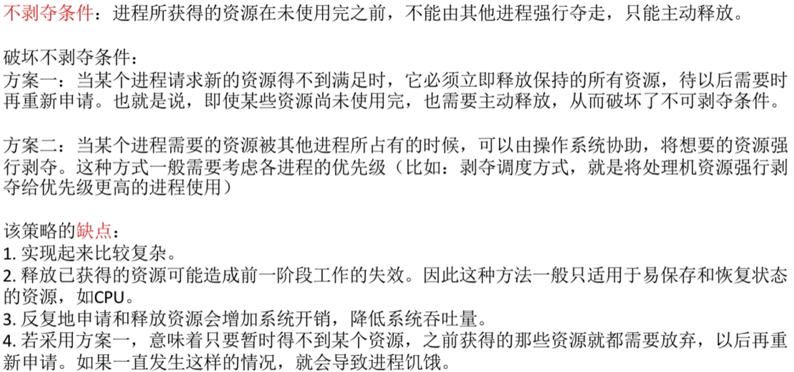
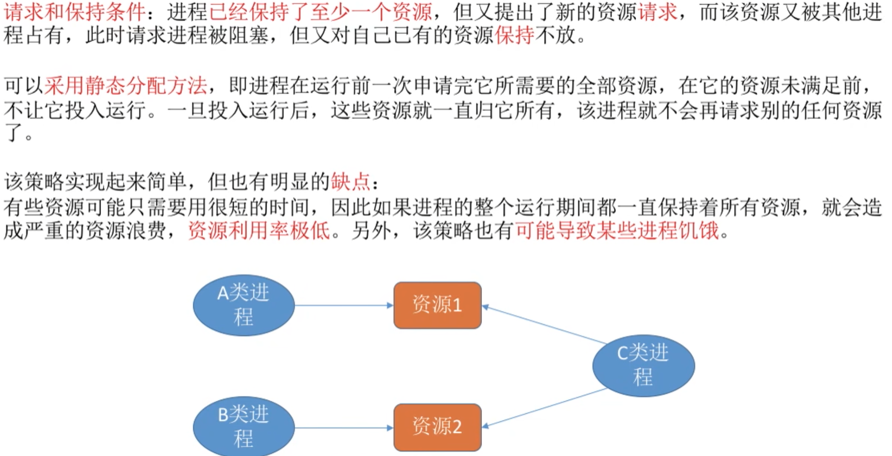
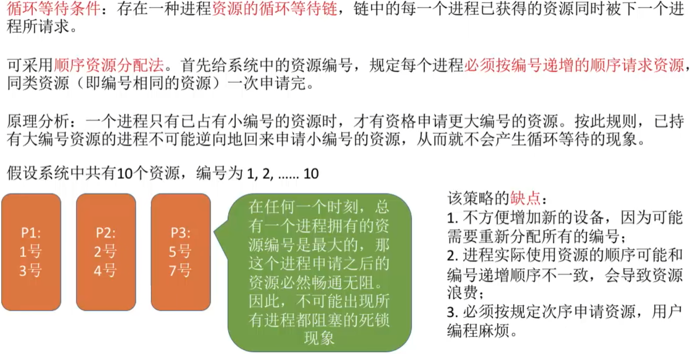
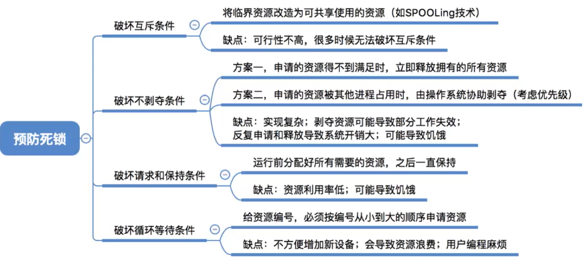

- [如何预防死锁](#如何预防死锁)
  - [破坏互斥条件](#破坏互斥条件)
  - [破坏不剥夺条件](#破坏不剥夺条件)
  - [破坏请求和保持条件](#破坏请求和保持条件)
  - [破坏循环等待条件](#破坏循环等待条件)
- [知识回顾与重要考点](#知识回顾与重要考点)

# 如何预防死锁
死锁的产生必须满足四个必要条件,只要其中一个或者几个条件不满足,死锁就不会产生。

## 破坏互斥条件

## 破坏不剥夺条件

## 破坏请求和保持条件

## 破坏循环等待条件

# 知识回顾与重要考点
