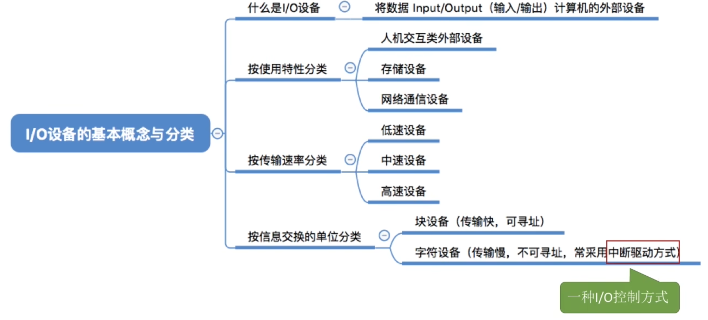

- [IO设备](#io设备)
- [知识点回顾与重要考点](#知识点回顾与重要考点)

# IO设备
什么是IO设备?\
"IO"就是"输入/输出"的意思\
IO设备就是可以将数据输入到计算机,或者可以接受计算机输出数据的外部设备,属于计算机中的硬件部位

UNIX系统将外部设别抽象为一种特殊的文件,用户可以使用与文件操作相同的方式对外部设别进行操作
- write操作: 向外部设备写出数据
- Read操作: 从外部设备读入数据

IO设备按使用特性分类
|设备名|速度|
|---|---|
|人机交互类外部设备|数据传输速度慢|
|存储设备|数据传输速度快|
|网络通信设备|数据传输速度介于上述二者之间|

# 知识点回顾与重要考点
