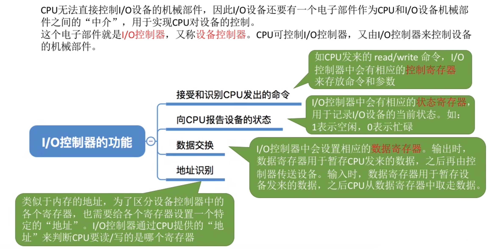
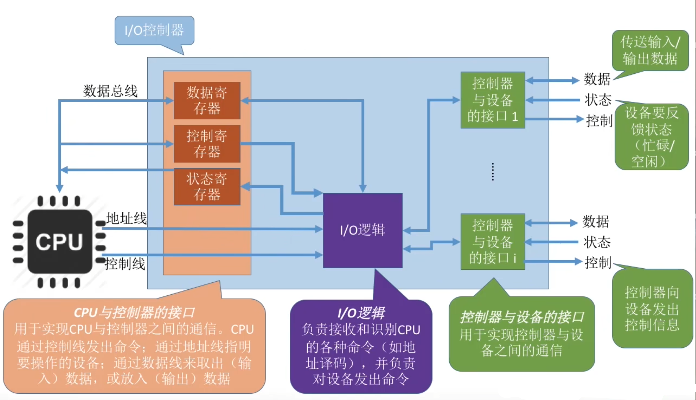
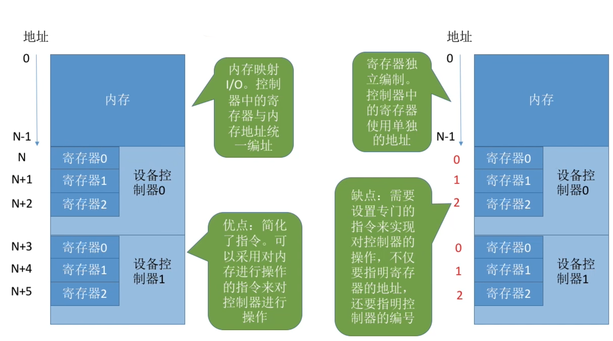
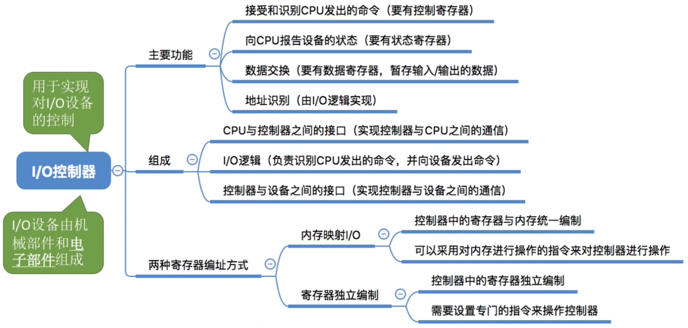

- [IO设备的电子部件](#io设备的电子部件)
- [IO控制器的组成](#io控制器的组成)
- [内存映像IO v.s. 寄存器独立编址](#内存映像io-vs-寄存器独立编址)
- [知识回顾与重要考点](#知识回顾与重要考点)

# IO设备的电子部件
CPU无法直接控制IO设备的机械部分,因此IO设备还需要有一个电子部件作为CPU和IO设备机械部件之间的"中介",用于实现CPU对设备的控制\
这个电子部件就是IO控制器,又称设备控制器。CPU可控制IO控制器，又由IO控制器来控制设备的机械部件

# IO控制器的组成

**tips**:
1. 一个IO控制器可能会对应多个设备
2. 数据寄存器、控制寄存器、状态寄存器可能有多个（如：每个控制/状态寄存器对应一个具体的设备），这些寄存器都要有相应的地址，才能方便CPU操作。有的计算机会让这些寄存器占用内存地址的一部分，称为**内存映像IO**；另一些计算机采用IO专用地址，即**寄存器独立编址**

# 内存映像IO v.s. 寄存器独立编址

# 知识回顾与重要考点
