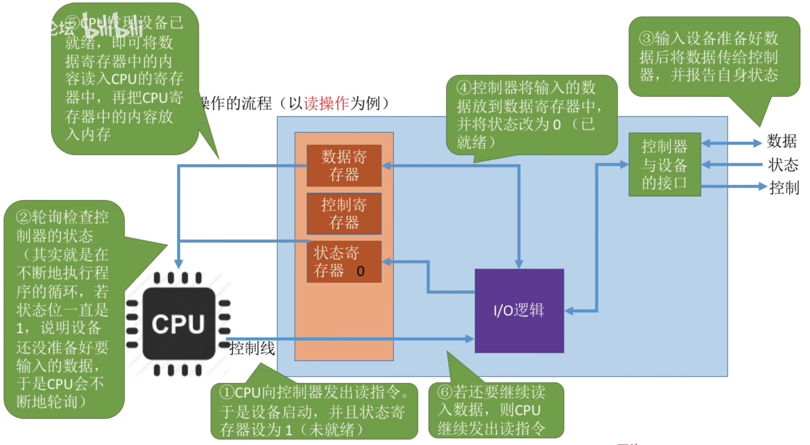
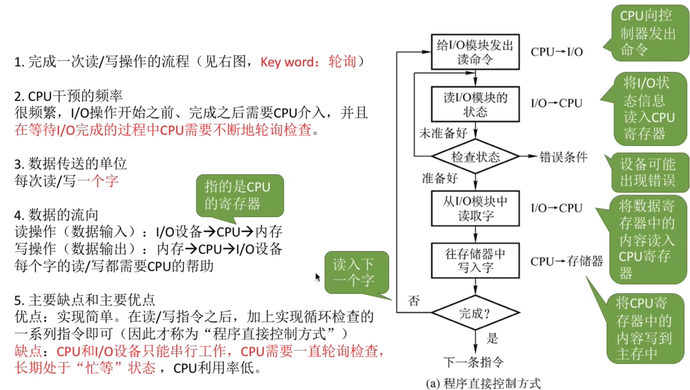
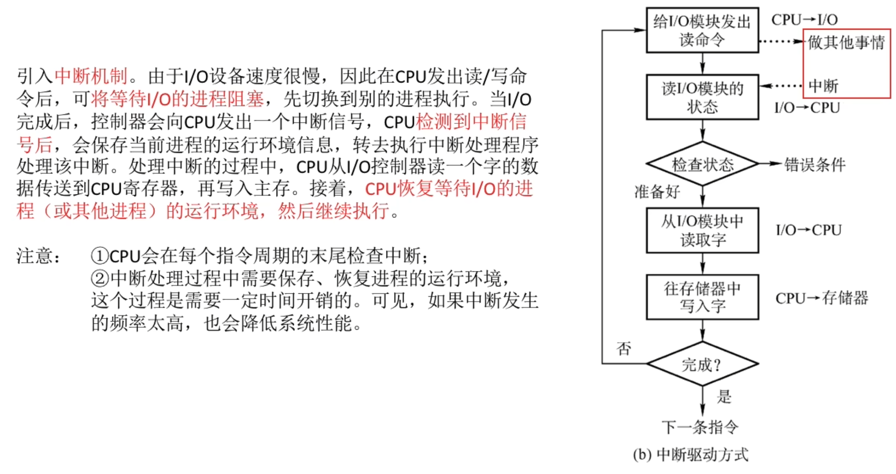
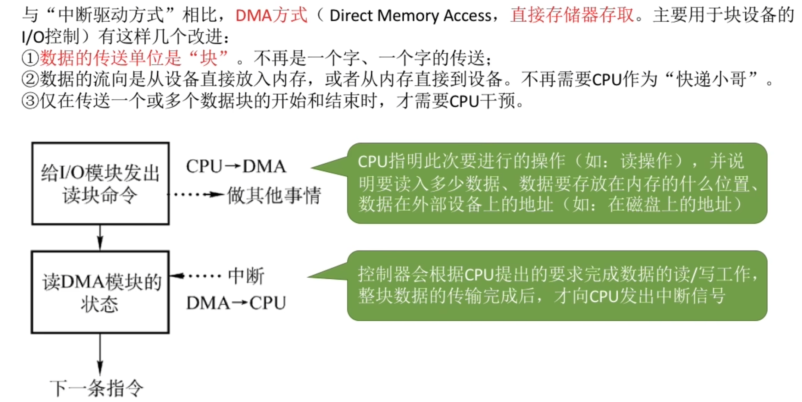
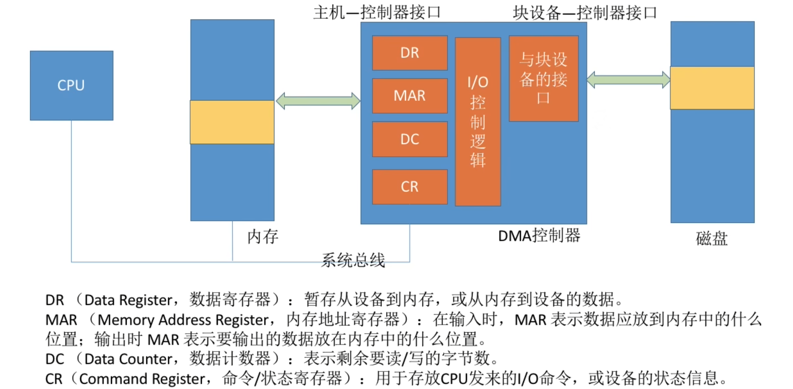
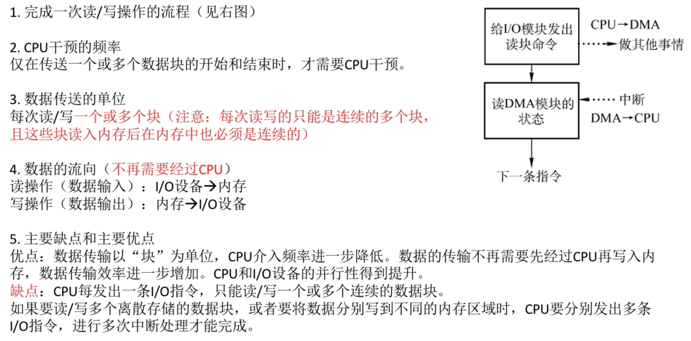
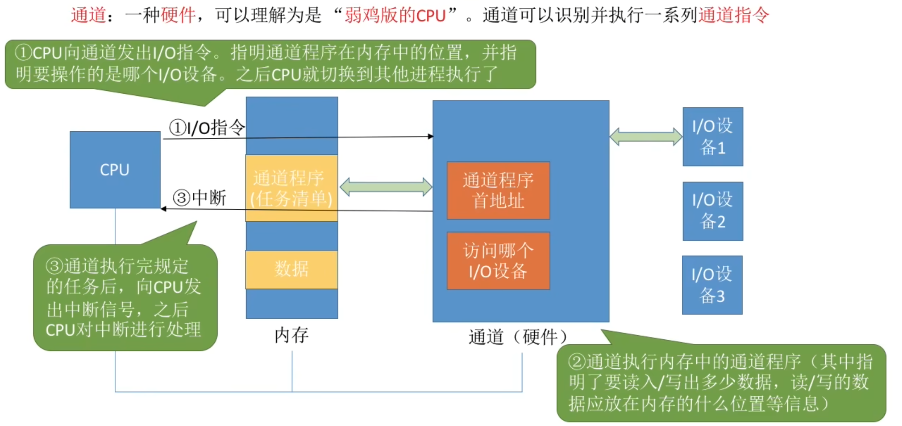
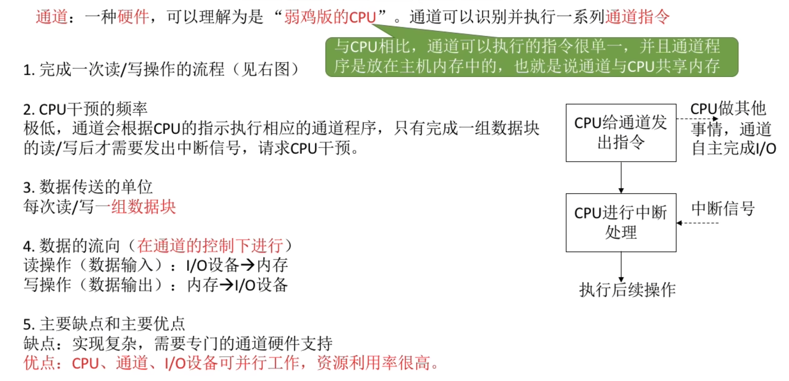
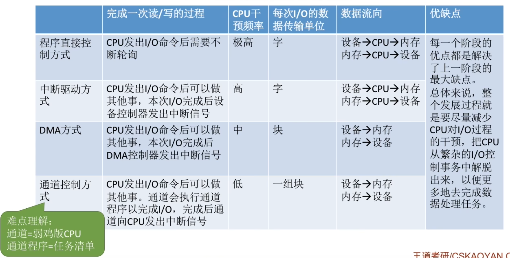

```
需要注意的问题:
1. 完成一次读/写操作的流程
2. CPU干预的频率
3. 数据传送的单位
4. 数据的流向
5. 主要缺点和主要优点
```

# 程序直接控制方式

因为CPU外部设备的运算速度存在很大的差异,所以CPU在等待外部设备回应的过程需要消耗较长的时间,CPU等待的过程会不断循环等待

# 程序直接控制方式


# 中断驱动方式


1. 完成一次读/写操作的流程
2. CPU干预的频率\
   每次IO操作开始之前、完成之后需要CPu介入\
   **等待IO完成的过程中CPU可以切换到别的进程执行**
3. 数据传送的单位\
    每次读/写**一个字**
4. 数据的流向\
   读操作(数据输入): IO设备->CPU->内存\
   写操作(数据输出): 内存->CPU->IO设备
5. 主要缺点和主要优点
优点: 与"程序直接控制方式"相比,在"中断驱动方式"中, IO控制器会通过中断信号主动报告IO已完成,CPU不再需要不停地轮询。**CPU和IO设备可并行工作**，CPU利用率得到明显提升。

# DMA方式

<hr>




# 通道控制方式

通道可以执行的指令和CPU相比很单一

没有自己独立的内存,只能和CPU共享



# 知识回顾与重要考点
