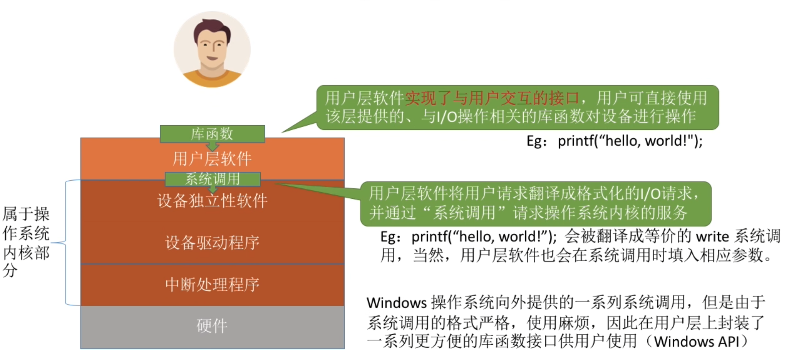
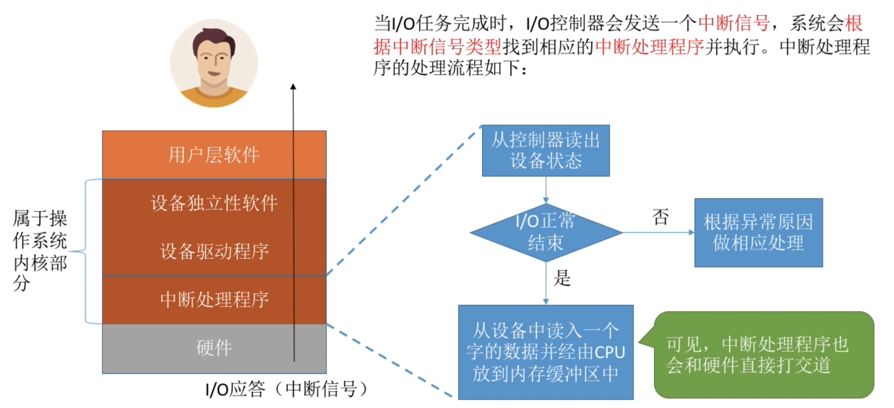
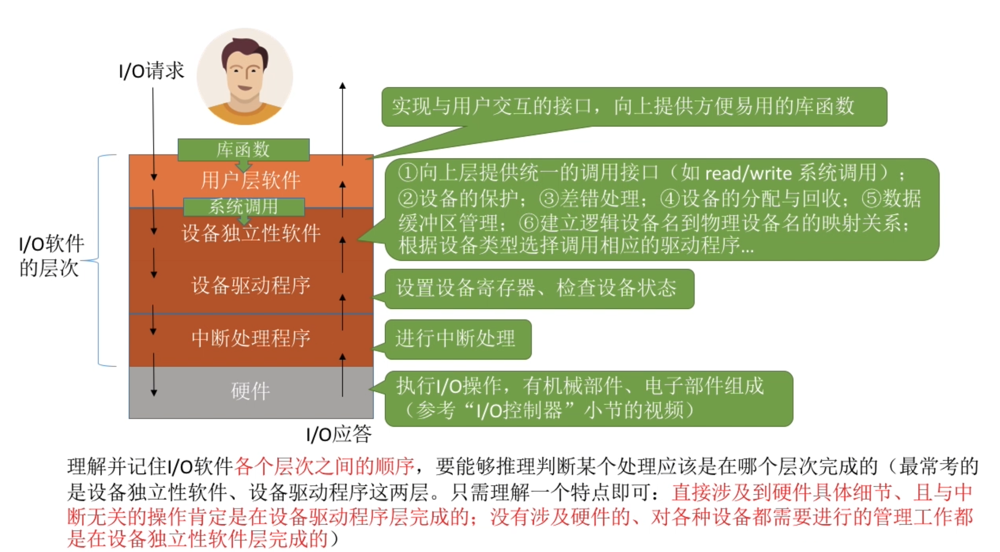

- [用户层软件](#用户层软件)
- [设备独立性软件](#设备独立性软件)
- [中断处理程序](#中断处理程序)
- [知识回顾与重要考点](#知识回顾与重要考点)

# 用户层软件

# 设备独立性软件
1. 向上层提供统一的调用接口(如read/write系统调用)
2. 设备的保护`原理类似于文件保护, 设备被看成是一种特殊的文件,不同用户的访问权限是不一样的`
3. 差错处理`对一些设备的错误进行处理`
4. 设备的分配与回收
5. 数据缓冲区管理
6. 建立逻辑设备名到物理设备名的映射关系;根据设备类型选择调用相应的驱动程序`用户看到的设备名都是逻辑设备`

- `整个系统只设置一张LUT(逻辑设备表)`, 因为所有用户不能使用相同的逻辑设备名,因此只适用于单用户操作系统
- `为每个用户设置一张LUT`,每个用户的逻辑设备名可以重复,适用于多用户操作系统

# 中断处理程序

# 知识回顾与重要考点
